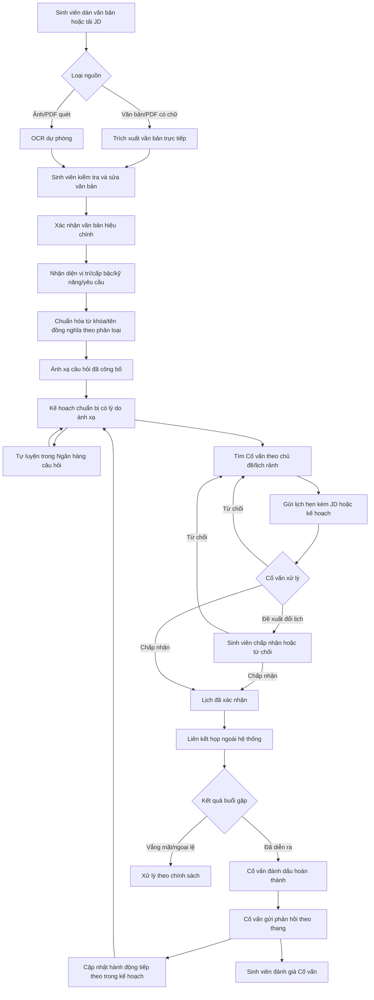
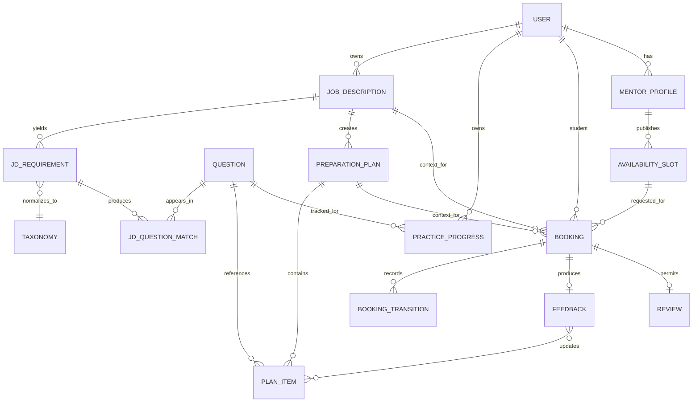

# Nền tảng luyện phỏng vấn — Quy trình trạng thái tương lai

## 1. Định nghĩa quy trình

Trạng thái tương lai mô tả quy trình nghiệp vụ hộp đen của MVP: Sinh viên đưa một Mô tả công việc (JD) vào hệ thống, kiểm tra văn bản, nhận kế hoạch chuẩn bị có ánh xạ câu hỏi, rồi tự luyện hoặc đặt Cố vấn và dùng phản hồi để cập nhật kế hoạch. Trường/lược đồ/ràng buộc kỹ thuật thuộc tài liệu Kiến trúc.

Theo phân công trong Project Charter, Hưng (Product Owner / Business Analyst) chịu trách nhiệm quy trình nghiệp vụ; Hùng (UI/UX Designer / Front-end Developer) kiểm tra trải nghiệm/nguyên mẫu và giao diện; Trí (PoC / Integration & E2E Developer) kiểm chứng khả thi đầu-cuối; Luân (Architecture / Technical Lead) kiểm tra ràng buộc kiến trúc; Tuấn Anh (Project Manager / Team Leader / Timekeeper) điều phối thời gian, Kanban, tích hợp và readiness; Gia Thành (Project Planning & Estimation Analyst / Full-stack Developer) phân tích tác động đến baseline và tham gia implementation.

## 2. Kịch bản chính

An có một JD Thực tập sinh Front-end. An dán văn bản hoặc tải lên tệp, xem nội dung được trích xuất và sửa lỗi trước khi xác nhận. Hệ thống nhận diện vị trí, cấp bậc, kỹ năng/công nghệ, chuẩn hóa tên đồng nghĩa theo bộ phân loại và ánh xạ các câu hỏi `PUBLISHED` kèm yêu cầu nguồn và lý do. An tạo kế hoạch chuẩn bị, tự luyện một số câu hỏi rồi chọn Cố vấn phù hợp với chủ đề trong kế hoạch. Lịch hẹn mang theo ngữ cảnh JD/kế hoạch; Cố vấn xác nhận, hai bên dùng liên kết họp ngoài hệ thống. Sau buổi luyện, phản hồi gồm điểm mạnh, điểm yếu và hành động tiếp theo được đưa trở lại kế hoạch chuẩn bị.

## 3. Quy trình đầu-cuối tương lai

`COMPLETED` là chuyển trạng thái lịch hẹn bắt buộc trước phản hồi; phản hồi không phải trạng thái lịch hẹn. Luồng vắng mặt/hủy/đổi lịch chỉ được bật theo chính sách đã phê duyệt. Trích xuất/OCR thành công không đồng nghĩa phân tích đúng; xác nhận của Sinh viên là cổng bắt buộc.

## 4. Đặc tả quy trình

| Bước | Tác nhân | Điều kiện trước | Hoạt động | Điều kiện sau |
|---|---|---|---|---|
| FS-01 | Sinh viên | Đã đăng nhập | Dán văn bản JD hoặc tải tệp trong giới hạn được phê duyệt | Tạo `JobDescription` thuộc Sinh viên |
| FS-02 | Hệ thống/tiến trình | Nguồn hợp lệ | Trích xuất trực tiếp; OCR chỉ khi ảnh/PDF quét cần thiết | Trích xuất kết thúc với văn bản hoặc mã lỗi an toàn |
| FS-03 | Sinh viên | Có văn bản trích xuất/dán | Xem, sửa và xác nhận văn bản hiệu chỉnh | Một phiên bản văn bản được xác nhận cho phân tích |
| FS-04 | Hệ thống | Văn bản hiệu chỉnh đã xác nhận | Nhận diện vị trí, cấp bậc, kỹ năng, công nghệ và yêu cầu chính | Yêu cầu giữ bằng chứng gốc và trạng thái chuẩn hóa |
| FS-05 | Hệ thống | Có phân loại/tên đồng nghĩa thử nghiệm | Chuẩn hóa yêu cầu và ánh xạ câu hỏi `PUBLISHED` | Kết quả ổn định theo phiên bản ánh xạ; có điểm/lý do |
| FS-06 | Sinh viên/Hệ thống | Có kết quả hợp lệ | Chọn/ghi nhận chủ đề, câu hỏi và tạo kế hoạch chuẩn bị | Kế hoạch thuộc Sinh viên, tham chiếu JD và phiên bản ánh xạ |
| FS-07 | Sinh viên | Có kế hoạch hoặc câu hỏi `PUBLISHED` | Mở câu hỏi, đánh dấu và cập nhật trạng thái luyện | Tiến độ luyện riêng tư được lưu |
| FS-08 | Sinh viên | Có chủ đề/kế hoạch và Cố vấn `APPROVED` | Lọc Cố vấn theo chuyên môn/lịch rảnh | Chọn được Cố vấn/khung giờ hoặc nhận trạng thái rỗng rõ ràng |
| FS-09 | Sinh viên | Khung giờ khả dụng; có JD/kế hoạch thuộc quyền sở hữu | Gửi lịch hẹn với ngữ cảnh tối thiểu cần thiết | Lịch `PENDING` tham chiếu JD hoặc kế hoạch |
| FS-10 | Cố vấn | Là chủ khung giờ/lịch hẹn | Chấp nhận/Từ chối/Đề xuất đổi lịch | Lịch hẹn chuyển trạng thái hợp lệ và có lưu vết |
| FS-11 | Hệ thống/hai bên | Lịch `CONFIRMED` | Khóa khung giờ, gửi thông báo và cấp quyền liên kết họp | Hai bên có thông tin buổi gặp; nhà cung cấp không phải nguồn chuẩn |
| FS-12 | Hai bên | Đến lịch | Phỏng vấn thử qua công cụ ngoài | Lịch đủ điều kiện xử lý hoàn thành/vắng mặt |
| FS-13 | Cố vấn sở hữu lịch hẹn | Lịch `COMPLETED` | Gửi phản hồi theo thang | Phản hồi riêng tư có điểm mạnh, điểm yếu, hành động tiếp theo |
| FS-14 | Sinh viên/Hệ thống | Có phản hồi | Áp dụng hành động tiếp theo vào kế hoạch; Sinh viên có thể đánh giá Cố vấn | Vòng lặp luyện tiếp bắt đầu |

### 4.1 Trạng thái đặt lịch chuẩn

| Trạng thái nghiệp vụ | Mã API/lưu trữ | Chiếm khung giờ | Ý nghĩa |
|---|---|---|---|
| Chờ xử lý | `PENDING` | Không | Lịch hẹn đang chờ Cố vấn quyết định |
| Đã xác nhận | `CONFIRMED` | Có | Cố vấn đã nhận và khung giờ được giữ |
| Đã đề xuất đổi lịch | `RESCHEDULE_PROPOSED` | Khung cũ giữ; khung mới chưa chiếm | Bên còn lại phải chấp nhận/từ chối đề xuất |
| Bị từ chối | `REJECTED` | Không | Cố vấn từ chối yêu cầu hiện tại |
| Đã hủy | `CANCELLED` | Không | Lịch hẹn được hủy theo chính sách |
| Đã hoàn thành | `COMPLETED` | Có dưới dạng lịch sử | Buổi luyện đã diễn ra và được ghi nhận hoàn thành |
| Vắng mặt | `NO_SHOW` | Lịch sử/ngoại lệ | Báo sau 15 phút và chỉ xác nhận khi Quản trị viên hoặc bên còn lại kiểm tra bằng chứng có thời điểm |

Không dùng `OCR` để gọi toàn bộ phân tích JD; không dùng lẫn các khái niệm “đổi lịch”, “đề xuất thay đổi” và `RESCHEDULE_PROPOSED`. Từ vựng đầy đủ nằm tại [Danh sách công việc sản phẩm, mục 1.3](Product_Backlog_and_Acceptance_Criteria.md#13-từ-vựng-trạng-thái-đặt-lịch).

### 4.2 Bảng chuyển trạng thái đặt lịch

| Từ | Lệnh/tác nhân | Điều kiện bảo vệ | Đến | Tác động kèm theo | Truy vết |
|---|---|---|---|---|---|
| — | `CreateBooking` / Sinh viên | Khung giờ khả dụng; JD/kế hoạch thuộc Sinh viên; ngữ cảnh hợp lệ | `PENDING` | Ghi lịch hẹn + sự kiện chống trùng | US-11, US-30; BR-03/10/18 |
| `PENDING` | `Accept` / Cố vấn sở hữu | Cố vấn/khung giờ hợp lệ; khóa/ràng buộc giao dịch đạt | `CONFIRMED` | Giữ khung giờ + sự kiện hộp sự kiện | US-12; BR-02/08/10 |
| `PENDING` | `Reject` / Cố vấn sở hữu | Lý do hợp lệ | `REJECTED` | Lưu vết + sự kiện | US-12; BR-08 |
| `PENDING`/`CONFIRMED` | `ProposeReschedule` / bên được phép | Còn ≥12 giờ; khung mới hợp lệ; chưa vượt 2 đề xuất | `RESCHEDULE_PROPOSED` | Giữ khung cũ; lưu đề xuất | US-12/13; BR-02/08/10 |
| `RESCHEDULE_PROPOSED` | `AcceptReschedule` / bên còn lại | Khung mới còn khả dụng lúc ghi | `CONFIRMED` | Chuyển khung giờ nguyên tử | US-13; BR-02/08/10 |
| `RESCHEDULE_PROPOSED` | `RejectReschedule` / bên còn lại | Đề xuất hợp lệ | Trạng thái trước đề xuất | Giữ khung cũ nếu trước đó `CONFIRMED`; lưu vết | US-13; BR-08 |
| `PENDING`/`CONFIRMED`/`RESCHEDULE_PROPOSED` | `Cancel` / bên được phép | Còn ≥12 giờ; nếu muộn hơn cần Quản trị viên/bên còn lại giải quyết | `CANCELLED` | Giải phóng khung phù hợp + sự kiện | US-13; BR-08/10 |
| `CONFIRMED` | `MarkCompleted` / Cố vấn sở hữu | Đã qua giờ kết thúc | `COMPLETED` | Lưu vết; Sinh viên có 24 giờ khiếu nại; phản hồi riêng tư và đánh giá chưa công bố đến khi hết thời hạn hoặc giải quyết khiếu nại | US-15/17; BR-05/06/08 |
| `CONFIRMED` | `ReportNoShow` / một trong hai bên | Đã qua giờ bắt đầu + 15 phút | `CONFIRMED`/chờ giải quyết | Lưu bằng chứng có thời điểm, chưa đổi trạng thái kết thúc | US-20; BR-08 |
| `CONFIRMED`/chờ giải quyết | `ConfirmNoShow` / Quản trị viên hoặc bên còn lại | Báo cáo/bằng chứng hợp lệ | `NO_SHOW` | Lưu vết + hành động vận hành | US-20; BR-08 |

Chuyển trạng thái không hợp lệ phải thất bại mà không để lại tác động lên trạng thái/khung giờ. Lỗi thông báo không đổi trạng thái đích đã ghi.

## 5. Mô hình đầu vào và đầu ra nghiệp vụ

### Nguồn JD

- `source_type`: tối đa 50.000 ký tự văn bản dán hoặc một PDF/PNG/JPEG; tệp không quá 10 MB, PDF không quá 5 trang, PNG/JPEG là một ảnh.
- Tham chiếu tệp gốc, tên tệp/loại nội dung, trạng thái xử lý và quyền sở hữu.
- Chữ ký tệp/MIME, dữ liệu mã hóa/nhúng/nhiều tệp và an toàn bộ phân tích được kiểm tra phía máy chủ; tệp gốc tự xóa trong 24 giờ sau khi trích xuất kết thúc.

### Trích xuất và hiệu chỉnh

- `extracted_text`, phương pháp/phiên bản/trạng thái trích xuất, thời lượng và mã lỗi an toàn; OCR chỉ hỗ trợ tiếng Việt/Anh, hết hạn 60 giây, tối đa 2 lần chạy và 2 tác vụ đồng thời/tiến trình.
- `corrected_text`, phiên bản hiệu chỉnh, thời điểm xác nhận và Sinh viên xác nhận.
- Phân tích chỉ dùng phiên bản hiệu chỉnh đã xác nhận.

### Dữ liệu yêu cầu và ánh xạ câu hỏi

- Yêu cầu gốc/đoạn bằng chứng từ văn bản hiệu chỉnh.
- Vị trí, cấp bậc, kỹ năng/công nghệ và chủ đề phân loại đã chuẩn hóa.
- Mã câu hỏi, điểm ánh xạ 0–100, lý do và phiên bản ánh xạ; trọng số lần lượt là 40 cho chủ đề/tên đồng nghĩa, 30 cho độ phủ từ khóa, 15 cho vai trò, 15 cho cấp bậc/độ khó.
- Chỉ câu hỏi `PUBLISHED` có phân loại/nguồn gốc hợp lệ được đưa vào kết quả.
- Chỉ lấy điểm ≥60; tối đa 10 câu/JD và 3 câu/yêu cầu; phân xử phải ổn định.

### Kế hoạch chuẩn bị

- Sinh viên, `JobDescription`, yêu cầu/chủ đề/câu hỏi đã chọn và trạng thái kế hoạch.
- Kế hoạch lưu tham chiếu/phiên bản; không sao chép nội dung nhạy cảm không cần thiết.
- Hành động tiếp theo từ phản hồi có thể thêm/chuyển ưu tiên mục nhưng không ghi đè lịch sử.

### Cố vấn, đặt lịch và phản hồi

- Chuyên môn/lịch rảnh và trạng thái xác minh của Cố vấn.
- Lịch hẹn tham chiếu `job_description_id` hoặc `preparation_plan_id`, Cố vấn, khung giờ, mục tiêu và loại phỏng vấn.
- Cố vấn chỉ xem ngữ cảnh tối thiểu cần luyện; tệp gốc không tự động được chia sẻ.
- Phản hồi gồm thang đánh giá, điểm mạnh, điểm yếu, bằng chứng và hành động tiếp theo.
- Cố vấn tạo liên kết họp; chỉ hai bên xem từ `CONFIRMED` đến 24 giờ sau buổi gặp. Khi US-22 Mở rộng được chọn, lời nhắc chạy tại 24 giờ và 1 giờ theo múi giờ người nhận.
- Dữ liệu dẫn xuất từ JD hết hạn sau 90 ngày không hoạt động; lịch sử lịch hẹn/phản hồi sau 180 ngày; yêu cầu xóa người dùng loại dữ liệu hoạt động trong 7 ngày và bản sao lưu trong 30 ngày.

## 6. Các giai đoạn xử lý

### 6.1 Nhập JD và xác nhận văn bản

Hệ thống phân biệt văn bản dán, PDF có chữ và PNG/JPEG/PDF quét. Đầu vào tuân giới hạn 50.000 ký tự hoặc một tệp 10 MB/5 trang; ưu tiên trích xuất trực tiếp và dùng OCR nội bộ tiếng Việt/Anh làm dự phòng. Dữ liệu không hỗ trợ/hỏng/rỗng/được bảo vệ bằng mật khẩu/vượt giới hạn phải thất bại an toàn. Sinh viên luôn xem và sửa văn bản trước phân tích.

### 6.2 Phân tích yêu cầu và chuẩn hóa phân loại

PoC dùng từ khóa, tên đồng nghĩa, bộ phân loại và quy tắc; kết quả giữ bằng chứng gốc để người rà soát hiểu vì sao yêu cầu được tạo. Thuật ngữ chưa biết không được tự gán chủ đề như một sự thật; phải ở trạng thái chưa ánh xạ/có thể rà soát.

### 6.3 Ánh xạ câu hỏi và kế hoạch chuẩn bị

Ánh xạ chỉ lấy câu hỏi `PUBLISHED` có điểm ≥60, tạo tối đa 10 câu/JD và 3 câu/yêu cầu bằng quy tắc 40/30/15/15. Cùng văn bản hiệu chỉnh, bộ phân loại và phiên bản ánh xạ phải cho cùng thứ tự/mã băm. Mỗi kết quả hiển thị yêu cầu nguồn, chủ đề, câu hỏi và lý do. Sinh viên có thể bỏ/chọn mục trước khi tạo kế hoạch.

### 6.4 Tự luyện và đặt lịch Cố vấn

Sinh viên có thể luyện trực tiếp hoặc tìm Cố vấn từ chủ đề/kế hoạch. Lịch hẹn phải giữ tham chiếu đến JD hoặc kế hoạch thuộc Sinh viên; Cố vấn được xem ngữ cảnh tối thiểu theo chính sách quyền sở hữu.

### 6.5 Buổi gặp, phản hồi và vòng lặp học tập

Chuyển trạng thái lịch hẹn dùng máy trạng thái chuẩn và mốc 12 giờ. Cố vấn tạo liên kết họp ngoài hệ thống; lời nhắc 24 giờ/1 giờ chỉ thuộc US-22 Mở rộng. Phản hồi chỉ có sau `COMPLETED`, riêng tư theo lịch hẹn và tạo hành động tiếp theo quay về kế hoạch/Ngân hàng câu hỏi. Sinh viên có thể khiếu nại việc hoàn thành trong 24 giờ; khiếu nại giữ đánh giá chưa công bố đến khi Quản trị viên giải quyết bằng quyết định có lưu vết.

## 7. Quy tắc nghiệp vụ và ngoại lệ

Danh mục quy tắc chuẩn, nguồn/chủ sở hữu và khả năng thay đổi nằm tại [Danh sách công việc sản phẩm và Tiêu chí chấp nhận, mục 1.2](Product_Backlog_and_Acceptance_Criteria.md#12-quy-tắc-nghiệp-vụ). Quy trình áp dụng các nhóm quy tắc sau:

- `BR-12`–`BR-14`: kiểm tra đầu vào/tệp, định tuyến trích xuất trực tiếp/OCR và xác nhận văn bản hiệu chỉnh.
- `BR-15`–`BR-17`: bằng chứng yêu cầu, chuẩn hóa phân loại, ánh xạ ổn định và quyền sở hữu kế hoạch.
- `BR-18`–`BR-19`: ngữ cảnh đặt lịch cùng quyền riêng tư/lưu giữ của JD, ánh xạ và kế hoạch.
- `BR-01`–`BR-11`: Cố vấn, lịch hẹn, Câu hỏi, thông báo, liên kết họp và phản hồi.

| Ngoại lệ | Hành vi yêu cầu | Quy tắc/kiểm chứng |
|---|---|---|
| Tệp không hỗ trợ/hỏng/mã hóa/nhiều tệp/>10 MB/PDF >5 trang | Từ chối trước xử lý; báo lỗi an toàn; không tạo phân tích/ánh xạ | BR-12/19; AC-24-01/02 |
| Trích xuất trực tiếp không có văn bản dùng được | Chuyển OCR nội bộ Việt/Anh; hết hạn 60 giây, ≤2 lần chạy; nếu thất bại thì cho dán/sửa/xử lý thủ công | BR-13; AC-25-01/02 |
| Trích xuất/OCR sai | Sinh viên sửa; phân tích cũ bị vô hiệu khi đổi phiên bản hiệu chỉnh | BR-14; AC-26-01 |
| Yêu cầu không ánh xạ được bộ phân loại | Giữ bằng chứng gốc ở trạng thái chưa ánh xạ; không bịa chủ đề/câu hỏi | BR-15; AC-27-01 |
| Không có câu hỏi điểm ≥60 | Trạng thái rỗng nêu khoảng trống độ phủ; không trả bản nháp hoặc ngầm hạ ngưỡng | BR-16; AC-28-01/02 |
| Ánh xạ chạy lại cùng phiên bản | Thứ tự/điểm/lý do ổn định; phiên bản mới tạo tập kết quả mới | BR-16; AC-28-01 |
| Người dùng khác truy cập JD/kế hoạch | Từ chối phía máy chủ; không lộ đối tượng/tệp/văn bản | BR-19; NFR-01/11 |
| Cố vấn mở ngữ cảnh lịch hẹn | Chỉ thấy ngữ cảnh tối thiểu của lịch thuộc mình | BR-18/19; AC-30-01 |
| Lỗi đặt lịch/thông báo/nhà cung cấp | Trạng thái lịch hẹn nội bộ vẫn là nguồn chuẩn; thông báo thử lại phút 1/5; Cố vấn có 15 phút đưa liên kết thay thế, nếu không phải đổi lịch rõ ràng | BR-09/10/11; TC-B/TC-N |

## 8. Ánh xạ miền tương lai

Đây là ánh xạ miền ở mức khái niệm để đồng bộ thuật ngữ và quan hệ. Lược đồ, ràng buộc cho phép rỗng/duy nhất, lưu trữ và API chi tiết thuộc tài liệu Kiến trúc. `JDQuestionMatch` là dữ liệu ánh xạ giữa yêu cầu và Câu hỏi, không phải lời khẳng định rằng gợi ý luôn đúng.

## 9. Rủi ro và giới hạn

- Chất lượng OCR phụ thuộc tệp/ảnh; không được bỏ qua hiệu chỉnh.
- Thiếu phân loại/tên đồng nghĩa làm giảm độ bao phủ yêu cầu và độ liên quan ánh xạ.
- JD có thể chứa PII hoặc thông tin công ty; cần giảm thiểu dữ liệu, phân quyền, lưu giữ và xóa.
- Ánh xạ theo quy tắc có thể bỏ sót tên đồng nghĩa mới; phải có phiên bản và đánh giá bằng bộ JD thử nghiệm.
- Nguồn cung Cố vấn thấp vẫn ảnh hưởng đặt lịch, nhưng không chặn kế hoạch chuẩn bị/tự luyện.
- Gián đoạn nhà cung cấp cuộc họp/OCR/email nằm ngoài quyền kiểm soát trực tiếp.
- Ánh xạ ngữ nghĩa/ML, thanh toán và video tích hợp không thuộc MVP.

## 10. Truy vết

| Khu vực quy trình | Yêu cầu | Câu chuyện | Kiểm chứng |
|---|---|---|---|
| Nhập/trích xuất/hiệu chỉnh JD | RQ-11 | US-24, US-25, US-26 | AC-24/25/26; TC-JD; OBJ-02 |
| Phân tích/ánh xạ/kế hoạch yêu cầu | RQ-12 | US-27, US-28, US-29 | AC-27/28/29; TC-MAP/PLAN; OBJ-03/04/05 |
| Tự luyện câu hỏi | RQ-03 | US-04, US-05, US-06, US-18 | TC-Q; OBJ-05 |
| Khám phá Cố vấn | RQ-05 | US-07–US-10 | TC-M/TC-SLOT |
| Ngữ cảnh từ kế hoạch đến đặt lịch | RQ-13 | US-30, US-11 | AC-30-01/AC-11; TC-B; OBJ-06 |
| Đặt lịch/buổi gặp/thông báo | RQ-06/07/09 | US-12–US-14, US-19, US-22 | TC-B/SESSION/N; OBJ-06 |
| Phản hồi/đánh giá/vòng lặp | RQ-08 | US-15–US-17 | TC-F; OBJ-07/08 |
| Kiểm duyệt/vận hành | RQ-10 | US-18, US-20, US-23 | TC-ADM; NFR-08 |

## 11. Kịch bản kiểm chứng quy trình

Các kịch bản dưới đây là điều kiện cần kiểm thử, không phải tuyên bố đã đạt. Phạm vi kiểm thử bao gồm ca thành công, âm, biên, độc hại và kiểm thử quy trình.

| Mã | Kịch bản | Kết quả mong đợi |
|---|---|---|
| WV-01 | Dán một JD hợp lệ | Văn bản xuất hiện để rà soát; Sinh viên sửa/xác nhận trước phân tích |
| WV-02 | Tải PDF có chữ và ảnh/PDF quét Việt/Anh | Ưu tiên trích xuất trực tiếp; OCR chỉ dùng khi cần, ≤60 giây/lần và có trạng thái rõ |
| WV-03 | Tệp không hỗ trợ/hỏng/rỗng/>10 MB/PDF >5 trang | Từ chối an toàn, không tạo ánh xạ/kế hoạch rác |
| WV-04 | Tên đồng nghĩa `ReactJS` trong văn bản hiệu chỉnh | Chuẩn hóa về chủ đề `React`, giữ bằng chứng gốc |
| WV-05 | JD có yêu cầu không thuộc bộ phân loại | Hiển thị chưa ánh xạ/khoảng trống độ phủ, không bịa Câu hỏi |
| WV-06 | Ánh xạ lặp cùng đầu vào/phiên bản | Cùng mã băm kết quả; chỉ điểm ≥60, tối đa 10 câu và 3 câu/yêu cầu; không có câu hỏi `DRAFT` |
| WV-07 | Sinh viên tạo kế hoạch chuẩn bị | Mỗi mục truy được về yêu cầu/chủ đề/câu hỏi/lý do |
| WV-08 | Sinh viên chuyển kế hoạch sang đặt lịch Cố vấn | Lịch tham chiếu JD/kế hoạch thuộc Sinh viên; Cố vấn thấy ngữ cảnh tối thiểu |
| WV-09 | Người dùng không thuộc lịch mở JD/kế hoạch/phản hồi | Bị từ chối phía máy chủ, không lộ sự tồn tại/nội dung đối tượng không cần thiết |
| WV-10 | Lịch hẹn có mốc/lời nhắc → `COMPLETED` → Phản hồi | Chính sách 12 giờ/15 phút/24 giờ, lời nhắc và phản hồi đủ thang/hành động tiếp theo hoạt động đúng |
| WV-11 | Tranh chấp đồng thời đặt/đổi lịch | Một khung giờ chỉ có một lịch chiếm chỗ; lịch thua ở trạng thái an toàn |
| WV-12 | Lỗi thông báo/nhà cung cấp | Lịch đã ghi giữ nguyên; thử lại/chống trùng/dự phòng hoạt động |

## 12. Kết quả trạng thái tương lai

Quy trình đạt mục tiêu khi Sinh viên chuyển được một JD hợp lệ thành văn bản hiệu chỉnh, yêu cầu/ánh xạ có thể giải thích và kế hoạch chuẩn bị; từ đó tự luyện hoặc hoàn thành đặt lịch/phản hồi với Cố vấn mà vẫn giữ truy vết về JD. Các đường cơ sở và đánh đổi được quản lý trong [Quyết định sản phẩm đã phê duyệt](Product_Backlog_and_Acceptance_Criteria.md#10-quyết-định-sản-phẩm-đã-phê-duyệt) và [Ghi chú ước lượng quyết định sản phẩm](Product_Decision_Estimation_Notes.md).
