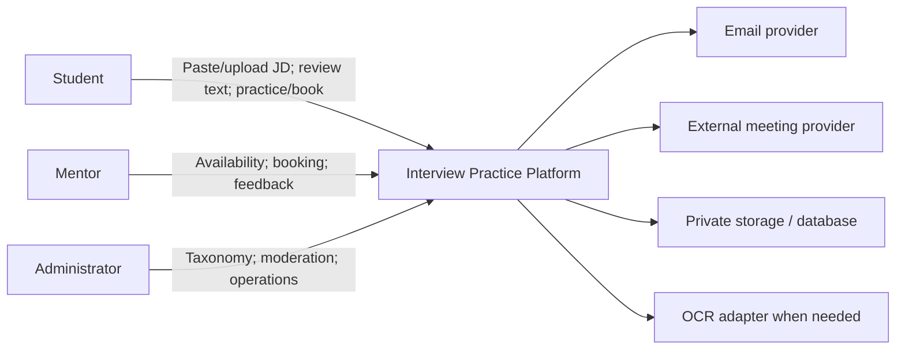

# Interview Practice Platform — Project Vision and Scope

## 1. Mục đích tài liệu

Tài liệu xác định product vision, người dùng mục tiêu, vấn đề cần giải quyết, mục tiêu sản phẩm, ranh giới MVP, giả định, ràng buộc và hướng phát triển tương lai. Đây là đầu vào cho Product Backlog, Future-State Workflow, prototype, architecture, PoC và UAT. Cấu trúc bám theo nội dung Vision & Scope trong [User Requirements, Slides 017–018](https://github.com/tnnhuaa/InterviewQuestionBank/blob/05ff4b99ae133de9b0f7c2f0de3585390b933718/docs/refs/03-2-user-requirements.md#slide-017--project-vision-and-scope-4).

## 2. Tổng quan sản phẩm

Interview Practice Platform là ứng dụng web giúp ứng viên Việt Nam chuyển một Job Description (JD) cụ thể thành kế hoạch ôn phỏng vấn có cấu trúc. Sau khi kiểm tra nội dung JD được trích xuất, người dùng nhận các requirement đã chuẩn hóa, câu hỏi liên quan cùng lý do mapping, rồi tự luyện hoặc chuyển preparation plan sang mock interview với mentor và nhận feedback.

| Thành phần | Mô tả |
|---|---|
| Người dùng chính | Sinh viên năm cuối, người chuẩn bị thực tập, người mới tốt nghiệp/chuyển hướng entry-level |
| Đầu vào chính | JD được dán dạng text hoặc upload bằng file thuộc định dạng được hỗ trợ |
| Giá trị trước marketplace | Text có thể kiểm tra/sửa, requirement chuẩn hóa, question mapping có lý do và preparation plan |
| Người cung cấp dịch vụ | Mentor có kinh nghiệm chuyên môn, phỏng vấn hoặc tuyển dụng |
| Người vận hành | Administrator/content moderator |
| Vòng lặp giá trị | JD → Preparation plan → Self-practice/Mentor → Feedback → Cập nhật kế hoạch |

## 3. Product vision

> Tạo một điểm đến đáng tin cậy để ứng viên entry-level hiểu một JD cụ thể đòi hỏi gì, biết cần luyện câu hỏi nào và có thể thực hành với mentor trong cùng một vòng lặp chuẩn bị.

## 4. Mission statement

> Giúp ứng viên biến yêu cầu tuyển dụng thành kế hoạch ôn có thể giải thích, thực hành và cải thiện bằng feedback có cấu trúc.

## 5. Product positioning

### 5.1 Vị trí hiện tại

Ứng viên đọc JD rồi tự suy luận kiến thức cần ôn, tìm câu hỏi và mentor trên nhiều nguồn, nhưng không biết requirement nào đã được bao phủ hoặc feedback liên quan thế nào đến JD ban đầu.

### 5.2 Vị trí MVP đề xuất

Một web app nhận JD, trích xuất và cho phép sửa text, phân tích requirement, chuẩn hóa taxonomy, mapping sang Question Bank và tạo preparation plan. Question Bank và Mentor Marketplace hỗ trợ thực hành sau khi kế hoạch đã hình thành; cuộc họp vẫn dùng công cụ ngoài.

### 5.3 Vị trí tương lai

Sau khi chứng minh chất lượng extraction/mapping và khả năng vận hành pilot, sản phẩm có thể bổ sung semantic recommendation, phỏng vấn tự động, payment, báo cáo tiến bộ nâng cao hoặc video tích hợp. Các khả năng này không thuộc MVP.

### 5.4 Positioning statement

> Dành cho ứng viên Việt Nam chuẩn bị thực tập hoặc công việc entry-level, Interview Practice Platform chuyển một JD cụ thể thành requirement, câu hỏi liên quan và preparation plan có thể kiểm tra. Khác với việc tự ghép tài liệu và mentor rời rạc, sản phẩm giữ liên kết từ JD → câu hỏi → buổi luyện → feedback → hành động tiếp theo.

## 6. Problem statement

### 6.1 Vấn đề chính

Ứng viên đọc một JD cụ thể nhưng không biết cần ôn kiến thức, kỹ năng và câu hỏi nào để chuẩn bị phỏng vấn. Đây là giả thuyết sản phẩm cần được kiểm chứng bằng discovery interview; chưa được xem là kết quả nghiên cứu đã xác nhận. Cách mô tả khoảng cách giữa current state và goal state dựa trên [Business Requirements, Slide 019](https://github.com/tnnhuaa/InterviewQuestionBank/blob/05ff4b99ae133de9b0f7c2f0de3585390b933718/docs/refs/03-1-business-requirements.md#slide-019--problem-definition-2).

### 6.2 Pain point hiện tại

- Ứng viên phải tự suy luận requirement, seniority, kỹ năng và công nghệ từ JD.
- Nội dung ôn tập rải rác; không có mapping cho biết requirement nào đã được bao phủ.
- JD dạng file hoặc ảnh có thể trích xuất sai nhưng người dùng không có bước xác nhận rõ ràng.
- Câu hỏi được tìm thấy thường thiếu lý do liên quan đến JD cụ thể.
- Tìm mentor và chốt lịch qua nhiều kênh tốn thời gian.
- Mentor thường nhận yêu cầu thiếu JD, topic và nhóm câu hỏi cần luyện.
- Feedback rời rạc, khó chuyển thành hành động cập nhật kế hoạch ôn.

### 6.3 Product opportunity

JD intake và preparation plan tạo giá trị trước khi người dùng cần mentor. Taxonomy dùng chung nối raw requirement với Question Bank; booking mang theo JD/preparation-plan context; feedback quay lại cùng kế hoạch. Marketplace vì vậy là bước thực hành và kiểm chứng, không còn là điểm bắt đầu duy nhất.

## 7. Target users

### 7.1 Primary persona — Ứng viên chuẩn bị cho một JD cụ thể

| Thuộc tính | Mô tả |
|---|---|
| Ví dụ | An, sinh viên năm ba CNTT có JD Front-end Intern cần ứng tuyển trong ba tuần |
| Mục tiêu | Biết requirement nào cần ôn và chuyển chúng thành kế hoạch khả thi |
| Hành vi hiện tại | Đọc JD, tìm từ khóa trên blog/video/cộng đồng, tự lưu câu hỏi |
| Pain | Không biết mình hiểu JD đúng chưa và câu hỏi nào thực sự liên quan |
| Nhu cầu | Text có thể kiểm tra, requirement/topic chuẩn hóa, câu hỏi có lý do, mentor đúng chuyên môn |
| Success moment | Xác nhận text JD, hiểu mapping và bắt đầu luyện từ preparation plan mà không cần tự tổng hợp lại |

### 7.2 Secondary persona — Người mới tốt nghiệp/chuyển hướng entry-level

Cần hiểu kỳ vọng của vị trí mới, phát hiện khoảng trống kiến thức và thực hành trong bối cảnh gần phỏng vấn thật nhưng có mạng lưới hạn chế.

### 7.3 Supply persona — Mentor/người phỏng vấn

Muốn chia sẻ kinh nghiệm và xây dựng uy tín; cần JD, topic, câu hỏi và mục tiêu rõ ràng, lịch chủ động, công cụ quản lý booking và rubric đủ nhanh để sử dụng.

### 7.4 Operational persona — Administrator

Cần quản lý taxonomy/alias, câu hỏi, mentor, booking và report; giữ audit trail mà không được xem toàn bộ dữ liệu JD riêng tư nếu không có thẩm quyền nghiệp vụ.

## 8. Product goals and measures

Goal là requirement cấp cao và requirement chi tiết phải đóng góp trực tiếp vào goal theo [Business Requirements, Slides 044–046](https://github.com/tnnhuaa/InterviewQuestionBank/blob/05ff4b99ae133de9b0f7c2f0de3585390b933718/docs/refs/03-1-business-requirements.md#slide-044--goals). Các target dưới đây là ngưỡng đề xuất; baseline phải được đo bằng discovery, bộ JD pilot, usability test hoặc dữ liệu pilot trước khi dùng để kết luận.

| ID | Goal | Measure/công thức | Baseline | Target đề xuất | Nguồn đo | Owner |
|---|---|---|---|---:|---|---|
| OBJ-01 | Xác nhận pain JD-preparation | Người tham gia xác nhận pain / mẫu hợp lệ | Chưa đo | ≥70% | Discovery round | Research owner |
| OBJ-02 | Nhập và kiểm tra JD thành công | Người hoàn tất nhập/upload, extraction và xác nhận text / lượt thử hợp lệ | Chưa đo | ≥80% | Usability + extraction events | UX/PO |
| OBJ-03 | Nhận diện đúng requirement pilot | Expected requirement được phát hiện / expected requirement trong bộ test | Chưa đo | ≥80% | Labeled JD test set | PO/Content |
| OBJ-04 | Mapping có liên quan và giải thích được | Kết quả relevant / kết quả được reviewer chấm; kết quả đủ source/topic/reason / tổng kết quả | Chưa đo | ≥80%; 100% | Expert review + match records | PO/Content |
| OBJ-05 | Bắt đầu luyện từ preparation plan | Người mở câu hỏi hoặc mentor flow từ plan / người có plan hợp lệ | Chưa đo | ≥80% | Usability/product events | UX/PO |
| OBJ-06 | Booking có ngữ cảnh và đáng tin cậy | Booking hợp lệ có JD/plan / lượt thử; Completed / Confirmed | Chưa đo | ≥80%; ≥80% | Usability + booking events | Operations |
| OBJ-07 | Feedback có thể hành động | Feedback đủ strength + weakness + next action / Completed bookings | Chưa đo | ≥90% | Feedback records | PO |
| OBJ-08 | Người học cảm nhận tiến bộ | Helpfulness trung bình; post-confidence − pre-confidence | Chưa đo | ≥4/5; +1/5 | Survey | Research owner |

### 8.1 Goal-to-capability mapping

| Objective | Capability | Verification path |
|---|---|---|
| OBJ-01 | Problem statement và discovery evidence | Research note + review decision |
| OBJ-02 | JD text/file intake, extraction/OCR routing và manual correction | TC-JD + prototype task |
| OBJ-03 | Requirement detection, alias và taxonomy normalization | Labeled JD cases + TC-MAP |
| OBJ-04 | Versioned question mapping và match reason | Expert relevance review + TC-MAP |
| OBJ-05 | Preparation plan, Question Bank và self-practice | Prototype task + TC-PLAN/TC-Q |
| OBJ-06 | Plan-to-mentor handoff, booking lifecycle và notification | PoC + TC-B/TC-N |
| OBJ-07 | Feedback rubric, privacy và plan update | TC-F + completeness KPI |
| OBJ-08 | Feedback-to-practice loop và survey | Workflow walkthrough + survey |

## 9. MVP scope

Scope statement nêu rõ inclusion, exclusion, deliverable, constraint và assumption theo [User Requirements, Slide 018](https://github.com/tnnhuaa/InterviewQuestionBank/blob/05ff4b99ae133de9b0f7c2f0de3585390b933718/docs/refs/03-2-user-requirements.md#slide-018--project-scope-statement-5).

### 9.1 In scope

- Tài khoản, xác thực và RBAC cho Student/Mentor/Admin.
- Nhập JD bằng text hoặc upload file. Baseline PoC hỗ trợ PDF, PNG, JPEG và tối đa 10 MB/file; giới hạn số trang, language pack, timeout và việc áp dụng nguyên trạng cho MVP cần được phê duyệt.
- Direct text extraction cho file có text; OCR fallback cho ảnh hoặc PDF scan trong giới hạn pilot.
- Hiển thị và cho Student sửa text trước khi phân tích.
- Nhận diện position, seniority, skill, technology và requirement chính; lưu raw evidence.
- Chuẩn hóa keyword/alias theo taxonomy dùng chung.
- Rule-based question mapping có matching version; chỉ dùng Question Published hợp lệ.
- Mỗi kết quả có requirement nguồn, topic chuẩn hóa, score/reason; preparation plan thuộc Student.
- Question Bank: browse/search/filter, detail, bookmark và progress cơ bản.
- Mentor profile, verification, expertise và availability.
- Booking tham chiếu JD hoặc preparation plan; mentor chỉ xem context tối thiểu cần thiết.
- Booking lifecycle, external meeting link, notification, feedback rubric, review và admin tối thiểu.

### 9.2 Out of scope

- AI interviewer, chatbot phỏng vấn, automatic scoring hoặc voice/video analysis.
- ML/semantic recommendation; PoC dùng keyword, alias, taxonomy và rule-based scoring.
- OCR cho mọi định dạng, ngôn ngữ hoặc tài liệu không phải JD.
- Built-in video call, recording và transcription.
- Automated payment, escrow và mentor payout.
- Native mobile app, ATS/job application và marketplace production-scale.

## 10. Scope boundary

| Năng lực | MVP | Future |
|---|---:|---:|
| JD text/file intake | Có | Thêm nguồn tích hợp |
| Direct extraction + OCR fallback giới hạn | Có | Mở rộng format/ngôn ngữ sau đánh giá |
| Manual correction trước analysis | Có | Hỗ trợ review nâng cao |
| Rule-based requirement/question mapping | Có | Semantic/ML recommendation sau khi có evidence |
| Preparation plan và Question Bank | Có | Cá nhân hóa/analytics nâng cao |
| Mentor profile/verification/booking | Có | Marketplace production-scale |
| External meeting link | Có | Video tích hợp |
| Feedback rubric và review | Có | Phân tích feedback nâng cao |
| Payment | Không | Payment/escrow/payout sau phê duyệt |

Platform là source of truth cho JD processing status, corrected text, normalized requirement, question-mapping data, preparation plan, user role, question state, slot, booking và feedback. OCR chỉ là phương pháp lấy text từ ảnh/PDF scan, không đồng nghĩa với toàn bộ JD analysis. Email, meeting và OCR provider nếu có là hệ thống liền kề; provider failure không được tự thay đổi booking hoặc ghi nhận kết quả analysis sai thành công.

Current business flow là: đọc JD → tự suy luận nội dung cần ôn → tìm câu hỏi/tài liệu/mentor trên nhiều nguồn → không biết requirement nào đã được bao phủ → điều phối lịch ngoài hệ thống → nhận feedback rời rạc. Target flow được mô tả trong [Future-State Workflow](Future_State_Workflow.md).

## 11. Giả định

- Có bộ JD mẫu đã loại dữ liệu nhạy cảm và expected requirement để đánh giá pilot.
- Taxonomy, alias và Question Published đủ bao phủ phân khúc nghề nghiệp pilot.
- Student sẵn sàng kiểm tra/sửa text trước khi phân tích.
- Có thể tuyển đủ mentor và Student cho usability test/pilot nhỏ.
- Mentor chấp nhận xem context tối thiểu và dùng feedback rubric chung.
- Công cụ họp ngoài và hạ tầng pilot đáp ứng luồng cơ bản.

## 12. Ràng buộc

- Thời lượng dự kiến là 12 tuần; capacity planning hiện dùng 6 thành viên × 16 giờ/tuần, khoảng 979 giờ sau reserve 15%. Scope JD-first vẫn phải được re-estimate trước khi baseline trở thành commitment.
- Architecture đã chọn cho PoC: paste/PDF/PNG/JPEG, tối đa 10 MB/file, direct extraction trước và internal OCR fallback. Số trang, language pack, timeout và việc ratify cho MVP phải được Architecture/PO chốt trước khi story liên quan đạt Ready.
- OCR quality phụ thuộc file/ảnh; Student correction là gate bắt buộc trước analysis.
- Mapping chỉ có ý nghĩa trong taxonomy và Question Bank pilot; không tuyên bố bao phủ mọi nghề nghiệp.
- JD có thể chứa dữ liệu cá nhân hoặc thông tin công ty; file/text/mapping/plan cần object authorization, retention và deletion policy.
- Marketplace vẫn có rủi ro demand/supply, nhưng preparation plan tạo giá trị trước booking.
- Tích hợp bên thứ ba có quota và outage.

## 13. Future backlog

| Candidate | Lý do chưa thuộc MVP |
|---|---|
| Semantic/ML question recommendation | Cần dataset, quality baseline, privacy review và kiểm thử bias/hallucination |
| Phỏng vấn tự động và chấm câu trả lời | Tăng đáng kể rủi ro accuracy, fairness và dữ liệu nhạy cảm |
| OCR đa ngôn ngữ/đa định dạng quy mô lớn | Vượt mục tiêu PoC và tăng chi phí vận hành |
| Ghi âm, phiên âm và phân tích giao tiếp | Tăng phạm vi kỹ thuật, consent và retention |
| Payment, escrow, refund và mentor payout | Cần policy, compliance và vận hành tài chính |
| Calendar sync hai chiều và video tích hợp | External link đáp ứng core workflow của MVP |
| Subscription, group session và enterprise partnership | Chỉ xem xét sau khi pilot xác nhận nhu cầu |
