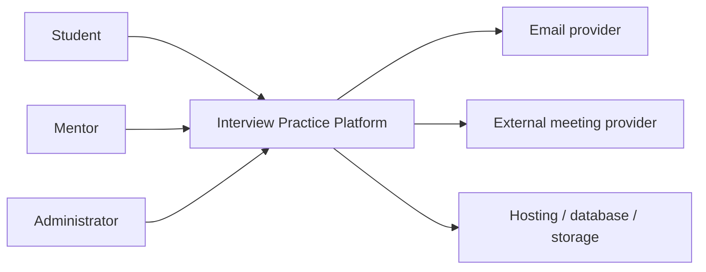

# Interview Practice Platform — Project Vision and Scope

## 1. Mục đích tài liệu

Tài liệu xác định product vision, người dùng mục tiêu, vấn đề cần giải quyết, mục tiêu sản phẩm, ranh giới MVP, giả định, ràng buộc và hướng phát triển tương lai. Đây là đầu vào cho Product Backlog, Future-State Workflow, prototype, architecture và UAT. Cấu trúc bám theo nội dung Vision & Scope trong [User Requirements, Slides 017–018](https://github.com/tnnhuaa/InterviewQuestionBank/blob/05ff4b99ae133de9b0f7c2f0de3585390b933718/docs/refs/03-2-user-requirements.md#slide-017--project-vision-and-scope-4).

## 2. Tổng quan sản phẩm

Interview Practice Platform là ứng dụng web dành cho sinh viên Việt Nam chuẩn bị thực tập hoặc công việc entry-level. Sản phẩm kết hợp Question Bank có cấu trúc với Mentor Marketplace để người dùng đi từ tự luyện đến mock interview, feedback và hành động cải thiện.

| Thành phần | Mô tả |
|---|---|
| Người dùng chính | Sinh viên năm cuối, người chuẩn bị thực tập, người mới tốt nghiệp |
| Người cung cấp dịch vụ | Mentor có kinh nghiệm chuyên môn, phỏng vấn hoặc tuyển dụng |
| Người vận hành | Administrator/content moderator |
| Giá trị chính | Giảm thời gian tìm kiếm, tăng cơ hội luyện tập và chuẩn hóa feedback |

## 3. Product vision

> Tạo một điểm đến đáng tin cậy để ứng viên entry-level tại Việt Nam biết cần luyện gì, tìm được người phù hợp để thực hành và biến feedback thành bước chuẩn bị tiếp theo.

## 4. Mission statement

> Giúp người học chuyển từ đọc câu hỏi thụ động sang luyện tập có mục tiêu, phản hồi và tiến bộ đo được.

## 5. Product positioning

### 5.1 Vị trí hiện tại

Nội dung, mentor, lịch và feedback nằm trên nhiều công cụ. Người học tự nối quy trình và chịu phần lớn chi phí điều phối.

### 5.2 Vị trí MVP đề xuất

Một web app tích hợp taxonomy câu hỏi, hồ sơ/lịch mentor, booking và feedback rubric; công cụ họp vẫn do nhà cung cấp ngoài đảm nhiệm.

### 5.3 Vị trí tương lai

Sau khi chứng minh nhu cầu và khả năng vận hành marketplace, sản phẩm có thể bổ sung payment, lộ trình cá nhân hóa, báo cáo tiến bộ và AI-assisted practice. Các khả năng này không thuộc MVP.

### 5.4 Positioning statement

> Dành cho sinh viên Việt Nam chuẩn bị thực tập hoặc công việc đầu tiên, Interview Practice Platform kết hợp bộ câu hỏi có cấu trúc với booking mentor theo nhu cầu. Khác với việc tự thu thập tài liệu và tìm mentor rời rạc, sản phẩm tạo một vòng lặp chuẩn bị → thực hành → feedback → luyện lại trong cùng hệ thống.

## 6. Problem statement

### 6.1 Vấn đề chính

Sinh viên thiếu một workflow đơn giản và đáng tin cậy để chuyển từ chuẩn bị kiến thức sang mock interview với mentor và nhận feedback có cấu trúc. Đây là giả thuyết sản phẩm cần được kiểm chứng bằng discovery interview; chưa được xem là kết quả nghiên cứu đã xác nhận. Cách mô tả khoảng cách giữa current state và goal state dựa trên [Business Requirements, Slide 019](https://github.com/tnnhuaa/InterviewQuestionBank/blob/05ff4b99ae133de9b0f7c2f0de3585390b933718/docs/refs/03-1-business-requirements.md#slide-019--problem-definition-2).

### 6.2 Pain point hiện tại

- Nội dung rải rác, trùng lặp và khó đánh giá độ tin cậy.
- Người học không biết câu trả lời đã rõ và đúng trọng tâm chưa.
- Tìm mentor và chốt lịch qua tin nhắn tốn thời gian.
- Chất lượng feedback không đồng nhất.
- Điểm yếu thường chỉ lộ ra trong phỏng vấn thật.
- Mentor nhận yêu cầu thiếu mục tiêu, bối cảnh và thời gian rõ ràng.

### 6.3 Product opportunity

Question Bank tạo điểm vào và ngữ cảnh luyện tập; Marketplace cung cấp feedback con người. Khi hai phần dùng chung vị trí, chủ đề và lịch sử luyện, sản phẩm tạo một vòng lặp học tập nhất quán hơn hai công cụ rời.

## 7. Target users

### 7.1 Primary persona — Sinh viên chuẩn bị thực tập

| Thuộc tính | Mô tả |
|---|---|
| Ví dụ | An, sinh viên năm ba CNTT |
| Mục tiêu | Sẵn sàng cho phỏng vấn Front-end Intern trong ba tuần |
| Hành vi | Tìm câu hỏi từ blog/video/cộng đồng; tự ghi chú |
| Pain | Không biết cách diễn đạt; khó tìm người có kinh nghiệm đúng vị trí |
| Nhu cầu | Lộ trình câu hỏi, mentor phù hợp, lịch rõ và feedback cụ thể |
| Success moment | Hoàn thành mock interview và biết hai hành động cần làm tiếp |

### 7.2 Secondary persona — Người mới tốt nghiệp/chuyển hướng entry-level

Cần rà soát kiến thức, hiểu kỳ vọng của vị trí mới và thực hành trong bối cảnh gần phỏng vấn thật nhưng có mạng lưới hạn chế.

### 7.3 Supply persona — Mentor/người phỏng vấn

Muốn chia sẻ kinh nghiệm và xây dựng uy tín; cần yêu cầu rõ, lịch chủ động, công cụ quản lý booking và rubric đủ nhanh để sử dụng.

### 7.4 Operational persona — Administrator

Cần duyệt mentor/câu hỏi, theo dõi booking, xử lý report và giữ audit trail mà không can thiệp thủ công vào mọi giao dịch.

## 8. Product goals and measures

Các goal là requirement cấp cao; requirement chi tiết phải đóng góp trực tiếp vào goal theo [Business Requirements, Slides 044–046](https://github.com/tnnhuaa/InterviewQuestionBank/blob/05ff4b99ae133de9b0f7c2f0de3585390b933718/docs/refs/03-1-business-requirements.md#slide-044--goals). Các target dưới đây là ngưỡng đề xuất và cần được xác nhận bằng discovery, usability test hoặc dữ liệu pilot.

| ID | Goal | Measure/công thức | Baseline | Target đề xuất | Nguồn đo | Owner |
|---|---|---|---|---:|---|---|
| OBJ-01 | Xác nhận pain cốt lõi | Người tham gia xác nhận ít nhất một pain / tổng người tham gia hợp lệ | TBD | ≥ 70% | Discovery round | Research owner |
| OBJ-02 | Tìm câu hỏi hiệu quả | Task hoàn thành / task thử; median duration | TBD | ≥ 80%; ≤ 2 phút | Usability test | UX/PO |
| OBJ-03 | Tạo booking dễ | Yêu cầu booking hợp lệ / tổng lần thử | TBD | ≥ 80% | Usability test | UX/PO |
| OBJ-04 | Booking đáng tin cậy | Completed bookings / Confirmed bookings | TBD | ≥ 80% | Pilot events | Operations |
| OBJ-05 | Feedback có thể hành động | Feedback có strength + weakness + next action / Completed bookings | TBD | ≥ 90% | Pilot feedback | PO |
| OBJ-06 | Người học cảm nhận tiến bộ | Helpfulness trung bình; post-confidence − pre-confidence | TBD | ≥ 4/5; +1/5 | Survey | Research owner |

### 8.1 Goal-to-capability mapping

| Objective | Capability | Verification path |
|---|---|---|
| OBJ-01 | Discovery evidence và problem statement | Research note + review decision |
| OBJ-02 | Question taxonomy, search/filter, detail, progress | Prototype task + TC-Q |
| OBJ-03 | Mentor discovery, availability, booking request | Prototype task + TC-SLOT/TC-B |
| OBJ-04 | Booking lifecycle, slot consistency, notification | PoC + booking event KPI |
| OBJ-05 | Feedback rubric, review và privacy | TC-F + completeness KPI |
| OBJ-06 | Feedback-to-practice loop và survey | Workflow walkthrough + survey |

## 9. MVP scope

Scope statement cần nêu rõ inclusion, exclusion, deliverable, constraint và assumption theo [User Requirements, Slide 018](https://github.com/tnnhuaa/InterviewQuestionBank/blob/05ff4b99ae133de9b0f7c2f0de3585390b933718/docs/refs/03-2-user-requirements.md#slide-018--project-scope-statement-5).

### 9.1 In scope

- Tài khoản, xác thực và RBAC cho Student/Mentor/Admin.
- Student profile và mục tiêu phỏng vấn.
- Question taxonomy, browse/search/filter, detail, bookmark và progress cơ bản.
- Mentor profile, verification, expertise và availability.
- Booking request, accept/reject/reschedule/cancel/complete và chống trùng slot.
- External meeting link và notification cần thiết cho booking.
- Feedback rubric và review sau booking.
- Admin moderation, report và operational metrics cơ bản.

### 9.2 Out of scope

- AI interviewer, automatic scoring, voice/video analysis.
- Built-in video call, recording và transcription.
- Automated payment, escrow và mentor payout.
- Native mobile app, ATS/job application và ML recommendation.
- Marketplace đa quốc gia hoặc coaching ngoài phỏng vấn.

## 10. Scope boundary

| Năng lực | MVP | Future |
|---|---:|---:|
| Question Bank có taxonomy | Có | Mở rộng nội dung/cá nhân hóa |
| Mentor profile/verification | Có | Xác minh nâng cao |
| Availability/booking | Có | Calendar sync nâng cao |
| External meeting link | Có | Video tích hợp |
| Feedback rubric | Có | Phân tích feedback nâng cao |
| Review hợp lệ | Có | Reputation nâng cao |
| Payment | Không | Payment/escrow/payout sau khi được phê duyệt |

Platform là source of truth cho user role, question state, slot, booking, feedback và audit. Email/meeting provider là hệ thống liền kề; provider failure không được tự thay đổi booking state. Built-in meeting, automated payment và AI service nằm ngoài system boundary của MVP.

Current business flow là: chọn vị trí/JD → tìm câu hỏi từ nhiều nguồn → tự lưu/luyện → tìm mentor qua mạng lưới → điều phối bằng tin nhắn/lịch → họp ngoài → nhận feedback tự do. Target flow được mô tả riêng trong [Future-State Workflow](Future_State_Workflow.md).

## 11. Giả định

- Có thể tuyển đủ mentor và sinh viên cho pilot nhỏ.
- Người dùng chấp nhận công cụ họp ngoài.
- Mentor chấp nhận feedback rubric chung.
- Nội dung pilot có thể được nhóm/mentor biên soạn hợp pháp.
- Free tier đủ cho giai đoạn phát triển và pilot nhỏ.

## 12. Ràng buộc

- Thời lượng dự kiến là 12 tuần; capacity của Tuấn Anh và ngân sách cuối cùng cần được xác nhận.
- Marketplace cần đồng thời demand và supply.
- Booking, meeting link và feedback chứa dữ liệu riêng tư.
- Nội dung phỏng vấn có nguy cơ sai, lỗi thời hoặc vi phạm bản quyền.
- Tích hợp bên thứ ba có quota và outage.

## 13. Future backlog

| Candidate | Lý do chưa thuộc MVP |
|---|---|
| AI interviewer và gợi ý cải thiện câu trả lời | Cần kiểm chứng giá trị, độ chính xác và privacy |
| Ghi âm, phiên âm và phân tích giao tiếp | Tăng đáng kể phạm vi kỹ thuật và dữ liệu nhạy cảm |
| Payment, escrow, refund và mentor payout | Cần policy, compliance và vận hành tài chính |
| Calendar sync hai chiều và video tích hợp | External link đáp ứng core workflow của MVP |
| Personalized learning path và analytics nâng cao | Phụ thuộc dữ liệu sử dụng đủ tin cậy |
| Subscription, coupon, group session và enterprise partnership | Chỉ xem xét sau khi pilot xác nhận nhu cầu |
