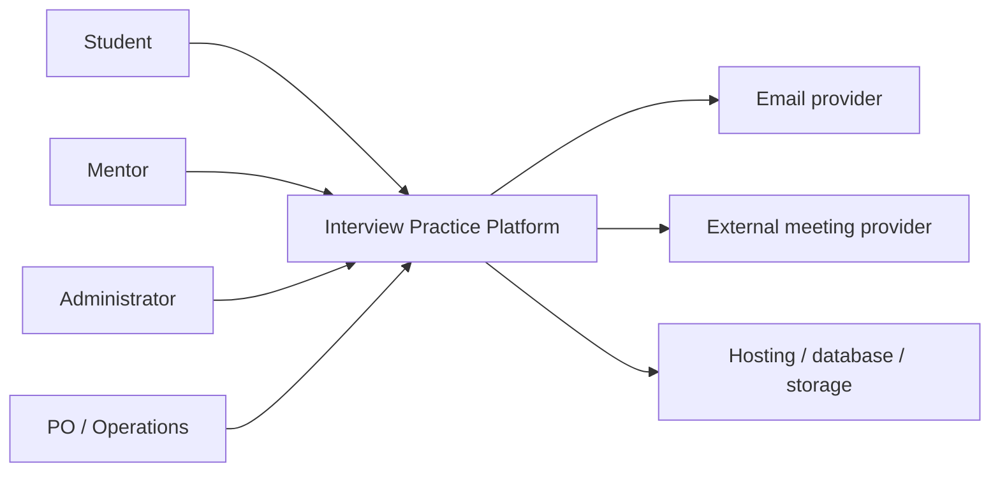

# Interview Practice Platform — Project Vision and Scope

> **AI-assisted reference version — Pending human audit.** Codex hỗ trợ tổng hợp và kiểm tra; Hưng/Product Owner phải xác minh evidence, quyết định scope và phê duyệt baseline. Tài liệu này chưa phải Approved baseline.

## 0. Kiểm soát tài liệu

| Thuộc tính | Giá trị |
|---|---|
| Owner/Producer | Hưng — Thành viên 3 |
| Công cụ hỗ trợ | Codex |
| Phiên bản | 0.2-ai-reference |
| Trạng thái | Reviewed by AI checks; pending human audit và Product Owner approval |
| Branch | `feat/member-3-scope-backlog` |
| Ngày cập nhật | 14/08/2026 |
| Reviewer/Approver | `[CẦN BỔ SUNG — Product Owner/Sponsor]` |
| Điều kiện phê duyệt | Evidence được kiểm chứng; scope/policy được chốt; backlog/workflow/RTM nhất quán; review record hoàn tất |

Theo định nghĩa baseline, tài liệu chỉ trở thành baseline sau formal review/agreement và sau đó chỉ thay đổi qua change control ([Software Configuration Management, Slide 017](../refs/07-software-configuration-management.md#slide-017--baseline-3)).

## 1. Mục đích tài liệu

Tài liệu xác định product vision, người dùng, mục tiêu và ranh giới MVP. Đây là nguồn tham chiếu cho backlog, kiến trúc, prototype, UAT và change control.

### 1.1 Nguồn và trạng thái bằng chứng

| ID | Nguồn | Loại | Cách sử dụng | Trạng thái |
|---|---|---|---|---|
| E-01 | [Project Proposal Draft](../Project_Proposal/Project_Proposal_Draft.md) | Tài liệu dự án | Problem, solution concept, MVP boundary | Internal source; chưa phải discovery evidence |
| E-02 | [Project Charter](../Project_Governance%20%26%20Stakeholder/Project_Charter.md) | Tài liệu governance | Goal, success criteria, deliverable, risk | Draft; còn trường cần bổ sung |
| E-03 | [Stakeholder Analysis](../Project_Governance%20%26%20Stakeholder/Stakeholder_Analysis.md) | Tài liệu dự án | Stakeholder/authority/decision owner | Draft; còn owner cần bổ sung |
| E-04 | [Current-State Workflow](Current_State_Workflow.md) | Baseline giả thuyết | Current process và pain point cần kiểm chứng | Hypothesis, chưa được discovery xác nhận |
| E-05 | [Feasibility Study](../Project_Feasibility/feasibility.md) | Phân tích dự án | Điều kiện kỹ thuật/vận hành và Go/No-Go gate | Conditional |
| E-06 | Interview/research notes | Primary evidence | Xác nhận problem, user, priority và policy | **Chưa có trong repository** |

Quy tắc evidence: nội dung chưa được E-06 xác nhận phải được hiểu là **hypothesis**, không phải finding thực tế. Không tạo tỷ lệ, trích dẫn người tham gia hoặc conclusion phỏng vấn khi chưa có source. Cách tiếp cận bắt đầu từ user/problem/need/goal theo [User Requirements, Slide 005](../refs/03-2-user-requirements.md#slide-005--discovering-user-requirements); customer discovery phải ghi rõ ai, ở đâu, thu gì và bằng cách nào theo [Business Requirements, Slide 049](../refs/03-1-business-requirements.md#slide-049--customer-discovery-for-a-product).

## 2. Tổng quan sản phẩm

Interview Practice Platform là ứng dụng web dành cho sinh viên Việt Nam chuẩn bị thực tập hoặc công việc entry-level. Sản phẩm cung cấp Question Bank có cấu trúc và Mentor Marketplace để người dùng đi từ tự luyện đến mock interview, feedback và hành động cải thiện.

| Thành phần | Mô tả |
|---|---|
| Người dùng chính | Sinh viên năm cuối, người chuẩn bị thực tập, người mới tốt nghiệp |
| Người cung cấp dịch vụ | Mentor có kinh nghiệm chuyên môn/phỏng vấn/tuyển dụng |
| Người vận hành | Administrator/content moderator |
| Giá trị | Giảm thời gian tìm kiếm, tăng cơ hội luyện thật và chuẩn hóa feedback |

## 3. Product vision

Tạo một điểm đến đáng tin cậy để ứng viên entry-level tại Việt Nam biết cần luyện gì, tìm được người phù hợp để thực hành và biến feedback thành bước chuẩn bị tiếp theo.

## 4. Mission statement

Giúp người học chuyển từ đọc câu hỏi thụ động sang luyện tập có mục tiêu, phản hồi và tiến bộ đo được.

## 5. Product positioning

### 5.1 Vị trí hiện tại

Nội dung, mentor, lịch và feedback nằm trên nhiều công cụ. Người học tự nối quy trình và chịu phần lớn chi phí điều phối.

### 5.2 Vị trí MVP đề xuất

Một web app tích hợp taxonomy câu hỏi, hồ sơ/lịch mentor, booking và feedback rubric; công cụ họp vẫn do nhà cung cấp ngoài đảm nhiệm.

### 5.3 Vị trí tương lai

Sau khi chứng minh demand/supply và unit economics, sản phẩm có thể bổ sung payment, lộ trình cá nhân hóa, báo cáo tiến bộ và AI-assisted practice. Các khả năng này không thuộc MVP.

### 5.4 Positioning statement

> Dành cho sinh viên Việt Nam chuẩn bị thực tập hoặc công việc đầu tiên, Interview Practice Platform kết hợp bộ câu hỏi có cấu trúc với booking mentor theo nhu cầu. Khác với việc tự thu thập tài liệu và tìm mentor rời rạc, sản phẩm tạo một vòng lặp chuẩn bị → thực hành → feedback → luyện lại trong cùng hệ thống.

## 6. Problem statement

### 6.1 Vấn đề chính

Sinh viên thiếu một workflow đơn giản và đáng tin cậy để chuyển từ chuẩn bị kiến thức sang mock interview với mentor và nhận feedback có cấu trúc.

**Evidence status:** Hypothesis tổng hợp từ E-01 và E-04; cần E-06 xác nhận. Problem được mô tả như khoảng cách giữa current state và goal state, phù hợp [Business Requirements, Slide 019](../refs/03-1-business-requirements.md#slide-019--problem-definition-2).

### 6.2 Pain point hiện tại

- Nội dung rải rác, trùng lặp và khó đánh giá độ tin cậy.
- Người học không biết câu trả lời đã rõ và đúng trọng tâm chưa.
- Tìm mentor và chốt lịch qua tin nhắn tốn thời gian.
- Chất lượng feedback không đồng nhất.
- Điểm yếu thường chỉ lộ ra trong phỏng vấn thật.
- Mentor nhận yêu cầu thiếu mục tiêu, bối cảnh và thời gian rõ ràng.

### 6.3 Product opportunity

Question Bank tạo điểm vào và ngữ cảnh luyện tập; Marketplace cung cấp feedback con người. Khi hai phần dùng chung vị trí, chủ đề và lịch sử luyện, sản phẩm có thể tạo giá trị lớn hơn tổng của hai công cụ rời.

## 7. Target users

### 7.1 Primary persona — Sinh viên chuẩn bị thực tập

| Thuộc tính | Mô tả |
|---|---|
| Ví dụ | An, sinh viên năm ba CNTT |
| Mục tiêu | Sẵn sàng cho phỏng vấn Front-end Intern trong ba tuần |
| Hành vi | Tìm câu hỏi từ blog/video/cộng đồng; tự ghi chú |
| Pain | Không biết cách diễn đạt; khó tìm người có kinh nghiệm đúng vị trí |
| Nhu cầu | Lộ trình câu hỏi, mentor phù hợp, lịch rõ và feedback cụ thể |
| Success moment | Hoàn thành mock interview và biết hai hành động cần làm tiếp |

### 7.2 Secondary persona — Người mới tốt nghiệp/chuyển hướng entry-level

Cần rà soát kiến thức, hiểu kỳ vọng của vị trí mới và thực hành trong bối cảnh gần phỏng vấn thật nhưng có mạng lưới hạn chế.

### 7.3 Supply persona — Mentor/người phỏng vấn

Muốn chia sẻ kinh nghiệm, xây dựng uy tín hoặc tạo thu nhập; cần yêu cầu rõ, lịch chủ động, công cụ quản lý booking và rubric đủ nhanh để sử dụng.

### 7.4 Operational persona — Administrator

Cần duyệt mentor/câu hỏi, theo dõi booking, xử lý report và giữ audit trail mà không can thiệp thủ công vào mọi giao dịch.

## 8. Product goals and measures

Các goal là requirement cấp cao; requirement chi tiết phải đóng góp tích cực vào goal ([Business Requirements, Slides 044-046](../refs/03-1-business-requirements.md#slide-044--goals)). Target dưới đây là **proposed threshold** từ E-02/E-05, chưa phải observed result.

| ID | Goal | Measure/công thức | Baseline | Target đề xuất | Nguồn đo/time window | Owner | Status |
|---|---|---|---|---:|---|---|---|
| OBJ-01 | Xác nhận pain cốt lõi | participants confirming at least one core pain / valid discovery participants | TBD | ≥ 70% | Discovery round trước scope approval | Research owner `[TBD]` | Hypothesis |
| OBJ-02 | Tìm câu hỏi hiệu quả | completed search tasks / attempted tasks; median duration | TBD | ≥ 80%; ≤ 2 phút | Prototype/usability sessions | UX/PO `[TBD]` | Proposed |
| OBJ-03 | Tạo booking dễ | valid booking requests / attempts | TBD | ≥ 80% | Prototype/usability sessions | UX/PO `[TBD]` | Proposed |
| OBJ-04 | Booking đáng tin cậy | Completed bookings / Confirmed bookings | TBD | ≥ 80% | Pilot booking events | Operations `[TBD]` | Proposed |
| OBJ-05 | Feedback có thể hành động | feedback có strength + weakness + next action / Completed bookings | TBD | ≥ 90% | Pilot feedback records | PO `[TBD]` | Proposed |
| OBJ-06 | Người học cảm nhận tiến bộ | average helpfulness; average post-confidence - pre-confidence | TBD | ≥ 4/5; +1/5 | Post-session và pre/post survey | Research owner `[TBD]` | Proposed |

### 8.1 Goal-to-feature mapping

| Objective | High-level feature/capability | Verification path |
|---|---|---|
| OBJ-01 | Discovery evidence và validated problem statement | Research note + review decision |
| OBJ-02 | Question taxonomy, search/filter, detail, progress | Prototype tasks + TC-Q |
| OBJ-03 | Mentor discovery, availability, booking request | Prototype tasks + TC-SLOT/TC-B |
| OBJ-04 | Booking lifecycle, slot consistency, notification | PoC + booking event KPI |
| OBJ-05 | Feedback rubric, review và privacy | TC-F + completeness KPI |
| OBJ-06 | Feedback-to-practice loop và survey | Workflow walkthrough + survey |

## 9. MVP scope

### 9.1 In scope

- Tài khoản, xác thực và RBAC cho Student/Mentor/Admin.
- Student profile và mục tiêu phỏng vấn.
- Question taxonomy, browse/search/filter, detail, bookmark và progress cơ bản.
- Mentor profile, verification, expertise, service scope, pricing placeholder và availability.
- Booking request, accept/reject/reschedule/cancel/complete và chống trùng slot.
- External meeting link, email/in-app notification.
- Feedback rubric và review sau booking.
- Admin moderation, report và operational metrics cơ bản.

### 9.2 Out of scope

- AI interviewer, automatic scoring, voice/video analysis.
- Built-in video call, recording và transcription.
- Automated payment/escrow/payout.
- Native mobile app, ATS/job application và ML recommendation.
- Marketplace đa quốc gia hoặc coaching ngoài phỏng vấn.

## 10. Scope boundary

| Năng lực | MVP | Future |
|---|---:|---:|
| Question Bank có taxonomy | Có | Mở rộng nội dung/cá nhân hóa |
| Mentor profile/verification | Có | Xác minh nâng cao |
| Availability/booking | Có | Calendar sync nâng cao |
| External meeting link | Có | Video tích hợp |
| Feedback rubric | Có | AI-assisted analysis |
| Review hợp lệ | Có | Reputation nâng cao |
| Manual/free pilot payment | Có thể | Payment/payout tự động |

### 10.1 Product scope và project scope

Product scope là features/functions của sản phẩm; project scope là work để tạo ra sản phẩm với các feature đó ([Software Project, Slide 009](../refs/02-software-project.md#slide-009--product-scope-vs-project-scope)).

| Loại | Trong phạm vi | Ngoài phạm vi |
|---|---|---|
| Product scope | Các capability tại mục 9.1 và boundary MVP ở mục 10 | Các capability tại mục 9.2/Future Backlog nếu chưa có approved change request |
| Project scope | Discovery; requirement/workflow/backlog; prototype; architecture/PoC; implementation MVP; test/security/UAT; deployment pilot; documentation/handoff | Xây video/payment/AI; vận hành marketplace ở quy mô thương mại; mobile native; production multi-region |

### 10.2 Project deliverables và acceptance cấp dự án

Scope statement cần product scope, exclusions, deliverables, acceptance criteria, constraints và assumptions theo [User Requirements, Slide 018](../refs/03-2-user-requirements.md#slide-018--project-scope-statement-5).

| ID | Deliverable | Acceptance cấp dự án | Approver/verification |
|---|---|---|---|
| DEL-01 | Vision, Scope, Backlog, AC và Workflow | Traceability không có orphan MVP requirement; source/hypothesis rõ; PO chấp nhận | PO + inspection/RTM |
| DEL-02 | Clickable prototype | Core loop và exception state được walkthrough; ≥80% task target khi test | PO/UX + usability evidence |
| DEL-03 | Architecture và ADR | Scope/module/quality driver nhất quán; ADR có rationale/status | Technical owner + review |
| DEL-04 | Technical PoC | Năm technical gate trong Feasibility có Pass/Fail evidence | Technical owner + PoC report |
| DEL-05 | Web MVP/pilot | Critical workflow/authorization/negative tests pass; không còn Critical/High defect | QA/PO + test/UAT |
| DEL-06 | Delivery evidence | Deployment, guide, release note, KPI/UAT report và change/risk record cập nhật | PM/PO/Sponsor |

### 10.3 Context boundary

- Platform là source of truth cho user role, question state, slot, booking, feedback và audit.
- Email/meeting provider là adjacent systems; provider failure không được tự đổi booking state.
- Built-in meeting, automated payment và AI service nằm ngoài system boundary của MVP.

### 10.4 Current/future use case và domain references

| Required view | Source/reference | Status |
|---|---|---|
| Current business use case | [Current-State Workflow](Current_State_Workflow.md) | Hypothesis; cần discovery validation |
| Future business use case | [Future-State Workflow](Future_State_Workflow.md) | AI-assisted reference; pending human walkthrough |
| Current domain | JD/source/question notes, contact/message, calendar/meeting link, free-form feedback | Conceptual; cần interview validation |
| Future domain | User/Role, StudentGoal, Question/Taxonomy/Progress, Mentor/Verification/Slot, Booking/Transition, SessionLink, Feedback/Review/Report/Notification | Conceptual mapping; technical data model thuộc Architecture |

## 11. Giả định

- Có mentor và sinh viên đủ cho pilot.
- Người dùng chấp nhận công cụ họp ngoài.
- Mentor chấp nhận rubric chung.
- Nội dung pilot có thể được nhóm/mentor biên soạn hợp pháp.
- Free tier đủ cho giai đoạn phát triển và pilot nhỏ.

## 12. Ràng buộc

- Chưa có baseline về team, lịch và ngân sách.
- Marketplace cần đồng thời demand và supply.
- Booking và feedback chứa dữ liệu riêng tư.
- Nội dung phỏng vấn có nguy cơ sai, lỗi thời hoặc vi phạm bản quyền.
- Tích hợp bên thứ ba có quota và outage.

## 13. Rủi ro, response và owner

| ID | Risk/trigger | Response | Owner/status |
|---|---|---|---|
| R-01 | Không có E-06 nhưng problem/priority bị coi là validated | Giữ Hypothesis; thu discovery evidence trước approval | Research owner `[TBD]` |
| R-02 | Thiếu mentor/slot cho pilot | Tuyển supply sớm; giới hạn segment; concierge fallback | Operations `[TBD]` |
| R-03 | Scope creep sang AI/video/payment | Future Backlog + formal change request/impact analysis | PO/PM |
| R-04 | Double booking/state inconsistency | DB constraint/transaction; concurrency PoC/test | Technical owner |
| R-05 | Meeting link/feedback/evidence bị lộ | Least privilege, object authorization, negative test, audit | Security/QA |
| R-06 | Notification/provider outage | Internal source of truth; retry/idempotency/fallback | Technical/Operations |
| R-07 | Nội dung sai/bản quyền | Provenance, moderation, report/appeal | Content/Admin |

## 14. Future backlog

- AI interviewer và gợi ý cải thiện câu trả lời.
- Ghi âm, phiên âm và phân tích giao tiếp.
- Payment, escrow, refund và mentor payout.
- Calendar sync hai chiều và video tích hợp.
- Personalized learning path và analytics nâng cao.
- Subscription, coupon, group session và enterprise/university partnership.

## 15. Open decisions

| ID | Decision cần chốt | Owner | Ảnh hưởng nếu chưa chốt |
|---|---|---|---|
| DEC-01 | Sponsor, Product Owner, PM và reviewer/approver | Sponsor/group | Không thể Approved baseline |
| DEC-02 | Pilot segment, sample size, mentor/booking target | PO/Research | OBJ-01/market validation chưa executable |
| DEC-03 | Cancellation, reschedule, no-show và completion authority | PO/Operations | BR/AC/state machine còn conditional |
| DEC-04 | Free/manual payment treatment trong pilot | PO/Sponsor | Scope/terms/operations chưa khóa |
| DEC-05 | Retention/deletion/privacy policy | PO/Privacy owner | Acceptance/security chưa đủ |
| DEC-06 | Estimate/capacity/date/budget | Team/PM/Sponsor | Chưa thể xác nhận delivery feasibility |

## 16. Kết luận và baseline readiness

Vision đề xuất giữ Question Bank -> Mentor -> Booking -> External Session -> Feedback làm core loop và loại AI/video/payment automation khỏi MVP. Bản này đáp ứng cấu trúc tham chiếu về context, current/future use case, problem/objective, inclusion/exclusion, assumption/risk và conclusion ([User Requirements, Slide 017](../refs/03-2-user-requirements.md#slide-017--project-vision-and-scope-4)).

**Readiness:** `Reviewed — conditionally ready for human audit`, chưa phải `Approved baseline`. Điều kiện nâng trạng thái: bổ sung/kiểm chứng E-06; đóng DEC-01..DEC-06 ở mức cần cho MVP; đồng bộ backlog/workflow/prototype/architecture/PoC; inspection và PO approval được ghi nhận.

## 17. Ref compliance index

| Tiêu chí | Ref | Vị trí đáp ứng |
|---|---|---|
| Product/project scope | [02, Slide 009](../refs/02-software-project.md#slide-009--product-scope-vs-project-scope) | 10.1 |
| Problem, goal, discovery | [03.1, Slides 019, 044-050](../refs/03-1-business-requirements.md#slide-019--problem-definition-2) | 1.1, 6, 8 |
| Context/scope/deliverable | [03.1, Slides 053, 055-060](../refs/03-1-business-requirements.md#slide-053--2-identify-high-level-features) | 8.1, 10.2-10.3 |
| Vision & Scope contents | [03.2, Slides 017-018](../refs/03-2-user-requirements.md#slide-017--project-vision-and-scope-4) | 1-16 |
| Baseline/approval | [07, Slides 017, 032](../refs/07-software-configuration-management.md#slide-017--baseline-3) | 0, 16 |

