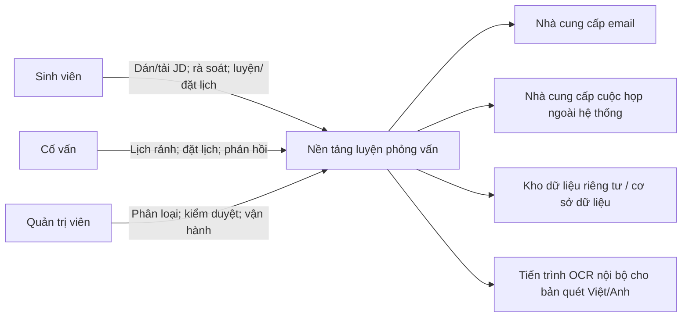

# Nền tảng luyện phỏng vấn — Tầm nhìn và phạm vi dự án

## 1. Mục đích tài liệu

Tài liệu xác định tầm nhìn sản phẩm, người dùng mục tiêu, vấn đề cần giải quyết, mục tiêu sản phẩm, ranh giới MVP, giả định, ràng buộc và hướng phát triển tương lai. Đây là đầu vào cho Danh sách công việc sản phẩm (Product Backlog), Quy trình Tương lai, nguyên mẫu, kiến trúc, PoC và UAT.

Theo Project Charter, Hưng là Product Owner/BA và chịu trách nhiệm tài liệu này. Hùng (UI/UX) được tham vấn về trải nghiệm/nghiên cứu; Trí (PoC/E2E) về kiểm chứng khả thi; Luân (Architecture/technical lead) về kiến trúc; Tuấn Anh (Trưởng nhóm / leadership & governance) về quản trị, tích hợp và readiness; Gia Thành (PM/Scrum Master, initiation & estimation) về baseline, ước lượng, lịch và rủi ro. Việc tham vấn không thay quyền sở hữu phạm vi và backlog của Product Owner.

## 2. Tổng quan sản phẩm

Nền tảng luyện phỏng vấn là ứng dụng web giúp ứng viên Việt Nam chuyển một Mô tả công việc (JD) cụ thể thành kế hoạch ôn phỏng vấn có cấu trúc. Sau khi kiểm tra nội dung JD được trích xuất, người dùng nhận các yêu cầu đã chuẩn hóa, câu hỏi liên quan cùng lý do ánh xạ, rồi tự luyện hoặc chuyển kế hoạch chuẩn bị sang buổi phỏng vấn thử với Cố vấn và nhận phản hồi.

| Thành phần | Mô tả |
|---|---|
| Người dùng chính | Sinh viên năm cuối, người chuẩn bị thực tập, người mới tốt nghiệp/chuyển hướng ở cấp đầu vào |
| Đầu vào chính | JD được dán dạng văn bản hoặc tải lên bằng tệp thuộc định dạng hỗ trợ |
| Giá trị trước danh mục Cố vấn | Văn bản có thể kiểm tra/sửa, yêu cầu chuẩn hóa, ánh xạ câu hỏi có lý do và kế hoạch chuẩn bị |
| Người cung cấp dịch vụ | Cố vấn có kinh nghiệm chuyên môn, phỏng vấn hoặc tuyển dụng |
| Người vận hành | Quản trị viên/người kiểm duyệt nội dung |
| Vòng lặp giá trị | JD → Kế hoạch chuẩn bị → Tự luyện/Cố vấn → Phản hồi → Cập nhật kế hoạch |

## 3. Tầm nhìn sản phẩm

> Tạo một điểm đến đáng tin cậy để ứng viên ở cấp đầu vào hiểu một JD cụ thể đòi hỏi gì, biết cần luyện câu hỏi nào và có thể thực hành với Cố vấn trong cùng một vòng lặp chuẩn bị.

## 4. Tuyên bố sứ mệnh

> Giúp ứng viên biến yêu cầu tuyển dụng thành kế hoạch ôn có thể giải thích, thực hành và cải thiện bằng phản hồi có cấu trúc.

## 5. Định vị sản phẩm

### 5.1 Vị trí hiện tại

Ứng viên đọc JD rồi tự suy luận kiến thức cần ôn, tìm câu hỏi và Cố vấn trên nhiều nguồn, nhưng không biết yêu cầu nào đã được bao phủ hoặc phản hồi liên quan thế nào đến JD ban đầu.

### 5.2 Vị trí MVP đề xuất

Một ứng dụng web nhận JD, trích xuất và cho phép sửa văn bản, phân tích yêu cầu, chuẩn hóa bộ phân loại, ánh xạ sang Ngân hàng câu hỏi và tạo kế hoạch chuẩn bị. Ngân hàng câu hỏi và danh mục Cố vấn hỗ trợ thực hành sau khi kế hoạch đã hình thành; cuộc họp vẫn dùng công cụ ngoài.

### 5.3 Vị trí tương lai

Sau khi chứng minh chất lượng trích xuất/ánh xạ và khả năng vận hành thử nghiệm, sản phẩm có thể bổ sung gợi ý ngữ nghĩa, phỏng vấn tự động, thanh toán, báo cáo tiến bộ nâng cao hoặc video tích hợp. Các khả năng này không thuộc MVP.

### 5.4 Tuyên bố định vị

> Dành cho ứng viên Việt Nam chuẩn bị thực tập hoặc công việc cấp đầu vào, Nền tảng luyện phỏng vấn chuyển một JD cụ thể thành yêu cầu, câu hỏi liên quan và kế hoạch chuẩn bị có thể kiểm tra. Khác với việc tự ghép tài liệu và Cố vấn rời rạc, sản phẩm giữ liên kết từ JD → câu hỏi → buổi luyện → phản hồi → hành động tiếp theo.

## 6. Phát biểu vấn đề

### 6.1 Vấn đề chính

Ứng viên đọc một JD cụ thể nhưng không biết cần ôn kiến thức, kỹ năng và câu hỏi nào để chuẩn bị phỏng vấn. Đây là giả thuyết sản phẩm cần được kiểm chứng bằng phỏng vấn khám phá; chưa được xem là kết quả nghiên cứu đã xác nhận.

### 6.2 Điểm khó khăn hiện tại

- Ứng viên phải tự suy luận yêu cầu, cấp bậc, kỹ năng và công nghệ từ JD.
- Nội dung ôn tập rải rác; không có ánh xạ cho biết yêu cầu nào đã được bao phủ.
- JD dạng file hoặc ảnh có thể trích xuất sai nhưng người dùng không có bước xác nhận rõ ràng.
- Câu hỏi được tìm thấy thường thiếu lý do liên quan đến JD cụ thể.
- Tìm Cố vấn và chốt lịch qua nhiều kênh tốn thời gian.
- Cố vấn thường nhận yêu cầu thiếu JD, chủ đề và nhóm câu hỏi cần luyện.
- Phản hồi rời rạc, khó chuyển thành hành động cập nhật kế hoạch ôn.

### 6.3 Cơ hội sản phẩm

Nhập JD và kế hoạch chuẩn bị tạo giá trị trước khi người dùng cần Cố vấn. Bộ phân loại dùng chung nối yêu cầu gốc với Ngân hàng câu hỏi; lịch hẹn mang theo ngữ cảnh JD/kế hoạch; phản hồi quay lại cùng kế hoạch. Danh mục Cố vấn vì vậy là bước thực hành và kiểm chứng, không còn là điểm bắt đầu duy nhất.

## 7. Người dùng mục tiêu

### 7.1 Chân dung chính — Ứng viên chuẩn bị cho một JD cụ thể

| Thuộc tính | Mô tả |
|---|---|
| Ví dụ | An, sinh viên năm ba CNTT có JD Thực tập sinh/Lập trình viên Front-end mới vào nghề dùng JavaScript, TypeScript hoặc React và cần ứng tuyển trong ba tuần |
| Mục tiêu | Biết yêu cầu nào cần ôn và chuyển chúng thành kế hoạch khả thi |
| Hành vi hiện tại | Đọc JD, tìm từ khóa trên blog/video/cộng đồng, tự lưu câu hỏi |
| Điểm khó khăn | Không biết mình hiểu JD đúng chưa và câu hỏi nào thực sự liên quan |
| Nhu cầu | Văn bản có thể kiểm tra, yêu cầu/chủ đề chuẩn hóa, câu hỏi có lý do, Cố vấn đúng chuyên môn |
| Thời điểm đạt giá trị | Xác nhận văn bản JD, hiểu ánh xạ và bắt đầu luyện từ kế hoạch chuẩn bị mà không cần tự tổng hợp lại |

### 7.2 Chân dung phụ — Người mới tốt nghiệp/chuyển hướng ở cấp đầu vào

Cần hiểu kỳ vọng của vị trí mới, phát hiện khoảng trống kiến thức và thực hành trong bối cảnh gần phỏng vấn thật nhưng có mạng lưới hạn chế.

### 7.3 Chân dung phía cung — Cố vấn/người phỏng vấn

Muốn chia sẻ kinh nghiệm và xây dựng uy tín; cần JD, chủ đề, câu hỏi và mục tiêu rõ ràng, lịch chủ động, công cụ quản lý đặt lịch và thang phản hồi đủ nhanh để sử dụng.

### 7.4 Chân dung vận hành — Quản trị viên

Cần quản lý bộ phân loại/tên đồng nghĩa, câu hỏi, Cố vấn, lịch hẹn và báo cáo; giữ dấu vết kiểm toán mà không được xem toàn bộ dữ liệu JD riêng tư nếu không có thẩm quyền nghiệp vụ.

## 8. Mục tiêu sản phẩm và cách đo

Mục tiêu cấp cao và yêu cầu chi tiết phải đóng góp trực tiếp vào mục tiêu sản phẩm. Các ngưỡng dưới đây là đề xuất; đường cơ sở phải được đo bằng khám phá, bộ JD thử nghiệm, kiểm thử khả dụng hoặc dữ liệu thử nghiệm trước khi dùng để kết luận.

| Mã | Mục tiêu | Số đo/công thức | Đường cơ sở | Ngưỡng đề xuất | Nguồn đo | Chủ sở hữu |
|---|---|---|---|---:|---|---|
| OBJ-01 | Xác nhận khó khăn chuẩn bị theo JD | Người tham gia xác nhận khó khăn / mẫu hợp lệ | Chưa đo | ≥70% | Vòng khám phá | Người phụ trách nghiên cứu |
| OBJ-02 | Nhập và kiểm tra JD thành công | Người hoàn tất dán/tải lên, trích xuất và xác nhận văn bản / lượt thử hợp lệ | Chưa đo | ≥80% | Khả dụng + sự kiện trích xuất | UX/PO |
| OBJ-03 | Nhận diện đúng yêu cầu thử nghiệm | Yêu cầu mong đợi được phát hiện / tổng yêu cầu mong đợi trong bộ kiểm thử | Chưa đo | ≥80% | Bộ JD có nhãn | PO/Nội dung |
| OBJ-04 | Ánh xạ liên quan và giải thích được | Kết quả liên quan / kết quả đã rà soát; kết quả đủ nguồn/chủ đề/lý do / tổng kết quả | Chưa đo | ≥80%; 100% | Chuyên gia rà soát + bản ghi ánh xạ | PO/Nội dung |
| OBJ-05 | Bắt đầu luyện từ kế hoạch chuẩn bị | Người mở câu hỏi hoặc luồng Cố vấn từ kế hoạch / người có kế hoạch hợp lệ | Chưa đo | ≥80% | Sự kiện khả dụng/sản phẩm | UX/PO |
| OBJ-06 | Đặt lịch có ngữ cảnh và đáng tin cậy | Lịch hợp lệ có JD/kế hoạch / lượt thử; `COMPLETED` / `CONFIRMED` | Chưa đo | ≥80%; ≥80% | Khả dụng + sự kiện đặt lịch | Vận hành |
| OBJ-07 | Phản hồi có thể hành động | Phản hồi đủ điểm mạnh + điểm yếu + hành động tiếp theo / lịch `COMPLETED` | Chưa đo | ≥90% | Bản ghi phản hồi | PO |
| OBJ-08 | Người học cảm nhận tiến bộ | Mức hữu ích trung bình; tự tin sau − trước | Chưa đo | ≥4/5; +1/5 | Khảo sát | Người phụ trách nghiên cứu |

### 8.1 Ánh xạ mục tiêu sang năng lực

| Mục tiêu | Năng lực | Cách kiểm chứng |
|---|---|---|
| OBJ-01 | Phát biểu vấn đề và bằng chứng khám phá | Ghi chú nghiên cứu + quyết định rà soát |
| OBJ-02 | Nhập JD bằng văn bản/tệp, định tuyến trích xuất/OCR và hiệu chỉnh thủ công | TC-JD + tác vụ nguyên mẫu |
| OBJ-03 | Phát hiện yêu cầu, tên đồng nghĩa và chuẩn hóa phân loại | Ca JD có nhãn + TC-MAP |
| OBJ-04 | Ánh xạ câu hỏi có phiên bản và lý do | Chuyên gia rà soát độ liên quan + TC-MAP |
| OBJ-05 | Kế hoạch chuẩn bị, Ngân hàng câu hỏi và tự luyện | Tác vụ nguyên mẫu + TC-PLAN/TC-Q |
| OBJ-06 | Bàn giao từ kế hoạch sang Cố vấn, vòng đời đặt lịch và thông báo | PoC + TC-B/TC-N |
| OBJ-07 | Thang phản hồi, quyền riêng tư và cập nhật kế hoạch | TC-F + KPI đầy đủ |
| OBJ-08 | Vòng lặp phản hồi đến luyện tập và khảo sát | Đi qua quy trình + khảo sát |

## 9. Phạm vi MVP

Phát biểu phạm vi nêu rõ phần bao gồm, loại trừ, sản phẩm bàn giao, ràng buộc và giả định.

### 9.1 Trong phạm vi

- Tài khoản, xác thực và RBAC cho Sinh viên/Cố vấn/Quản trị viên.
- Nhập JD bằng tối đa 50.000 ký tự văn bản hoặc một PDF/PNG/JPEG tối đa 10 MB; PDF tối đa 5 trang, PNG/JPEG là một ảnh.
- Trích xuất văn bản trực tiếp cho tệp có chữ; OCR dự phòng cho ảnh hoặc PDF quét trong giới hạn thử nghiệm.
- Hiển thị và cho Sinh viên sửa văn bản trước khi phân tích.
- Nhận diện vị trí, cấp bậc, kỹ năng, công nghệ và yêu cầu chính; lưu bằng chứng gốc.
- Chuẩn hóa từ khóa/tên đồng nghĩa theo bộ phân loại dùng chung.
- Ánh xạ câu hỏi theo quy tắc có phiên bản; chỉ dùng câu hỏi `PUBLISHED` hợp lệ.
- Mỗi kết quả có yêu cầu nguồn, chủ đề chuẩn hóa, điểm/lý do; kế hoạch chuẩn bị thuộc Sinh viên.
- Ngân hàng câu hỏi: duyệt/tìm kiếm/lọc, chi tiết, đánh dấu và tiến độ cơ bản.
- Hồ sơ Cố vấn, xác minh, chuyên môn và lịch rảnh.
- Lịch hẹn tham chiếu JD hoặc kế hoạch chuẩn bị; Cố vấn chỉ xem ngữ cảnh tối thiểu cần thiết.
- Vòng đời đặt lịch, liên kết họp ngoài hệ thống, thông báo, thang phản hồi, đánh giá và quản trị tối thiểu.

### 9.2 Ngoài phạm vi

- Người phỏng vấn tự động, chatbot phỏng vấn, chấm điểm tự động hoặc phân tích giọng nói/video.
- Gợi ý ML/ngữ nghĩa; PoC dùng từ khóa, tên đồng nghĩa, bộ phân loại và tính điểm theo quy tắc.
- OCR cho mọi định dạng, ngôn ngữ hoặc tài liệu không phải JD.
- Gọi video, ghi hình và phiên âm tích hợp.
- Thanh toán tự động, ký quỹ và chi trả Cố vấn.
- Ứng dụng di động riêng, ATS/nộp đơn việc làm và danh mục Cố vấn quy mô vận hành thật.

## 10. Ranh giới phạm vi

| Năng lực | MVP | Tương lai |
|---|---:|---:|
| Nhập JD bằng văn bản/tệp | Có | Thêm nguồn tích hợp |
| Trích xuất trực tiếp + OCR dự phòng giới hạn | Có | Mở rộng định dạng/ngôn ngữ sau đánh giá |
| Hiệu chỉnh thủ công trước phân tích | Có | Hỗ trợ rà soát nâng cao |
| Ánh xạ yêu cầu/câu hỏi theo quy tắc | Có | Gợi ý ngữ nghĩa/ML sau khi có bằng chứng |
| Kế hoạch chuẩn bị và Ngân hàng câu hỏi | Có | Cá nhân hóa/phân tích nâng cao |
| Hồ sơ/xác minh/đặt lịch Cố vấn | Có | Danh mục Cố vấn ở quy mô vận hành thật |
| Liên kết họp ngoài hệ thống | Có | Video tích hợp |
| Thang phản hồi và đánh giá | Có | Phân tích phản hồi nâng cao |
| Thanh toán | Không | Thanh toán/ký quỹ/chi trả sau phê duyệt |

Nền tảng là nguồn dữ liệu chuẩn cho trạng thái xử lý JD, văn bản hiệu chỉnh, yêu cầu chuẩn hóa, dữ liệu ánh xạ câu hỏi, kế hoạch chuẩn bị, vai trò người dùng, trạng thái câu hỏi, khung giờ, lịch hẹn và phản hồi. OCR nội bộ chỉ là phương pháp lấy văn bản tiếng Việt/Anh từ ảnh/PDF quét, không đồng nghĩa với toàn bộ phân tích JD. Email và nhà cung cấp cuộc họp là hệ thống liền kề; lỗi nhà cung cấp không được tự thay đổi lịch hẹn hoặc ghi nhận sai kết quả phân tích là thành công.

Quy trình nghiệp vụ hiện tại là: đọc JD → tự suy luận nội dung cần ôn → tìm câu hỏi/tài liệu/Cố vấn trên nhiều nguồn → không biết yêu cầu nào đã được bao phủ → điều phối lịch ngoài hệ thống → nhận phản hồi rời rạc. Quy trình mục tiêu được mô tả trong [Quy trình Tương lai](Future_State_Workflow.md).

## 11. Giả định

- Có 20 JD Thực tập sinh/Lập trình viên Front-end mới vào nghề đã loại dữ liệu nhạy cảm và yêu cầu mong đợi: 12 hiệu chỉnh, 8 kiểm chứng mù.
- Bộ phân loại, tên đồng nghĩa và câu hỏi `PUBLISHED` đủ bao phủ JavaScript, TypeScript và React trong phân khúc thử nghiệm.
- Sinh viên sẵn sàng kiểm tra/sửa văn bản trước khi phân tích.
- Có thể tuyển 12 Sinh viên và 4 Cố vấn `APPROVED`; mỗi Cố vấn tham gia tự nguyện, cung cấp ít nhất 3 khung giờ để tạo 12 lịch hẹn hợp lệ; thanh toán/chi trả không thuộc thử nghiệm.
- Cố vấn chấp nhận xem ngữ cảnh tối thiểu và dùng thang phản hồi chung.
- Công cụ họp ngoài và hạ tầng thử nghiệm đáp ứng luồng cơ bản.

## 12. Ràng buộc

- Đường cơ sở lập kế hoạch được chấp nhận cho 8 tuần: 6 thành viên × 16 giờ/tuần, khoảng 653 giờ sau dự phòng 15%; 134 SP ban đầu vẫn cần Nhóm phát triển ước lượng đồng thuận bằng Planning Poker và xác lập khoảng vận tốc trước khi cam kết chu kỳ sprint.
- Đường cơ sở đầu vào: dán ≤50.000 ký tự hoặc một PDF/PNG/JPEG ≤10 MB; PDF ≤5 trang. Trích xuất trực tiếp chạy trước; OCR nội bộ tiếng Việt/Anh có thời hạn 60 giây, tối đa 2 lần chạy và 2 tác vụ đồng thời/tiến trình.
- Chất lượng OCR phụ thuộc tệp/ảnh; Sinh viên hiệu chỉnh là cổng bắt buộc trước phân tích.
- Ánh xạ chỉ có ý nghĩa trong bộ phân loại và Ngân hàng câu hỏi thử nghiệm; không tuyên bố bao phủ mọi nghề nghiệp.
- JD có thể chứa dữ liệu cá nhân hoặc thông tin công ty; tệp gốc xóa trong 24 giờ, dữ liệu dẫn xuất sau 90 ngày không hoạt động, lịch sử lịch hẹn/phản hồi sau 180 ngày; yêu cầu xóa người dùng loại dữ liệu hoạt động trong 7 ngày và bản sao lưu trong 30 ngày.
- Danh mục Cố vấn vẫn có rủi ro cung/cầu, nhưng kế hoạch chuẩn bị tạo giá trị trước đặt lịch.
- Tích hợp bên thứ ba có hạn mức và gián đoạn.

## 13. Danh sách chức năng tương lai

| Ứng viên chức năng | Lý do chưa thuộc MVP |
|---|---|
| Gợi ý câu hỏi bằng ngữ nghĩa/ML | Cần bộ dữ liệu, đường cơ sở chất lượng, rà soát quyền riêng tư và kiểm thử thiên lệch/kết quả bịa đặt |
| Phỏng vấn tự động và chấm câu trả lời | Tăng đáng kể rủi ro về độ chính xác, tính công bằng và dữ liệu nhạy cảm |
| OCR đa ngôn ngữ/đa định dạng quy mô lớn | Vượt mục tiêu PoC và tăng chi phí vận hành |
| Ghi âm, phiên âm và phân tích giao tiếp | Tăng phạm vi kỹ thuật, yêu cầu đồng ý và lưu giữ dữ liệu |
| Thanh toán, ký quỹ, hoàn tiền và chi trả Cố vấn | Cần chính sách, tuân thủ và vận hành tài chính |
| Đồng bộ lịch hai chiều và video tích hợp | Liên kết ngoài hệ thống đã đáp ứng quy trình cốt lõi của MVP |
| Thuê bao, buổi nhóm và hợp tác doanh nghiệp | Chỉ xem xét sau khi thử nghiệm xác nhận nhu cầu |
