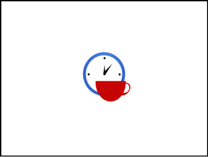
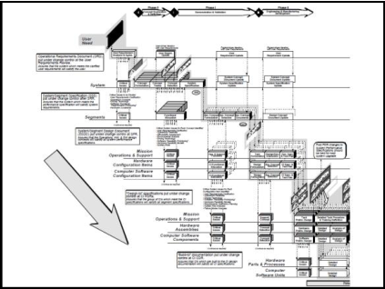
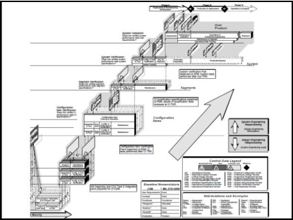

# 04.01. Software Development Models

> Source: `04.01. Software Development Models.pdf`  
> Extracted slides: **87**  
> Structure: one Markdown section per original PowerPoint slide in the 6-up PDF handout.  
> Wording is preserved from the PDF text layer; no outside knowledge was added. Visual-only slides include a cropped image.

## Slide 001 — Software Development

_PDF page 1, handout panel 1_

```text
Software Development
Models
Lecturer: Ngo Huy Bien
Software Engineering Department
Faculty of Information Technology
VNUHCM - University of Science
Ho Chi Minh City, Vietnam
nhbien@fit.hcmus.edu.vn
```

---

## Slide 002 — Objectives

_PDF page 1, handout panel 2_

```text
Objectives
To present Waterfall model

To present modified Waterfall models

To present Iterative and Incremental
development (IID) model

To present Spiral model

To present Vee model
```

---

## Slide 003 — References

_PDF page 1, handout panel 3_

```text
References
1.
Herbert D. Bennington (1956). Production of Large
Computer Programs.
2.
Winston Royce (1970). Managing The Development of
Large Software Systems.
3.
Steve Mcconnell (1996). Rapid Development: Taming Wild
Software Schedules. Microsoft Press.
4.
Craig Larman (2003). Agile and Iterative Development: A
Manager's Guide.
5.
Barry Boehm (1988). A Spiral Model of Software
Development and Enhancement.
6.
Nayan B. Ruparelia (2010). Software Development
Lifecycle.
7.
Barry Boehm (2000). Spiral Development: Experience,
Principles, and Refinements.
8.
Kevin Forsberg and Harold Mooz (1991). The Relationship
of System Engineering to the Project Cycle.
```

---

## Slide 004 — Why Software Development Models?

_PDF page 1, handout panel 4_

```text
Why Software Development Models?
•
Which step should we do next?
•
How long will it take?
•
How to perform the step?
•
Which artifacts will it use and produce?
•
Who is responsible for doing the step?
```

---

## Slide 005 — Analysis and Coding [1, 2]

_PDF page 1, handout panel 5_

```text
Analysis and Coding [1, 2]
• There are two essential steps common to all computer
program developments, regardless of size or complexity.
There is first an analysis step, followed second by a coding
step.

• It's the development effort for which most customers are
happy to pay, since both steps involve genuinely creative
work which directly contributes to the usefulness of the final
product.
```

---

## Slide 006 — Code and Fix

_PDF page 1, handout panel 6_

```text
Code and Fix
System
specification
(Optional)
Analyze, Code
and Fix
Release
(Maybe)
Code and Fix is the development method in which you write
some code and then fix the problems in the code.

No Overhead (No planning,
documentation, QA, standards
enforcing, etc., just coding.)

Requires no expertise; anybody
can do this.
No way of identifying risk
Poor match to user’s need
Poor structure
No way of accessing quality
Expensive fix
No way of accessing progress
```

---

## Slide 007 — A More Grandiose Approach

_PDF page 2, handout panel 1_

```text
A More Grandiose Approach
In my experience, the simpler model . . .
[such as the one pictured in
this slide] has never worked on large
software development efforts.
```

---

## Slide 008 — Iterative Relationship Between

_PDF page 2, handout panel 2_

```text
Iterative Relationship Between
Successive Phases
As each step progresses and the
design is further detailed, there is an
iteration with the preceding and
succeeding steps but rarely with the
more remote steps in the sequence.
As the design proceeds the change
process is scoped down to
manageable limits.
At any point in the design process
after the requirements analysis is
completed there exists a firm and close-up,
moving baseline to which to return in the
event of unforeseen design difficulties.
What we have is an effective fallback
position that tends to maximize the extent
of early work that is salvageable
and preserved.
Hopefully, the iterative interaction between the
various phases is confined to successive steps.
```

---

## Slide 009 — Development Risk

_PDF page 2, handout panel 3_

```text
Development Risk
System fails to satisfy the
various external constraints
A major redesign is required
Requirements must be modified
Unfortunately, the design iterations are never confined
to the successive steps
```

---

## Slide 010 — Preliminary Program Design

_PDF page 2, handout panel 4_

```text
Preliminary Program Design
As the analysis proceeds in the
succeeding phase the program
designer must impose on the
analyst the storage, timing, and
operational constraints in such
a way that he senses the
consequences.
If something wrong
is recognized at
this earlier stage,
the iteration with
requirements and
preliminary design
can be redone
before final design,
coding and test
commences.
Insure that a preliminary program design is complete before analysis begins
```

---

## Slide 011 — Document The Design

_PDF page 2, handout panel 5_

```text
Document The Design
Why so much documentation?
1.
Communication
2.
Quality control
3.
All phases activities support
4.
Redesign support
Insure that documentation is current and complete
```

---

## Slide 012 — Do It Twice

_PDF page 2, handout panel 6_

```text
Do It Twice
If the computer program in
question is being developed for the
first time, attempt to do the job
twice - the first result provides an
early simulation of the final
product.
This process is
done in
miniature, to
a time scale
that is
relatively
small with
respect to the
overall effort.
```

---

## Slide 013 — Plan, Control and Monitor Testing

_PDF page 3, handout panel 1_

```text
Plan, Control and Monitor Testing
This step will uncover the majority of coding
errors although it is difficult for large systems.
```

---

## Slide 014 — Involve the Customer

_PDF page 3, handout panel 2_

```text
Involve the Customer
To give the contractor free rein
between requirement
definition and operation is
inviting trouble.
The insight, judgment, and
commitment of the
customer can bolster the
development effort.
The involvement should be formal, in-depth and continuing.
```

---

## Slide 015 — Managing the Development of

_PDF page 3, handout panel 3_

```text
Managing the Development of
Large Software Systems
If the relatively simpler
process without the five
complexities described
here would work
successfully, then of
course the additional
money is not well spent.
The simpler method has never
worked on large software
development efforts and the
costs to recover far exceeded
those required to finance the
five-step process listed.
```

---

## Slide 016 — (Winston Royce’s) Waterfall Model

_PDF page 3, handout panel 4_

```text
(Winston Royce’s) Waterfall Model
• The (Winston Royce’s) successful waterfall model
is a SDLC model that has the following
characteristics:
– It consists of definite phases that are executed in
sequence.
– There are tangible deliverables produced at the end of
each phase.
– The phases be revisited but the overall cycle is
completely executed no more than 2 times. If executed
more than once, the first cycle is for a simulation.
– Once design begins, a formal change-control process is
used.
– The process is document-driven.
```

---

## Slide 017 — Waterfall Model Pros & Cons

_PDF page 3, handout panel 5_

```text
Waterfall Model Pros & Cons
•
Its emphasis on fully elaborated documents as completion criteria for
early requirements and design phases.
•
Document-driven standards have pushed many projects to write
elaborate specifications of poorly understood user interfaces and
decision support functions, followed by the design and development
of large quantities of unusable code.
•
In real life there is a need to initiate software design and coding, and
hardware modeling, earlier in the project cycle to ensure that user
requirements are understood and to prove technical feasibility.
•
Limit risk to an affordable sum.
•
Minimize effort spent on unproductive
or undesired directions.
•
Avoid the possibility of losing control
of a project.
```

---

## Slide 018 — Waterfall with Risk-Reduction [3]

_PDF page 3, handout panel 6_

```text
Waterfall with Risk-Reduction [3]
Risk Reduction
Risk Reduction
 It requires more effort.
1.
Develop a user-
interface prototype
2.
Use system
storyboarding
3.
Conduct user
interviews
4.
Videotape users
interacting with an
older system
```

---

## Slide 019 — Visual-only slide

_PDF page 4, handout panel 1_

> No extractable text was found in the PDF text layer for this slide. The visual is preserved below.


---

## Slide 020 — Customer Confidence

_PDF page 4, handout panel 2_

```text
Customer Confidence
When will I receive my
product?
How will it look like?
Will it be usable?
Deliver business values to client fast and repeatedly.
Gives customers a chance to “try software” periodically and
provide feedback.
```

---

## Slide 021 — Sashimi Model

_PDF page 4, handout panel 3_

```text
Sashimi Model
•
Most of the weaknesses in the pure waterfall model arise not from
problems with these activities but from the treatment of these
activities as disjoint, sequential phases.
•
The traditional waterfall model allows for minimal overlapping
between phases at the end-of-phase review.
•
This model suggests a stronger degree of overlap.
•
Milestones are more
ambiguous. It’s harder to track
progress accurately.
•
Performing activities in parallel
can lead to miscommunication,
mistaken assumptions, and
inefficiency.
```

---

## Slide 022 — Waterfall with Subprojects

_PDF page 4, handout panel 4_

```text
Waterfall with Subprojects
The main risk with this
approach is unforeseen
interdependences.
Why delay the implementation of the areas that are easy to design just
because we're waiting for the design of a difficult area? If the architecture
has broken the system into logically independent subsystems, you can spin
off separate projects, each of which can proceed at its own pace.
```

---

## Slide 023 — Staged Delivery

_PDF page 4, handout panel 5_

```text
Staged Delivery
The staged-delivery is a model in which you show software to the
customer in successively refined stages.

Avoid problem of no
part of the system
being done until all is
done.

Provide tangible signs
of progress earlier.

Must account for
all technical
dependencies
between different
components of
the product.

Integration cost.
```

---

## Slide 024 — Real World Waterfall Model: A New System

_PDF page 4, handout panel 6_

```text
Real World Waterfall Model: A New System
High level
requirements
High level design
(with prototypes
and PoC)
First plan and
estimation (first
contract)
Detailed
requirements and
test cases
Full architecture
and low level
design
Plan and schedule
(full contract)
Implementation/
Unit testing
(staged delivery if
possible)
System testing
(staged delivery if
possible)
Production
```

---

## Slide 025 — Real World Waterfall Model: System

_PDF page 5, handout panel 1_

```text
Real World Waterfall Model: System
Maintenance
High level
requirements
Current system
understanding
(with prototypes
and PoC)
First plan and
estimation (first
contract)
Detailed
requirements and
test cases
Revised
architecture and
low level design
Plan and schedule
(full contract)
Implementation/
Unit testing
(staged delivery if
possible)
System testing
(staged delivery if
possible) and pilot
Production
```

---

## Slide 026 — When To Use Waterfall Model?

_PDF page 5, handout panel 2_

```text
When To Use Waterfall Model?
• Cost and time are clear and fixed.
• Objectives are clear, reliable and
fixed.
• Requirements can be specified and
are not ambiguous.
• Technology is understood.
• Resources (with expertise) are
available.
• Similar projects exist.
• Existing (maintenance) system
should be available at the beginning.
```

---

## Slide 027 — Actually, Waterfall is Often Used When

_PDF page 5, handout panel 3_

```text
Actually, Waterfall is Often Used When
Low customer
engagement
Low supplier
development
transparency
Bureaucracy
management
style
```

---

## Slide 028 — Visual-only slide

_PDF page 5, handout panel 4_

> No extractable text was found in the PDF text layer for this slide. The visual is preserved below.



---

## Slide 029 — Requirements Gathering

_PDF page 5, handout panel 5_

```text
Requirements Gathering
I can’t tell you what I want,
but I’ll know it when I see it.
```

---

## Slide 030 — Software Changes

_PDF page 5, handout panel 6_

```text
Software Changes
The requirements change.
The design changes.
The business changes.
The technology changes.
The team changes.
The team members change.
The problem isn't change, because change is going to happen; the
problem, rather, is our inability to cope with change.
Software Development is more like New Product Development than Manufacturing
Uncertainty and
Unknown Variables
```

---

## Slide 031 — Evolutionary Delivery

_PDF page 6, handout panel 1_

```text
Evolutionary Delivery
Evolutionary delivery is a lifecycle model in which you develop a version
of your product, show it to your customer, and refine the product based
on customer feedback.
Your initial emphasis is on the core of
the system, which consists of lower
level system functions that are unlikely
to be changed by customer feedback.
HOW? – IID
```

---

## Slide 032 — Evolutionary Prototyping Model

_PDF page 6, handout panel 2_

```text
Evolutionary Prototyping Model
Evolutionary prototyping is a lifecycle model whose stages consist of
expanding increments of an operational software product, with the
directions of evolution being determined by operational experience.
•
Begin by developing the most visible aspects of the system.
•
Demonstrate that part of the system to the customer and then continue
to develop die prototype based on the feedback you receive.
•
At some point, you and the customer agree that the prototype is "good
enough."
•
At that point, you complete any remaining work on the system and
release the prototype as the final product.
HOW? – IID
```

---

## Slide 033 — Iterative and Incremental Development [4]

_PDF page 6, handout panel 3_

```text
Iterative and Incremental Development [4]
The goal for the end of an iteration is an
iteration release, a stable, integrated and tested
partially complete system.
Iterative and incremental development is an approach to building software in which the
overall lifecycle is composed of several iterations in sequence and system functionality are
sliced into increments (portions).
Each iteration is a self-
contained mini-project
composed of activities
such as requirements
analysis, design,
programming, and test.
```

---

## Slide 034 — Incremental Delivery

_PDF page 6, handout panel 4_

```text
Incremental Delivery
Incremental delivery is the practice of repeatedly delivering a
system into production (or the marketplace) in a series of
expanding capabilities.
Increment
5
Increment
1
Increment 2
Increment
3
Increment
4
A product
```

---

## Slide 035 — Evolutionary Delivery

_PDF page 6, handout panel 5_

```text
Evolutionary Delivery
Evolutionary delivery is a refinement of the practice of
incremental delivery in which there is a vigorous attempt to
capture feedback regarding the installed product, and use this to
guide the next delivery.
A property of a product
```

---

## Slide 036 — Incremental Evolutionary Delivery

_PDF page 6, handout panel 6_

```text
Incremental Evolutionary Delivery
Add, revise
and improve
parts of the
system.
Add, revise
and improve
parts of the
system.
Add, revise and improve
parts of the system.
```

---

## Slide 037 — Time-boxed Iterative Development

_PDF page 7, handout panel 1_

```text
Time-boxed Iterative Development
Iteration time-boxing is the practice of fixing the iteration end
date and not allowing it to change.
```

---

## Slide 038 — Evolutionary Iterative

_PDF page 7, handout panel 2_

```text
Evolutionary Iterative
Development (IID)
Evolutionary iterative development implies that the requirements,
plan, estimates, and solution evolve or are refined over the course of
the iterations, rather than fully defined and "frozen" in a major up-
front specification effort before the development iterations begin.
```

---

## Slide 039 — Evolutionary And Iterative

_PDF page 7, handout panel 3_

```text
Evolutionary And Iterative
Requirements Engineering
20-iteration project. Most requirements will be discovered and refined
within the first four iterations
Are the requirements forever unbounded or always changing at a high rate?
```

---

## Slide 040 — Evolutionary and Adaptive Planning

_PDF page 7, handout panel 4_

```text
Evolutionary and Adaptive Planning
Are the estimates and schedules are forever unbounded or unknown?
Cone of Uncertainty
33 days
8 days
132 days
```

---

## Slide 041 — Pros & Cons of IID

_PDF page 7, handout panel 5_

```text
Pros & Cons of IID
It's impossible to know at the outset of the project how long it will
take to create an acceptable product.
It’s hard for several  independently evolved applications to be
integrated.
It's easy to evolve a lot of hard-to-change code before addressing
long-range architectural and usage considerations.

Requirements are changing rapidly.

Customer is reluctant to commit to a set of
requirements.

Neither you nor your customer understands the
application area well.

Developers are unsure of the optimal
architecture or algorithms to use.

Steady, visible signs of progress.
```

---

## Slide 042 — Real World IID Model: A New System

_PDF page 7, handout panel 6_

```text
Real World IID Model: A New System
High level
requirements
High level design
(with
PoC/prototype)
First plan and
estimation (flexible
contract)
Waterfall 1: a new
system (partial
production if
possible)
Waterfall 2: a
maintenance system
(partial production if
possible)
…
…
Waterfall n: a
maintenance system
(partial production if
possible)
Full production
```

---

## Slide 043 — Real World IID: System Maintenance

_PDF page 8, handout panel 1_

```text
Real World IID: System Maintenance
High level
requirements
Current system
understanding (with
PoC/prototype)
First plan and
estimation (flexible
contract)
Waterfall 1: a
maintained system
(partial production if
possible)
Waterfall 2: a
maintained system
(partial production if
possible)
…
…
Waterfall n: a
maintained system
(partial production if
possible)
Full production
```

---

## Slide 044 — When To Use IID Model?

_PDF page 8, handout panel 2_

```text
When To Use IID Model?
• Cost and time are flexible.
• Objectives are clear but not fixed.
• Requirements cannot be specified
(without system implementation)
or are ambiguous.
• Technology is new.
• Resources (with expertise) are not
available.
• Similar projects do not exist.
• Existing (maintenance) system may
not be available at the beginning.
```

---

## Slide 045 — Visual-only slide

_PDF page 8, handout panel 3_

> No extractable text was found in the PDF text layer for this slide. The visual is preserved below.


---

## Slide 046 — Spiral Model [5, 6]

_PDF page 8, handout panel 4_

```text
Spiral Model [5, 6]
1. The radial dimension
represents the
cumulative cost
incurred in
accomplishing the
steps to date.
2. The angular dimension
represents the
progress made in
completing each cycle
of the spiral.
3. The risks are
categorized as
performance (or user
interface) related risks
or development risks.
```

---

## Slide 047 — Start

_PDF page 8, handout panel 5_

```text
Start
1
Each cycle of the spiral begins
with the identification of
1. the objectives of the
portion of the product
being elaborated
(performance,
functionality, ability to
accommodate change,
etc.);
2. the alternative means of
implementing this portion
of the product (design A ,
design B, reuse, buy, etc.);
and
3. the constraints imposed on
the application of the
alternatives (cost,
schedule, inter-face, etc.).
```

---

## Slide 048 — Risk Analysis

_PDF page 8, handout panel 6_

```text
Risk Analysis
2
Evaluate the alternatives
relative to the objectives and
constraints.
1. Identify areas of
uncertainty that are
significant sources of
project risk.
2. If so, the next step should
involve the formulation of
a cost-effective strategy
for resolving the sources
of risk. This may involve
prototyping, simulation,
benchmarking, reference
checking, administering
user questionnaires,
analytic modelling.
```

---

## Slide 049 — Another Prototype

_PDF page 9, handout panel 1_

```text
Another Prototype
2
If performance or user-
interface risks strongly
dominate program
development or internal
interface-control risks,
the next step may be an
evolutionary development
one: a minimal effort to
specify the overall nature
of the product, a plan for
the next level of
prototyping, and the
development of a more
detailed prototype to
continue to resolve the
major risk issues.
3
4
```

---

## Slide 050 — Series of Evolutionary Prototypes

_PDF page 9, handout panel 2_

```text
Series of Evolutionary Prototypes
If this prototype is
operationally useful and
robust enough to serve as a
low-risk base for future
product evolution, the
subsequent risk-driven
steps would be the evolving
series of evolutionary
prototypes going toward the
right of the figure.
In this case, the option of
writing specifications would
be addressed but not
exercised. Thus, risk
considerations can lead to a
project implementing only a
subset of all the potential
steps in the model.
```

---

## Slide 051 — Waterfall Approach

_PDF page 9, handout panel 3_

```text
Waterfall Approach
On the other hand, if previous
prototyping efforts have
already resolved all of the
performance or user-interface
risks, and program
development or interface-
control risks dominate, the
next step follows the basic
waterfall approach (concept
of operation, soft-ware
requirements, preliminary
design, etc.), modified as
appropriate to incorporate
incremental development.
Each level of software
specification in the figure is
then followed by a validation
step and the preparation of
plans for the succeeding cycle.
```

---

## Slide 052 — Review

_PDF page 9, handout panel 4_

```text
Review
Each cycle is completed
by a review involving the
primary people or
organizations concerned
with the product.
The plans for succeeding
phases may also include a
partition of the product into
increments for successive
development or components
to be developed by individual
organizations or persons.
```

---

## Slide 053 — Initiating and Terminating the

_PDF page 9, handout panel 5_

```text
Initiating and Terminating the
Spiral
•
The spiral gets started by a
hypothesis that a
particular operational
mission (or set of missions)
could be improved by a
software effort.
•
The spiral process then
involves a test of this
hypothesis: at any time, if
the hypothesis fails the
test the spiral is
terminated.
•
Otherwise, it terminates
with the installation of new
on modified software, and
the hypothesis is tested by
observing the effect on the
operational mission.
```

---

## Slide 054 — Spiral Model

_PDF page 9, handout panel 6_

```text
Spiral Model
The spiral model is a
software development
process that uses a risk-
driven approach to the
software process rather
than a primarily
document-driven or
code-driven process.
1
2
3
4
Risk resolution
Barry Boehm
```

---

## Slide 055 — Spiral Model Definition [7]

_PDF page 10, handout panel 1_

```text
Spiral Model Definition [7]
• The spiral development model is a risk-driven process
model generator.
• It is used to guide multi-stakeholder concurrent
engineering of software intensive systems.
• It has two main distinguishing features.
• One is a cyclic approach for incrementally growing a
system's degree of definition and implementation while
decreasing its degree of risk.
• The other is a set of anchor point milestones for ensuring
stakeholder commitment to feasible and mutually
satisfactory system solutions.
```

---

## Slide 056 — A Process Model Generator

_PDF page 10, handout panel 2_

```text
A Process Model Generator
• A process model answers two main questions:
– What should be done next?
– For how long should it continue?
• Under the spiral model the answers to these questions
are driven by risk considerations and vary from project to
project and sometimes from one spiral cycle to the next.
– Each choice of answers generates a different process model.
– At the start of a cycle, all of the project’s success-critical
stakeholders must participate concurrently in reviewing risks
and choosing the project’s process model accordingly.
```

---

## Slide 057 — Anchor Point Milestones

_PDF page 10, handout panel 3_

```text
Anchor Point Milestones
• A major difficulty of the original spiral model was its lack of
intermediate milestones to serve as commitment points and
progress checkpoints.
• This difficulty has been remedied by the development of a set
of anchor point milestones: Life Cycle Objectives (LCO), Life
Cycle Architecture (LCA), and Initial Operational Capability
(IOC).
• These can be described as stakeholder commitment points in
the software life cycle: LCO is the stakeholders’ commitment
to support architecting; LCA is the stakeholders' commitment
to support full life cycle; and IOC is the stakeholders'
commitment to support operations.
```

---

## Slide 058 — Life Cycle Objectives (LCO) & Life

_PDF page 10, handout panel 4_

```text
Life Cycle Objectives (LCO) & Life
Cycle Architecture (LCA)
• Definition of Operational Concept
• System Prototype(s)
• Definition of System Requirements
• Definition of System & Software Architecture
• Definition of Life-Cycle Plan
• Feasibility Rationale
• Their focus is not on requirements snapshots or architecture
point solutions, but on requirements and architectural
specifications which anticipate and accommodate system
evolution. This is the reason for calling them the "Life Cycle"
Objectives and Architecture milestones.
```

---

## Slide 059 — Initial Operational Capability (IOC)

_PDF page 10, handout panel 5_

```text
Initial Operational Capability (IOC)
• The Initial Operational capability (IOC) is the first the users will
see of a functioning system.
• Software preparation, including both operational and support
software with appropriate commentary and documentation;
data preparation or conversion.
• Site preparation, including facilities, equipment, supplies, and
COTS vendor support arrangements.
• User, operator and maintainer preparation, including
selection, teambuilding, training and other qualification for
familiarization, usage, operations, or maintenance.
```

---

## Slide 060 — Pros & Cons of Spiral Model

_PDF page 10, handout panel 6_

```text
Pros & Cons of Spiral Model

Complex and time consuming

Only intended for internal projects (inside a company), because risk
is assessed as the project is developed.

Spiral model is risk driven. Therefore it requires knowledgeable
staff.

Suitable for only large scale software development. It does not
make sense if the cost of risk analysis is a major part of the overall
project cost.
Very flexible
It is more able to cope with the
(nearly inevitable) changes
Takes a pro-active stance on risks
with explicit risk analysis
assessment and resolving stage
```

---

## Slide 061 — Visual-only slide

_PDF page 11, handout panel 1_

> No extractable text was found in the PDF text layer for this slide. The visual is preserved below.


---

## Slide 062 — Vee-Model Introduction [8]

_PDF page 11, handout panel 2_

```text
Vee-Model Introduction [8]
• In real life there is a need to initiate software design
and coding, and hardware modeling, earlier in the
project cycle to ensure that User Requirements are
understood and to prove technical feasibility.
• Spiral model attempts to resolve the above
deficiency by addressing the need for early feasibility
modeling (“prototyping”) to identify risks and define
appropriate action.
• The system engineering role is still obscured.
```

---

## Slide 063 — Vee-Model Overview

_PDF page 11, handout panel 3_

```text
Vee-Model Overview
```

---

## Slide 064 — Nine Phases

_PDF page 11, handout panel 4_

```text
Nine Phases
1.
Understand user requirements, develop system concept and validation
plan
2.
Develop system performance specification and system verification plan
3.
Expand system performance specification into CI “Design-to”
specifications and CI verification plan
4.
Evolve “Design-to” specifications into “Build-to” documentation and
inspection plan
5.
Fabricate, assemble and code to “Build-to” documentation
6.
Inspect to “Build-to” documentation
7.
Assemble CIs and perform CI verification to CI “Design-to”
specifications
8.
Integrate system and perform system verification to performance
specification
9.
Demonstrate and validate system to user validation plan
```

---

## Slide 065 — The “Vee” Chart

_PDF page 11, handout panel 5_

```text
The “Vee” Chart
•
V-model is a software development model in which the technical
aspect of the project cycle is envisioned as a “Vee,” starting with
User needs on the upper left and ending with a User-validated
system on the upper right.
•
On the left side of the chart, Decomposition and Definition
descends as in the waterfall model.
•
However, Integration and Verification flows up and to the right as
successively higher levels of assemblies, units, components, and
subsystems are verified, culminating at the system level.
•
The substantial advance in visualization of the technical aspect of
the project cycle, and the role of system engineering, is gained by
understanding the comprehensive “Vee” chart.
```

---

## Slide 066 — Visual-only slide

_PDF page 11, handout panel 6_

> No extractable text was found in the PDF text layer for this slide. The visual is preserved below.



---

## Slide 067 — Visual-only slide

_PDF page 12, handout panel 1_

> No extractable text was found in the PDF text layer for this slide. The visual is preserved below.



---

## Slide 068 — Segments and Configuration Items

_PDF page 12, handout panel 2_

```text
Segments and Configuration Items
•
At each level, moving into the depth of the paper (perpendicular to
the surface) there are a number of parallel boxes illustrating that
there may be many Segments or Configuration Items that make up
the system at that level of decomposition.
```

---

## Slide 069 — Alternate Concepts

_PDF page 12, handout panel 3_

```text
Alternate Concepts
•
Also at the System level, on the left of the chart, the number of
parallel boxes illustrates that alternate concepts should be
evaluated to determine the best solution for the User’s needs. At
the System Requirements Review (SRR), the choice is approved and
a single concept is base-lined for further definition.
```

---

## Slide 070 — Baselines and Control Gates

_PDF page 12, handout panel 4_

```text
Baselines and Control Gates
•
As project development progresses, a series of six baselines are
established to systematically manage cohesive system development.
Each of the baselines is put under formal Configuration Management at
the time they are approved.
•
The Control Gates define significant decision points in the project cycle.
```

---

## Slide 071 — Six Baselines

_PDF page 12, handout panel 5_

```text
Six Baselines
•
“User Requirements Baseline” established by the System
Requirement Document approved and put under Configuration
Management prior to the System Requirements Review (SRR).
•
“Concept Baseline” established by the Concept Definition section of
the Integrated Program Summary document at the SRR.
•
“System Performance Baseline” (or Development Baseline)
established by the System Performance Specification at the System
Design Review (SDR).
•
“‘Design-To’ Baseline” (or Allocated Baseline) established at the
series of Preliminary Design Reviews (PDRs).
•
“‘Build-To’ Baseline” (or preliminary Product Baseline) established
at the series of Critical Design Reviews (CDRs).
•
“‘As-Built’ Baseline” (or Production Baseline) established at the
series of Formal Qualification Reviews (FQRs).
```

---

## Slide 072 — Off-core Activities

_PDF page 12, handout panel 6_

```text
Off-core Activities
•
The left side of the core of the “Vee” (the shaded area) follows the
well-established waterfall model for the project cycle.
•
As the project progresses, detailed analyses, risk identification, and
risk reduction modeling continues. This is shown on the chart by
the vertical and descending off-core activities.
```

---

## Slide 073 — Off-core Activities Repeat

_PDF page 13, handout panel 1_

```text
Off-core Activities Repeat
•
While technical feasibility decisions are made in the off-core
activities only decisions at the core-level are put under Configuration
Management at the various Control Gates.
•
The off-core work is not formally controlled, and will be repeated at
the appropriate level to prepare justification for introduction into the
baseline definition.
```

---

## Slide 074 — Downward Iteration

_PDF page 13, handout panel 2_

```text
Downward Iteration
•
The multiple arrows descending from the bottom of the left side of
the core of the “Vee” indicate that there can, and should be,
sufficient iteration downward to establish feasibility and to identify
and quantify risks.
```

---

## Slide 075 — Upward Iteration

_PDF page 13, handout panel 3_

```text
Upward Iteration
•
Upward iteration with User Requirements (and levels leading to
them) is permitted, but should be kept to a minimum unless the
user is still generating requirements. The User needs to be
cautioned that changes in requirements during the development
process will cause positive or negative changes in the predicted cost
and schedule.
```

---

## Slide 076 — Modification of User Requirements

_PDF page 13, handout panel 4_

```text
Modification of User Requirements
• Often in software projects upward confirmation of solutions
with the User is necessary because User Requirements cannot
be adequately defined at the start.
• Iteration with User Requirements should be stopped at PDR.
• Modification of User Requirements after PDR should be held
for the next model or release. If significant changes to User
Requirements must absolutely be made after PDR, then the
project should be stopped and restarted at the start of a new
“Vee,” reinitiating the entire process.
• The repeat of the process may be quicker because of the
lessons learned, but all steps must be redone.
```

---

## Slide 077 — Incremental Development

_PDF page 13, handout panel 5_

```text
Incremental Development
•
If the User Requirements are too vague to permit final definition at
PDR, one approach is to develop the project in predetermined
incremental releases.
•
The first release is focused on meeting a minimum set of User
Requirements, with subsequent releases providing added
functionality and performance.
```

---

## Slide 078 — Concurrent Engineering

_PDF page 13, handout panel 6_

```text
Concurrent Engineering
•
If high iteration with User Requirements is required after the
System Design Review (SDR), it is probable that the project has
passed early Control Gates prematurely, and it is not sufficiently
defined.
•
One cause of premature advance is that the appropriate technical
experts were not involved at early stages, resulting in acceptance of
requirements and design concepts which cannot be built,
inspected, and/or maintained.
```

---

## Slide 079 — Role of System Engineering

_PDF page 14, handout panel 1_

```text
Role of System Engineering
•
Above the line System Engineering is responsible, and Design
Engineering provides technical assistance. Below the line Design
Engineering is responsible, and System Engineering performs
technical audit.
•
Note that System Engineering is influential throughout the entire
project life cycle, from User Requirements development to system
decommissioning.
```

---

## Slide 080 — Technology Insertion

_PDF page 14, handout panel 2_

```text
Technology Insertion
•
Technology development can be done in parallel with the project
evolution, and inserted as late as Preliminary Design Review.
•
The technology development would be represented by a horizontal
bar off the core, at the Configuration Item level (or below).
```

---

## Slide 081 — Integration and Verification

_PDF page 14, handout panel 3_

```text
Integration and Verification
•
Ascending the right side of the
“Vee” is the process of
Integration and Verification.
•
At each level there is a direct
correspondence between
activities on the left and right
sides of the chart. This is
deliberate. The method of
verification must be
determined as the
requirements are developed
and documented at each level.
Verification is the process of proving that each product
meets its specification (“Have we built the system right?”).
Validation is the process of demonstrating (as opposed to proving) that the product satisfies the User
Needs, “regardless” of what the system specification requires (“Have we built the right system?”).
```

---

## Slide 082 — System Analysis and Design

_PDF page 14, handout panel 4_

```text
System Analysis and Design
Process
```

---

## Slide 083 — Application of the System Analysis and Design

_PDF page 14, handout panel 5_

```text
Application of the System Analysis and Design
Process to the Technical Aspect of the Project Cycle
The system engineering process is repeated at every level of the
cycle, and may be repeated many times within a phase.
```

---

## Slide 084 — System Verification and Integration

_PDF page 14, handout panel 6_

```text
System Verification and Integration
Process
```

---

## Slide 085 — Application of the System Verification and Integration

_PDF page 15, handout panel 1_

```text
Application of the System Verification and Integration
Process to the Technical Aspect of the Project Cycle
```

---

## Slide 086 — System Engineering Definition

_PDF page 15, handout panel 2_

```text
System Engineering Definition
• System Engineering can now be more accurately defined as
the application of the System Analysis and Design Process and
the Integration and Verification Process to the logical
sequence of the Technical Aspect of the Project Cycle.
• Emphasize baseline management and configuration control
that is an essential discipline to good system management.
```

---

## Slide 087 — Thank You & See You Again

_PDF page 15, handout panel 3_

```text
Thank You & See You Again
```

---

