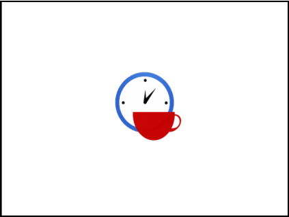

# 04.02. Scrum Development Process

> Source: `04.02. Scrum Development Process.pdf`  
> Extracted slides: **80**  
> Structure: one Markdown section per original PowerPoint slide in the 6-up PDF handout.  
> Wording is preserved from the PDF text layer; no outside knowledge was added. Visual-only slides include a cropped image.

## Slide 001 — Scrum Development

_PDF page 1, handout panel 1_

```text
Scrum Development
Process
Lecturer: Ngo Huy Bien
Software Engineering Department
Faculty of Information Technology
VNUHCM - University of Science
Ho Chi Minh City, Vietnam
nhbien@fit.hcmus.edu.vn
```

---

## Slide 002 — Objectives

_PDF page 1, handout panel 2_

```text
Objectives

To present why use Agile development
methods.

To present Scrum roles.

To present Scrum activities.

To present Scrum work products.

To present Scrum phases.

To apply Scrum method to develop a
software system.
```

---

## Slide 003 — Contents

_PDF page 1, handout panel 3_

```text
Contents
I.
Product backlog.
II.
Release backlog.
III.
Sprint backlog.
IV. System architecture.
V.
Definition of done.
VI.
Burn-down chart.
VII. Velocity.
```

---

## Slide 004 — References

_PDF page 1, handout panel 4_

```text
References
1.
Craig Larman (2003). Agile and Iterative
Development: A Manager's Guide.
2.
Ken Schwaber (1995). SCRUM Development Process.
3.
Jonathan Rasmusson (2010). The Agile Samurai: How
Agile Masters Deliver Great Software.
4.
Kenneth S. Rubin (2012). Essential Scrum A Practical
Guide to the Most Popular Agile Process.
5.
Dean Leffingwell (2011). Agile Software
Requirements - Lean Requirements Practices for
Teams, Programs, and the Enterprise. Addison-
Wesley Professional.
6.
Sridhar Nerur et al. (2005). Challenges of Migrating to
Agile Methodologies.
```

---

## Slide 005 — Time To Market

_PDF page 1, handout panel 5_

```text
Time To Market
Time to market is the time until your product is sufficiently
debugged that it can be shipped in volume production.
•
Your Time To
Market Determines
The Success of Your
Product
•
Your Time To
Market Determines
Your Rate of Return
On Investment
```

---

## Slide 006 — Lightweight Documentation

_PDF page 1, handout panel 6_

```text
Lightweight Documentation
• Traditional system
documentation
– instantly out of date,
– often misleading and
– expensive to maintain
• Solution: making system
knowledge explicit
```

---

## Slide 007 — Agile Software Development [1]

_PDF page 2, handout panel 1_

```text
Agile Software Development [1]
Agile development methods apply time-boxed iterative and evolutionary
development, adaptive planning, promote evolutionary delivery, and include
other values and practices that encourage agility—rapid and flexible response
to change.
```

---

## Slide 008 — https://agilemanifesto.org/

_PDF page 2, handout panel 2_

```text
https://agilemanifesto.org/
(Produce no
document unless
its need is
immediate and
significant)
A successful
contract should
govern the way the
developing team
and the customer
collaborate rather
than details of
scope and
schedule for a
fixed cost.
```

---

## Slide 009 — Agile Principles

_PDF page 2, handout panel 3_

```text
Agile Principles
7)
Working software is the primary
measure of progress.
8)
 Sustainable development
9)
Continuous attention to technical
excellence and good design
enhances agility
10) Simplicity is essential
11) The best architectures,
requirements, and designs emerge
from self-organizing teams
12) At regular intervals, the team
reflects on how to become more
effective, then tunes and adjusts
its behavior accordingly
1)
Early and continuous delivery
of valuable software
2)
Welcome changing
requirements, even late in
development
3)
Deliver working software
frequently with a preference to
the shorter timescale
4)
Business people and
developers must work together
daily
5)
Trust individuals to get the job
done
6)
Face-to-face conversation
```

---

## Slide 010 — Evidence

_PDF page 2, handout panel 4_

```text
Evidence
```

---

## Slide 011 — Visual-only slide

_PDF page 2, handout panel 5_

> No extractable text was found in the PDF text layer for this slide. The visual is preserved below.


---

## Slide 012 — Scrum 101

_PDF page 2, handout panel 6_

```text
Scrum 101
```

---

## Slide 013 — Kick-Off Meeting

_PDF page 3, handout panel 1_

```text
Kick-Off Meeting
Kick-off meeting is held to agree on the foundation objectives
and requirements of the project.
•
Project vision
•
Feasibility study
•
Statement of work
•
Initial product backlog
```

---

## Slide 014 — The Product Backlog

_PDF page 3, handout panel 2_

```text
The Product Backlog
• A comprehensive backlog list.
• What is it?
We don’t need a product backlog
we just need to figure out what to
do for the next Sprint!!!
Refer to Software Requirements
course for details.
```

---

## Slide 015 — The Product Owner [2]

_PDF page 3, handout panel 3_

```text
The Product Owner [2]
• Representing the interests of everyone
with a stake in the project and its
resulting system.
• Achieving initial and ongoing funding for
the project by creating the project’s
initial overall requirements, return on
investment (ROI) objectives, and release
plans.
• Using the product backlog to ensure
that the most valuable functionality is
produced first and built upon.
```

---

## Slide 016 — The Scrum Team

_PDF page 3, handout panel 4_

```text
The Scrum Team
• The Development Team
– Developing functionality.
– Self-managing, self-organizing,
and cross-functional.
• The Scrum Master
– Scrum process.
– Teaching Scrum to everyone
involved in the project.
– Implementing Scrum so that it
fits within an organization’s
culture.
– Ensuring that everyone follows
Scrum rules and practices.
```

---

## Slide 017 — Visual-only slide

_PDF page 3, handout panel 5_

> No extractable text was found in the PDF text layer for this slide. The visual is preserved below.


---

## Slide 018 — Release 101

_PDF page 3, handout panel 6_

```text
Release 101
```

---

## Slide 019 — Release Backlog

_PDF page 4, handout panel 1_

```text
Release Backlog
•
Selection of the release most appropriate for immediate
development.
•
Release backlog are  the user stories that are included in the
next release.
•
Mapping of product packets (objects) for backlog items in
the selected release.
```

---

## Slide 020 — Release Planning

_PDF page 4, handout panel 2_

```text
Release Planning
• Definition of project team(s) for the building of the new
release.
• Assessment of risk and appropriate risk controls.
• Validation or reselection of development tools and
infrastructure.
• Estimation of release cost, including development, collateral
material, marketing, training, and rollout.
• Verification of management approval and funding.
Refer to Software Project
Management: 06.1. Agile
Planning.pptx for details.
```

---

## Slide 021 — Pregame

_PDF page 4, handout panel 3_

```text
Pregame
```

---

## Slide 022 — Visual-only slide

_PDF page 4, handout panel 4_

> No extractable text was found in the PDF text layer for this slide. The visual is preserved below.


---

## Slide 023 — A First Sprint

_PDF page 4, handout panel 5_

```text
A First Sprint
With Scrum, projects progress via a series of iterations called
sprints. Each sprint is typically 2-4 weeks long.
```

---

## Slide 024 — Sprint Backlog

_PDF page 4, handout panel 6_

```text
Sprint Backlog
The sprint backlog is the list of work the team
must address during the next sprint.
```

---

## Slide 025 — Sprint Planning

_PDF page 5, handout panel 1_

```text
Sprint Planning
• Sprint deliverables.
• How to achieve the sprint
deliverables?
• Agreement between Product
Owner and the Team.
Refer to Software Project
Management: 06.1. Agile
Planning.pptx for details.
```

---

## Slide 026 — Task Board (I)

_PDF page 5, handout panel 2_

```text
Task Board (I)
```

---

## Slide 027 — Task Board (II)

_PDF page 5, handout panel 3_

```text
Task Board (II)
```

---

## Slide 028 — Daily Status Meeting: Rugby/Scrum

_PDF page 5, handout panel 4_

```text
Daily Status Meeting: Rugby/Scrum
1. What did you do since last Scrum meeting?
2. Do you have any obstacles?
3. What will you do before next meeting?
The team’s ability to tackle its problems and
solve them is the heart of Scrum.
```

---

## Slide 029 — Individual Work

_PDF page 5, handout panel 5_

```text
Individual Work
• Where available, explicit process knowledge is used;
otherwise tacit knowledge and trial and error is used to build
process knowledge.
```

---

## Slide 030 — Analysis and Design [3]

_PDF page 5, handout panel 6_

```text
Analysis and Design [3]
• Making the Work Ready
```

---

## Slide 031 — One Pager

_PDF page 6, handout panel 1_

```text
One Pager
```

---

## Slide 032 — Technical Practices [4]

_PDF page 6, handout panel 2_

```text
Technical Practices [4]
System metaphor: Choose a
system of names for your
objects that everyone can
relate to without specific,
hard to earn knowledge
about the system.
```

---

## Slide 033 — The Life Cycle of a Story [5]

_PDF page 6, handout panel 3_

```text
The Life Cycle of a Story [5]
```

---

## Slide 034 — Definition of Done [3]

_PDF page 6, handout panel 4_

```text
Definition of Done [3]
```

---

## Slide 035 — Example DoD 1

_PDF page 6, handout panel 5_

```text
Example DoD 1
• coded to standards
• reviewed by other member
• implemented with unit tests
• tested with 100 percent test
automation
• integrated and deployed
• documented
• tested by other member
• accepted by PO
```

---

## Slide 036 — Example DoD 2

_PDF page 6, handout panel 6_

```text
Example DoD 2
•
Release backlog created (documentation task)
•
Release plan created (documentation task)
•
User story documented (documentation task)
•
Code builds without errors (technical task)
•
Code unit tested (technical task)
•
Functional test passed (technical task)
•
Non-functional (UI and performance) test passed (technical task)
•
Brief user guide created (documentation task)
•
Build pushed to demo server (technical task)
•
Build tested (technical task)
•
Release backlog updated (documentation task)
•
Release plan/schedule updated (documentation task)
```

---

## Slide 037 — Sprint Review

_PDF page 7, handout panel 1_

```text
Sprint Review
Sprint review is a meeting at after the Sprint ends, it’s just a
demo of what’s been built, and anyone present is free to ask
questions and give input.
```

---

## Slide 038 — Burn-down Chart

_PDF page 7, handout panel 2_

```text
Burn-down Chart
Burn-down chart shows,
each day, how much work
(measured in hours or days)
remains until the team’s
commitment is completed.
```

---

## Slide 039 — Measuring Velocity

_PDF page 7, handout panel 3_

```text
Measuring Velocity
Iteration
Points
1
28
2
32
3
36
4
34
5
33
6
37
7
31
8
35
Velocity is the long-term
tracking of how much
work has been done by a
team per iteration.
```

---

## Slide 040 — Sprint Retrospective

_PDF page 7, handout panel 4_

```text
Sprint Retrospective
Sprint retrospective is a meeting for the team to discuss what’s working and
what’s not working, and agree on changes to try.
```

---

## Slide 041 — Tools

_PDF page 7, handout panel 5_

```text
Tools
• https://www.atlassian.com/software/jira
• https://trello.com/
• http://www.agilefant.com/
• https://slack.com/
```

---

## Slide 042 — Review: The First Sprint

_PDF page 7, handout panel 6_

```text
Review: The First Sprint
```

---

## Slide 043 — Where Do We Go Now?

_PDF page 8, handout panel 1_

```text
Where Do We Go Now?
```

---

## Slide 044 — Here We Go: Release Backlog Board

_PDF page 8, handout panel 2_

```text
Here We Go: Release Backlog Board
```

---

## Slide 045 — Here We Go: Re-planning

_PDF page 8, handout panel 3_

```text
Here We Go: Re-planning
1. The schedule is not changed. The 4th iteration
still ends with week number 8, and the releases
are delivered in the weeks 6, 12 and 18.
2. The scope and content of the project is adjusted
empirically as the developers and customers
gain understanding of the solution.
```

---

## Slide 046 — And… Second Sprint

_PDF page 8, handout panel 4_

```text
And… Second Sprint
```

---

## Slide 047 — And… Third Sprint

_PDF page 8, handout panel 5_

```text
And… Third Sprint
```

---

## Slide 048 — And… Fourth Sprint

_PDF page 8, handout panel 6_

```text
And… Fourth Sprint
```

---

## Slide 049 — Game

_PDF page 9, handout panel 1_

```text
Game
```

---

## Slide 050 — Postgame

_PDF page 9, handout panel 2_

```text
Postgame
•
This phase prepares the developed product for general release.
•
Integration, system test, user documentation, training material
preparation, and marketing material preparation are among closure
tasks.
```

---

## Slide 051 — Visual-only slide

_PDF page 9, handout panel 3_

> No extractable text was found in the PDF text layer for this slide. The visual is preserved below.


---

## Slide 052 — How Can We Track Project Status?

_PDF page 9, handout panel 4_

```text
How Can We Track Project Status?
• Scope delivered?
• Estimated completion date?
• Total budget spent?
• Current release status (release date, %
completed)? On track? Late? Fast?
• Risks?
• Issues?
• Scope changes?
```

---

## Slide 053 — How to Control the Project? [2]

_PDF page 9, handout panel 5_

```text
How to Control the Project? [2]
• Controls in the SCRUM methodology are:
– Backlog: Product functionality requirements
that are not adequately addressed by the
current product release.
– Release/Enhancement: backlog items that at
a point in time represent a viable release
based on the variables of requirements,
time, quality, and competition.
– Packets: Product components or objects that
must be changed to implement a backlog
item into a new release.
```

---

## Slide 054 — Controls in the SCRUM

_PDF page 9, handout panel 6_

```text
Controls in the SCRUM
Methodology Are Also
• Risks: risks that effect the success of the project are
continuously assessed and responses planned.
• Changes: Changes that must occur to a packet to implement a
backlog item.
• Problems: Technical problems that occur and must be solved
to implement a change.
• Solutions: solutions to the problems and risks, often resulting
in changes.
• Issues: Overall project and project issues that are not defined
in terms of packets, changes and problems.
```

---

## Slide 055 — Controls Management

_PDF page 10, handout panel 1_

```text
Controls Management
• These controls are used in the various phases of SCRUM.
• Management uses these controls to manage backlog.
• Teams use these controls to manage changes, problems.
• Both management and teams jointly manage issues, risks, and
solutions.
• These controls are reviewed, modified, and reconciled at
every Sprint review meeting.
```

---

## Slide 056 — Review: Scrum Work Products

_PDF page 10, handout panel 2_

```text
Review: Scrum Work Products
```

---

## Slide 057 — Scrum Phases

_PDF page 10, handout panel 3_

```text
Scrum Phases
Defined
process
Defined
process
Empirical process
```

---

## Slide 058 — What is Scrum? [2]

_PDF page 10, handout panel 4_

```text
What is Scrum? [2]
• SCRUM is a management, enhancement and
maintenance methodology for an existing
system or production prototype.
• Waterfall and Spiral methodologies set the
context and deliverable definition at the start
of a project.
• SCRUM and Iterative methodologies initially
plan the context and broad deliverable
definition, and then evolve the deliverable
during the project based on the
environment.
```

---

## Slide 059 — Visual-only slide

_PDF page 10, handout panel 5_

> No extractable text was found in the PDF text layer for this slide. The visual is preserved below.



---

## Slide 060 — No Sustainable Pace

_PDF page 10, handout panel 6_

```text
No Sustainable Pace
• Every sprint becomes a small two or four-week project with a
well-defined scope, a clear beginning, and a fixed end date.
• Many teams were not able to deliver what they had agreed to
at the start of their sprint.
What if the sprint deliverables cannot be
achieved?
```

---

## Slide 061 — Possible Solutions (I)

_PDF page 11, handout panel 1_

```text
Possible Solutions (I)
• Reasons:
– Wrong estimation
– The unexpected

• Solutions:
– Stop committing to so much work.
– Breaking down the features (stories).
– Follow the life cycle: analysis, design, design test, build, developer
test, other team member test, and acceptance test
– Risk reserve
```

---

## Slide 062 — Possible Solutions (II)

_PDF page 11, handout panel 2_

```text
Possible Solutions (II)
•
Hold people accountable for getting done what they say they will
get done.
•
If it turns out they can only get a tiny feature done each sprint, then
figure out why and make it better (which may involve replacing the
developer).
•
If it turns out they can't figure out how to commit to reasonable
amounts of work, you fire them.
•
Alternatively, try Kanban.
```

---

## Slide 063 — Visual-only slide

_PDF page 11, handout panel 3_

> No extractable text was found in the PDF text layer for this slide. The visual is preserved below.


---

## Slide 064 — In Short

_PDF page 11, handout panel 4_

```text
In Short
The SCRUM methodology embodies these general,
loose controls, using OO techniques for the actual
construction of deliverables.
```

---

## Slide 065 — Scrum Values [1]

_PDF page 11, handout panel 5_

```text
Scrum Values [1]
Commitment
Focus
Openness
Respect
Courage
```

---

## Slide 066 — Why Scrum? [4]

_PDF page 11, handout panel 6_

```text
Why Scrum? [4]
• Previous approach to development simply wasn’t
working.
– A complex domain where more was unknown than known.
– Products that had never been built before.
– Need for rapid exploration and feedback.
• Avoid big up-front architecture design.
• Teams to be more cross-functional.
```

---

## Slide 067 — When To Use Scrum? (I)

_PDF page 12, handout panel 1_

```text
When To Use Scrum? (I)
• Complex Domain
– Domain of emergence.
– We need to explore to learn about the problem, then
inspect and adapt based on our learning.
– Innovative new-product development, enhancing existing
products with innovative new features.
– Scrum is particularly well suited.
```

---

## Slide 068 — When To Use Scrum? (II)

_PDF page 12, handout panel 2_

```text
When To Use Scrum? (II)
• Complicated Domain
– Domain of good practices dominated by experts.
– Software maintenance.
– Although Scrum can certainly work with these problems, it
might not be the best solution.
• Chaotic Domain
– Chaotic problems require a rapid response.
– We are in a crisis.
– Large damages.
– Scrum is not the best solution here.
```

---

## Slide 069 — When To Use Scrum? (III)

_PDF page 12, handout panel 3_

```text
When To Use Scrum? (III)
• Simple Domain
– The domain of legitimate best practices.
– There are known solutions.
– Reproducing the same product.
– Deploying the same commercial-off-the-shelf (COTS)
product into the 100th customer.
– Well-defined assembly-line process would be a better fit
than Scrum.
```

---

## Slide 070 — When To Use Scrum? (IV)

_PDF page 12, handout panel 4_

```text
When To Use Scrum? (IV)
• Disorder
– You are in the disorder domain when you don’t know which of
the other domains you are in.
– You don’t know how to make sense of your situation.
– You are not trying to apply Scrum in the disorder domain; you
are trying to get out of this domain.
– The way out is to break down the situation into constituent
parts and assign each to one of the other four domains.
```

---

## Slide 071 — When To Use Scrum? (V)

_PDF page 12, handout panel 5_

```text
When To Use Scrum? (V)
• Interrupt-Driven Work
– At no point in time do you have a product backlog that
extends very far into the future, and the content and order
of your backlog could change frequently.
– Interrupt-driven support and maintenance.
– Considering an alternative agile approach called Kanban.
```

---

## Slide 072 — Visual-only slide

_PDF page 12, handout panel 6_

> No extractable text was found in the PDF text layer for this slide. The visual is preserved below.


---

## Slide 073 — Waterfall Methodology Problem

_PDF page 13, handout panel 1_

```text
Waterfall Methodology Problem
• Its linear nature has been its largest problem.
• The process does not define how to respond
to unexpected output from any of the
intermediate process.
```

---

## Slide 074 — Iterative Methodology Problem

_PDF page 13, handout panel 2_

```text
Iterative Methodology Problem
• The overall project deliverable has been partitioned into
prioritized subsystems, each with clean interfaces.
• The Iterative approach still expects that the underlying
development processes are defined and linear.
```

---

## Slide 075 — Methodology Comparison [2]

_PDF page 13, handout panel 3_

```text
Methodology Comparison [2]
```

---

## Slide 076 — Traditional vs. Agile [6]

_PDF page 13, handout panel 4_

```text
Traditional vs. Agile [6]
```

---

## Slide 077 — Traditional vs. Agile [5]

_PDF page 13, handout panel 5_

```text
Traditional vs. Agile [5]
• Agile fixes the date and resources and varies the scope.
```

---

## Slide 078 — Fixed-Price Contracts

_PDF page 13, handout panel 6_

```text
Fixed-Price Contracts
• Fixed price contracts freeze all the three factors at once: cost,
time and scope.
Refer to Software Project
Management: 06.1. Agile
Planning.pptx for details.
```

---

## Slide 079 — Further Reading

_PDF page 14, handout panel 1_

```text
Further Reading
• Craig Larman and Bas Vodde (2010). Practices for
Scaling Lean & Agile Development. Addison-Wesley
Professional.
– Large-scale Scrum.
```

---

## Slide 080 — Thank You & See You Again

_PDF page 14, handout panel 2_

```text
Thank You & See You Again
```

---

