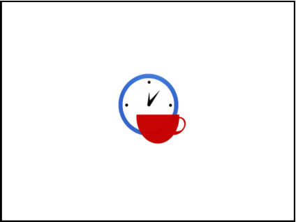

# 06. Software Project Planning

> Source: `06. Software Project Planning.pdf`  
> Extracted slides: **86**  
> Structure: one Markdown section per original PowerPoint slide in the 6-up PDF handout.  
> Wording is preserved from the PDF text layer; no outside knowledge was added. Visual-only slides include a cropped image.

## Slide 001 — Software Project Planning

_PDF page 1, handout panel 1_

```text
Software Project Planning
Lecturer: Ngo Huy Bien
Software Engineering Department
Faculty of Information Technology
VNUHCM - University of Science
Ho Chi Minh City, Vietnam
nhbien@fit.hcmus.edu.vn
```

---

## Slide 002 — Objectives

_PDF page 1, handout panel 2_

```text
Objectives
To create a project schedule.
To calculate a project budget.
To create a statement of work.
To create a software contract.
To create a project plan.
```

---

## Slide 003 — Contents

_PDF page 1, handout panel 3_

```text
Contents
I.
Project schedule
II.
Project budget
III.
Statement of work
IV.
Software contract
V.
Project plan
```

---

## Slide 004 — References

_PDF page 1, handout panel 4_

```text
References
1.
Project Management Institute (2017). A Guide
to the Project Management Body of
Knowledge. 6th Edition.
2.
Andrew Stellman and Jennifer Greene (2014).
Head First PMP. 3rd Edition. O’Reilly Media.
3.
Project Management Institute (2011). Practice
Standard for Scheduling. 2nd Edition.
4.
Pascal Van Cauwenberghe (2003). Agile Fixed
Price Projects Part 1: The Price is Right.
5.
Roger S. Pressman (2010). Software
Engineering : A Practitioner’s Approach.
6.
Mike Cohn (2005). Agile Estimating And
Planning. Pearson Education.
```

---

## Slide 005 — Problems

_PDF page 1, handout panel 5_

```text
Problems
• You have relatively good requirements (25 use cases).

• How long will it take to develop the system?
• What is the cost?
• How many people do you need to develop the system?
```

---

## Slide 006 — How Much Time Do We Need?

_PDF page 1, handout panel 6_

```text
How Much Time Do We Need?
```

---

## Slide 007 — Effort vs. Duration [1]

_PDF page 2, handout panel 1_

```text
Effort vs. Duration [1]
• Effort. The number of labor units required to complete a
schedule activity or work breakdown structure component,
often expressed in man-hours (person-hours), man-days, or
man-weeks.
• Duration (DU or DUR). The total number of work periods (not
including holidays or other nonworking periods) required to
complete a schedule activity or work breakdown structure
component. Usually expressed as workdays or workweeks.
```

---

## Slide 008 — Effort vs. Duration vs. Elapsed Time

_PDF page 2, handout panel 2_

```text
Effort vs. Duration vs. Elapsed Time
Mon
24 hrs
Tues
24 hrs
Wed
24 hrs
Thurs
24 hrs
Fri
24 hrs
Sat
24 hrs
Sun
24 hrs
Mon
8 hrs
Tues
8 hrs
Wed
8 hrs
Thurs
8 hrs
Fri
8 hrs
Mon
8 hrs
Tues
0 hrs
Wed
10 hrs
Thurs
8 hrs
Fri
16 hrs
Effort
Duration
Elapsed Time
```

---

## Slide 009 — Gantt Charts

_PDF page 2, handout panel 3_

```text
Gantt Charts
Gantt charts represent schedule information where activities are listed on the
vertical axis, dates are shown on the horizontal axis, and activity durations are
shown as horizontal bars placed according to start and finish dates.
```

---

## Slide 010 — How to Create a Gantt Chart?

_PDF page 2, handout panel 4_

```text
How to Create a Gantt Chart?
```

---

## Slide 011 — 1. Define Activities

_PDF page 2, handout panel 5_

```text
1. Define Activities
•
Define Activities is the process of identifying and documenting
the specific actions to be performed to produce the project
deliverables.
•
The key benefit of this process is to break down work packages
into activities that provide a basis for estimating, scheduling,
executing, monitoring, and controlling the project work.
Inputs: The
project WBS,
deliverables,
constraints,
and
assumptions
Techniques:
Decomposition,
Expert
Judgment,
Rolling Wave
Planning
Outputs:
Activity List,
Activity
Attributes,
Milestone List
```

---

## Slide 012 — Activity List

_PDF page 2, handout panel 6_

```text
Activity List
• The activity list is a comprehensive list that includes all
schedule activities required on the project.
• The activity list also includes the activity
– identifier and
– a scope of work description for each activity in sufficient
detail to ensure that project team members understand
what work is required to be completed.
WBS_ID
ID
Description
1
1
Create project vision
2
Review project vision
3
Create Proof of Concept
```

---

## Slide 013 — Determine Dependencies

_PDF page 3, handout panel 1_

```text
Determine Dependencies
• Internal dependencies. Internal dependencies involve a
precedence relationship between project activities.
• External dependencies. External dependencies involve a
relationship between project activities and non-project
activities.
• Mandatory dependencies. Mandatory dependencies are those
that are legally or contractually required or inherent in the
nature of the work.
```

---

## Slide 014 — Discretionary Dependencies

_PDF page 3, handout panel 2_

```text
Discretionary Dependencies
• Discretionary dependencies. Discretionary dependencies are
sometimes referred to as preferred logic, preferential logic, or
soft logic.
• Discretionary dependencies are established based on
knowledge of best practices.
```

---

## Slide 015 — Identify Logical Relationships

_PDF page 3, handout panel 3_

```text
Identify Logical Relationships
• A predecessor activity is an activity that logically comes before
a dependent activity in a schedule.
• A successor activity is a dependent activity that logically
comes after another activity in a schedule
• Finish-to-start is the most commonly used type of precedence
relationship.
```

---

## Slide 016 — Other Logical Relationships

_PDF page 3, handout panel 4_

```text
Other Logical Relationships
• The start-to-finish relationship is very rarely used.
```

---

## Slide 017 — Activity Attributes

_PDF page 3, handout panel 5_

```text
Activity Attributes
• Activity attributes extend the description of the activity by
identifying the multiple components associated with each
activity.
• The components for each activity evolve over time.
• Possible attributes:
– predecessor activities,
– successor activities, and
– logical relationships.
WBS_ID
ID
Description
Predecessor
1
1
Create project vision
2
Review project vision
1
2
3
Create Proof of Concept
2
```

---

## Slide 018 — Milestone List

_PDF page 3, handout panel 6_

```text
Milestone List
• A milestone is a significant point or event in a project.
• A milestone list is a list identifying all project milestones and
indicates whether the milestone is mandatory, such as those
required by contract, or optional, such as those based upon
historical information.
• Milestones are similar to regular schedule activities, with the
same structure and attributes, but they have zero duration
because milestones represent a moment in time.
Milestone 1
Milestone 2
Milestone 3
Milestone 4
Week 4
Week 6
Week 8
Week 14
Specs
Specs
baseline
Design
baseline
Final product
Design
Prototype
```

---

## Slide 019 — 2. Sequence Activities

_PDF page 4, handout panel 1_

```text
2. Sequence Activities
• Sequence Activities is the process of identifying and
documenting relationships among the project activities.
• The key benefit of this process is that it defines the logical
sequence of work to obtain the greatest efficiency given all
project constraints.
Inputs:
Activity list,
Activity
attributes,
Milestone
list
Techniques:
Precedence
diagramming
method (PDM),
Dependency
determination,
Leads and lags
Outputs:
Project
schedule
network
diagrams
```

---

## Slide 020 — Project Schedule Network Diagram

_PDF page 4, handout panel 2_

```text
A project schedule network diagram is a graphical
representation of the logical relationships, also referred to as
dependencies, among the project schedule activities.
Project Schedule Network Diagram
```

---

## Slide 021 — How to Create a

_PDF page 4, handout panel 3_

```text
How to Create a
Schedule Network Diagram?
```

---

## Slide 022 — Draw a Precedence Diagram

_PDF page 4, handout panel 4_

```text
Draw a Precedence Diagram
•
The precedence diagramming method (PDM) is a technique used for
constructing a schedule model in which activities are represented by
nodes and are graphically linked by one or more logical relationships
to show the sequence in which the activities are to be performed.
•
Activity-on-node (AON) is one method of representing a precedence
diagram.
```

---

## Slide 023 — Draw Activity-On-Arrow Diagram

_PDF page 4, handout panel 5_

```text
Draw Activity-On-Arrow Diagram
• An alternative method of representing a precedence diagram
is activity-on-arrow.
```

---

## Slide 024 — 3. Estimate Activity Resources

_PDF page 4, handout panel 6_

```text
3. Estimate Activity Resources
•
Estimate Activity Resources is the process of estimating the type
and quantities of material, human resources, equipment, or
supplies required to perform each activity.
•
The key benefit of this process is that it identifies the type, quantity,
and characteristics of resources required to complete the activity
which allows more accurate cost and duration estimates.
Inputs: Activity
list, Activity
attributes,
Resource
calendars
Techniques:
Expert
judgment,
Alternative
analysis
Outputs:
Activity
resource
requirement,
Resource
breakdown
structure
```

---

## Slide 025 — Resource Breakdown Structure

_PDF page 5, handout panel 1_

```text
Resource Breakdown Structure
•
The resource breakdown structure is a hierarchical representation of
resources by category and type.
•
Examples of resource categories include labor, material, equipment, and
supplies.
•
Resource types may include the skill level, grade level, or other
information as appropriate to the project.
```

---

## Slide 026 — Activity Resource Requirements

_PDF page 5, handout panel 2_

```text
Activity Resource Requirements
•
Activity resource requirements identify the types and quantities of
resources required for each activity in a work package.
WBS_ID
ID
Description
Resource
Type
Resource
Quantity
1
1
Create project vision
People
2
2
Review project vision
People
1
2
3
Create Proof of Concept
People
3
People
o
Name
o
A brief one-line description
o
Communication
o
The availability
o
The cost
```

---

## Slide 027 — 4. Estimate Activity Durations

_PDF page 5, handout panel 3_

```text
4. Estimate Activity Durations
•
Estimate Activity Durations is the process of estimating the number
of work periods needed to complete individual activities with
estimated resources.
•
The key benefit of this process is that it provides the amount of
time each activity will take to complete.
Inputs:
Activity list,
Activity
attributes,
Milestone list
Techniques: Expert
judgment, Analogous
estimating, Parametric
estimating, Three-point
estimating, Group
decision-making
techniques, Reserve
analysis
Outputs:
Activity
duration
estimates
```

---

## Slide 028 — Expert Judgment

_PDF page 5, handout panel 4_

```text
Expert Judgment
• Expert judgment, guided by historical information, can
provide duration estimate information or recommended
maximum activity durations from prior similar projects.
```

---

## Slide 029 — Analogous Estimating

_PDF page 5, handout panel 5_

```text
Analogous Estimating
•
Analogous estimating, also called top-down estimating, is a form of
expert judgment.
•
With this technique, you will use the actual effort of a similar
activity completed on a previous project to determine the effort of
the current activity—provided the information was documented
and stored with the project information on the previous project.
```

---

## Slide 030 — Parametric Estimating

_PDF page 5, handout panel 6_

```text
Parametric Estimating
• Parametric estimating is a quantitatively
based estimating method that multiplies the
quantity of work by the rate.
```

---

## Slide 031 — Three-Point Estimates

_PDF page 6, handout panel 1_

```text
Three-Point Estimates
• Triangular Distribution.
tE = (tO + tM + tP) / 3
• Beta Distribution (from the traditional PERT technique).

tE = (tO + 4tM + tP) / 6
```

---

## Slide 032 — Reserve Analysis

_PDF page 6, handout panel 2_

```text
Reserve Analysis
• Reserve effort—also called buffer or
contingency effort means adding a portion of
effort to the activity to account for risks.
```

---

## Slide 033 — Activity Duration Estimates

_PDF page 6, handout panel 3_

```text
Activity Duration Estimates
• Activity duration estimates are quantitative assessments of
the likely number of time periods that are required to
complete an activity.
• Activity duration estimates may include some indication of
the range of possible results.
WBS_ID
ID
Description
Duration
(days)
1
1
Create project vision
1
2
Review project vision
2
2
3
Create Proof of Concept
5
```

---

## Slide 034 — 5. Select a Scheduling Tool

_PDF page 6, handout panel 4_

```text
5. Select a Scheduling Tool
• The scheduling tool is typically a software-specific tool that
contains scheduling components and the rules for
interrelating these components.
•
https://products.office.com/en-au/Project/project-for-office-365
•
http://www.ganttproject.biz/
•
https://ganttpro.com/
•
https://www.smartsheet.com/
```

---

## Slide 035 — Schedule Model

_PDF page 6, handout panel 5_

```text
Schedule Model
•
Schedule model is a dynamic representation of the plan for
executing the project activities developed by the project
stakeholders, applying a selected scheduling method to a
scheduling tool using project-specific data.
•
The schedule model describes the work to be done (what), the
resource(s) required to do it (who), and the optimum sequence
(activity starts, finishes, and relationships) in which the work should
be undertaken (when).
```

---

## Slide 036 — Schedule Model Instance

_PDF page 6, handout panel 6_

```text
Schedule Model Instance
• Schedule model instance is a copy of the schedule model,
that has been processed by a schedule tool and has
reacted to inputs and adjustments made to the project
specific data within the scheduling tool (completed update
cycle), that is saved for record and reference.
```

---

## Slide 037 — Schedule Model Presentation

_PDF page 7, handout panel 1_

```text
Schedule Model Presentation
• Presentation is an output from schedule model instances,
used to communicate project-specific data for reporting,
analysis, and decision making.
```

---

## Slide 038 — 6. Develop Schedule

_PDF page 7, handout panel 2_

```text
6. Develop Schedule
•
Develop Schedule is the process of analyzing activity sequences,
durations, resource requirements, and schedule constraints to
create the project schedule model.
•
The key benefit of this process is that by entering schedule
activities, durations, resources, resource availabilities, and logical
relationships into the scheduling tool, it generates a schedule
model with planned dates for completing project activities.
Inputs: Project
schedule network
diagrams, Activity
resource requirements,
Activity duration
estimates
Techniques:
Critical Path
Method
Outputs:
Project
schedule
(Gantt chart,
Milestone
char)
```

---

## Slide 039 — Visual-only slide

_PDF page 7, handout panel 3_

> No extractable text was found in the PDF text layer for this slide. The visual is preserved below.


---

## Slide 040 — 7. Identify Critical Path [1, 2]

_PDF page 7, handout panel 4_

```text
7. Identify Critical Path [1, 2]
• The critical path is the sequence of activities that represents
the longest path through a project, which determines the
shortest possible project duration.
• A delay in any one of the critical path activities will cause the
entire project to be delayed.
```

---

## Slide 041 — Critical Path Method

_PDF page 7, handout panel 5_

```text
Critical Path Method
• The critical path method, which is a method used to estimate
the minimum project duration and determine the amount of
scheduling flexibility on the logical network paths within the
schedule model.
• This schedule network analysis technique calculates the early
start, early finish, late start, and late finish dates for all
activities without regard for any resource limitations by
performing a forward and backward pass analysis through the
schedule network.
```

---

## Slide 042 — Early Start Date & Late Start Date

_PDF page 7, handout panel 6_

```text
Early Start Date & Late Start Date
•
Early Start Date (ES). The earliest possible point in time when the
uncompleted portions of a schedule activity can start based on the
schedule network logic, the data date, and any schedule
constraints.
•
Late Start Date (LS). The latest possible point in time when the
uncompleted portions of a schedule activity can start based on the
schedule network logic, the project completion date, and any
schedule constraints.
```

---

## Slide 043 — Forward Pass [2]

_PDF page 8, handout panel 1_

```text
Forward Pass [2]
•
Start at the beginning of the critical path and move forward through
each activity.
•
Add the early start and finish to each path in your network diagram.
```

---

## Slide 044 — Backward Pass

_PDF page 8, handout panel 2_

```text
Backward Pass
• Start at the end of the path you just took a pass through and
work your way backward to figure out the late finish and start.
```

---

## Slide 045 — Total Float (Slack) [1, 2]

_PDF page 8, handout panel 3_

```text
Total Float (Slack) [1, 2]
•
Total Float. The amount of time that a schedule activity can be delayed or
extended from its early start date without delaying the project finish date
or violating a schedule constraint.
•
Total Float = LF – EF (or LS – ES)
•
The float for any activity on the critical path is zero.
```

---

## Slide 046 — Free Float [1]

_PDF page 8, handout panel 4_

```text
Free Float [1]
•
Free Float. The amount of time that a schedule activity can be
delayed without delaying the early start date of any successor or
violating a schedule constraint.
•
Free Float = ES of successor activity – EF – 1
```

---

## Slide 047 — Critical Chain Method

_PDF page 8, handout panel 5_

```text
Critical Chain Method
• The critical chain method (CCM) is a schedule method that
allows the project team to place buffers on any project
schedule path to account for limited resources and project
uncertainties.
• The critical chain method adds duration buffers that are non-
work schedule activities to manage uncertainty.
```

---

## Slide 048 — Visual-only slide

_PDF page 8, handout panel 6_

> No extractable text was found in the PDF text layer for this slide. The visual is preserved below.


---

## Slide 049 — 8. Assign Resources

_PDF page 9, handout panel 1_

```text
8. Assign Resources
• Critical Path
• Time-Resource-Cost tradeoff
• Genetic Algorithms
```

---

## Slide 050 — 9. Check Resource Usage

_PDF page 9, handout panel 2_

```text
9. Check Resource Usage
```

---

## Slide 051 — Over-allocation

_PDF page 9, handout panel 3_

```text
Over-allocation
Over-
allocation
Level
resources
Over-allocation generally refers to situations where
resources are allocated at excessive levels.
X: Time
Y: Resource
```

---

## Slide 052 — 10. Perform Resource Leveling

_PDF page 9, handout panel 4_

```text
10. Perform Resource Leveling
• Resource leveling. A technique in which start and finish
dates are adjusted based on resource constraints with
the goal of balancing demand for resources with the
available supply.
• Resource leveling can often cause the original critical
path to change, usually to increase.
```

---

## Slide 053 — Resource Leveling Example

_PDF page 9, handout panel 5_

```text
Resource Leveling Example
```

---

## Slide 054 — 11. Perform Resource Smoothing

_PDF page 9, handout panel 6_

```text
11. Perform Resource Smoothing
• Resource Smoothing. A technique that adjusts the activities of
a schedule model such that the requirements for resources on
the project do not exceed certain predefined resource limits.
• In resource smoothing, as opposed to resource leveling, the
project’s critical path is not changed and the completion date
may not be delayed.
• In other words, activities may only be delayed within their
free and total float.
```

---

## Slide 055 — Leads and Lags

_PDF page 10, handout panel 1_

```text
Leads and Lags
• A lead is the amount of time whereby a successor activity
can be advanced with respect to a predecessor activity.
• A lag is the amount of time whereby a successor activity
will be delayed with respect to a predecessor activity.
```

---

## Slide 056 — Perform Schedule Compression

_PDF page 10, handout panel 2_

```text
Perform Schedule Compression
• Schedule compression techniques are used to shorten the
schedule duration without reducing the project scope, in
order to meet schedule constraints, imposed dates, or
other schedule objectives.
Crashing
Fast tracking
```

---

## Slide 057 — Perform Crashing

_PDF page 10, handout panel 3_

```text
Perform Crashing
• Crashing. A technique used to shorten the schedule
duration for the least incremental cost by adding
resources.
• Examples of crashing include
– approving overtime,
– bringing in additional resources,
– or paying to expedite delivery to activities on the critical path.
```

---

## Slide 058 — Perform Fast Tracking

_PDF page 10, handout panel 4_

```text
Perform Fast Tracking
• Fast tracking. A schedule compression technique in which
activities or phases normally done in sequence are performed
in parallel for at least a portion of their duration.
• Fast tracking only works if activities can be overlapped to
shorten the project duration.
```

---

## Slide 059 — Milestone Charts [3]

_PDF page 10, handout panel 5_

```text
Milestone Charts [3]
• Milestone charts are similar to bar charts, but only identify
the scheduled start or completion of major deliverables and
key external interfaces.
```

---

## Slide 060 — Visual-only slide

_PDF page 10, handout panel 6_

> No extractable text was found in the PDF text layer for this slide. The visual is preserved below.



---

## Slide 061 — Why Create a Project Schedule?

_PDF page 11, handout panel 1_

```text
Why Create a Project Schedule?
• Be used to predict when the project work that remains to be
completed can reasonably be expected to be accomplished.
• To provide a useful ‘road map’ that can be used by the project
manager and the project team.
• Once the project completes, the project schedule model
forms the basis for lessons learned activities and
• Once updated becomes the foundation for similar projects in
the future.
```

---

## Slide 062 — Visual-only slide

_PDF page 11, handout panel 2_

> No extractable text was found in the PDF text layer for this slide. The visual is preserved below.


---

## Slide 063 — Estimate Costs

_PDF page 11, handout panel 3_

```text
Estimate Costs
• Estimate Costs is the process of developing an
approximation of the monetary resources needed to
complete project activities.
• The key benefit of this process is that it determines the
amount of cost required to complete project work.
Inputs:
Project schedule,
Enterprise
environmental
factors
Techniques:
Bottom-Up
Estimating,
Reserve
Analysis
Outputs:
Activity cost
estimates
```

---

## Slide 064 — Activity Cost Estimates

_PDF page 11, handout panel 4_

```text
Activity Cost Estimates
• Effort costs  (the dominant factor in most
projects)
– The salaries of engineers involved in the
project
– Social and insurance costs
– Effort costs must take overheads into
account
• Hardware and software costs.
• Costs of building, heating, lighting,
networking and communications
• Costs of shared facilities (e.g. library, staff
restaurant, etc.)
• Travel and training costs
• Support and maintenance costs
```

---

## Slide 065 — Determine Budget

_PDF page 11, handout panel 5_

```text
Determine Budget
• Determine Budget is the process of aggregating the estimated
costs of individual activities or work packages to establish an
authorized cost baseline.
Inputs:
Activity cost
estimates
Techniques:
Cost aggregation,
Reserve analysis,
Historical
relationships
Outputs:
Cost
baseline
There is not a simple relationship between the price
charged for a system and its development costs.
```

---

## Slide 066 — Project Estimate

_PDF page 11, handout panel 6_

```text
Project Estimate
• Project: XYZ.
• Start: 04/23/14. Finish: 07/17/14
• Total effort: 720 man-days. Duration: 61 days. Cost: $21580.
• Please review the attached schedule for detail.
• Milestones:
– Milestone 1: 05/07/14: Requirements and design documents
(10 days)
– Milestone 2: 05/28/14: Test plan and module 1 (15 days)
– Milestone 3: 06/11/14: Module 2 and module 3 (10 days)
– Milestone 4: 07/01/14: Module 4 and module 5 (14 days)
– Milestone 5: 07/17/14: Module 6 and User Guide (12 days)
```

---

## Slide 067 — Visual-only slide

_PDF page 12, handout panel 1_

> No extractable text was found in the PDF text layer for this slide. The visual is preserved below.


---

## Slide 068 — How to Make Negotiation?

_PDF page 12, handout panel 2_

```text
How to Make Negotiation?
```

---

## Slide 069 — Statement of Work

_PDF page 12, handout panel 3_

```text
Statement of Work
SOW is a formal written description of your minimum requirements to
be performed by a contractor.
WHAT, not HOW
Purpose
Objectives of
the work
Scope of work
Location of the
work
Period of
performance
Proposed Designs, UIs,
Workflows, Features
Assumptions
Deliverables
schedule
Applicable
standards
Acceptance
criteria
Change
management
process
Professional services
agreement
Specialized
requirements
```

---

## Slide 070 — Why SOW?

_PDF page 12, handout panel 4_

```text
Why SOW?
Provides a clear understanding of the
requirements
Establishes a baseline for proposal evaluation
Reduces evaluation and negotiation time
Minimizes need for future changes
Baselines contractor performance measures
```

---

## Slide 071 — Software Contract

_PDF page 12, handout panel 5_

```text
Software Contract
Custom-software development agreement that stipulates the rights and
responsibilities of a programmer (or vendor) and a principal or customer.
o
Identification of the parties
o
Payment
o
Other costs
o
Late fees
o
Changes in project scope
o
Delays
o
Training
o
Support and Maintenance
o
Warranties
o
Responsibilities
```

---

## Slide 072 — Fixed-Price Contract

_PDF page 12, handout panel 6_

```text
Fixed-Price Contract
Two contract phases
What about if requirements are too vague?
```

---

## Slide 073 — Time and Materials Contract

_PDF page 13, handout panel 1_

```text
Time and Materials Contract
An arrangement under which a contractor is paid on the basis of
(1) actual cost of direct labor, usually at specified hourly rates,
(2) actual cost of materials and equipment usage, and
(3) agreed upon fixed add-on to cover the contractor's overheads and
profit.
•
The client has to trust that the developer is spending money wisely.
•
The developer has to trust that the client won’t cancel the ongoing
contract without good reason.
```

---

## Slide 074 — When to Enter a Fixed Price Contract [4]

_PDF page 13, handout panel 2_

```text
When to Enter a Fixed Price Contract [4]
• Can your team fully specify, estimate and plan the
project?
– Do your team know the domain?
– Do your team know the technology?
– Are your team able to break down a large project (> 1 year)?
– Can your team handle communication overhead (> 50 people)?
– Did your team members work together?
```

---

## Slide 075 — Sales Tip 1: Don’t Just Respond to RFPs

_PDF page 13, handout panel 3_

```text
Sales Tip 1: Don’t Just Respond to RFPs
•
The RFP contains a description of a problem to be solved.
•
Providers who wish to implement a solution, have to respond with a written
proposal containing a specification, timing, planning and price.
•
The customer then chooses the provider with the best proposal, according to their
own criteria.
•
This customer has, most likely, been helped to write this document by one of your
competitors.
•
As a result, RFPs, which should be open-ended, typically have a concrete solution
in mind: your competitor’s solution.
•
And, in any case, these RFPs are always incomplete.
```

---

## Slide 076 — Sales Tip 2: It Works Both Ways

_PDF page 13, handout panel 4_

```text
Sales Tip 2: It Works Both Ways
•
A fixed-price contract is a contract between two parties for their mutual
benefit.
•
Both parties have rights and responsibilities and these must be divided
fairly between the two parties.
•
More important than the contract is the working relationship of the
customer and the provider:
– Is there a good level of communication?
– Do both parties trust each other?
– Are both parties willing to perform their part of the job?
– Does everyone realize the commitment they are making?
– Do both parties have the necessary time, knowledge and authority to do their
job well?
– Is there a willingness to solve the problems that will inevitably arise?
– Is everyone committed to making a success of this project?
```

---

## Slide 077 — Sales Tip 3: Don’t Underbid

_PDF page 13, handout panel 5_

```text
Sales Tip 3: Don’t Underbid
•
If you’re in competition to get the project, it will be tempting to
lower your price, planning to go over budget anyway.
•
This extra billing might compensate for the loss you make on the
initial bid.
•
I don’t enter into a contract that is unfair to me and I don’t try to
correct this unfairness by not giving the customer what was agreed.
```

---

## Slide 078 — Sales Tip 4: Add Some Slack to Cover the Risks

_PDF page 13, handout panel 6_

```text
Sales Tip 4: Add Some Slack to Cover the Risks
•
There are factors related to the customer that can’t be controlled:
how well will they respect their commitments, how well have they
specified what they needed.
•
There are the “forces of nature” that I have no control over: people
will get sick, computers will throw tantrums, and other jobs will
need to be done urgently.
•
I’ve added between 10% (for predictable, short projects for known,
professional customers) and 30% of the original estimates.
```

---

## Slide 079 — Sales Tip 5: Real Business Requirements

_PDF page 14, handout panel 1_

```text
Sales Tip 5: Real Business Requirements
• I write the specification together with the customer.
• If they don’t have enough time to discuss, review and improve
the specification, I don’t bid for the project.
• Each item of the specification, each feature (or use case or
user story) must comply with the following criteria:
– The description of the feature must be fully understood by the
customer and by the development team. The description uses a
vocabulary that is familiar to the customer, no technical mumbo-
jumbo!
– The feature must add some business value. The customers must
understand why this feature is included, what value it will provide.
– The feature must be verifiable by the customer.
```

---

## Slide 080 — Implementation Tips

_PDF page 14, handout panel 2_

```text
Implementation Tips
• Change management
• Risk management
• Project control and monitoring
```

---

## Slide 081 — Visual-only slide

_PDF page 14, handout panel 3_

> No extractable text was found in the PDF text layer for this slide. The visual is preserved below.


---

## Slide 082 — Where Do We Go?

_PDF page 14, handout panel 4_

```text
Where Do We Go?
```

---

## Slide 083 — Project Plan [5]

_PDF page 14, handout panel 5_

```text
• Any complicated journey can be simplified if a map exists.
• A software project is a complicated journey, and the planning
activity creates a “map” that helps guide the team as it makes
the journey.
• The map—called a software project plan—defines the
software engineering work by describing
– the work products to be produced (e.g. statement of work),
– the technical tasks to be conducted (e.g. proof of concept, architecture),
– the resources that will be required (e.g. activity resource

requirements, budget) and,
– a work schedule (project schedule), and
– the risks that are likely (risk management plan,

feasibility study report).
Project Plan [5]
```

---

## Slide 084 — The W5HH Principle

_PDF page 14, handout panel 6_

```text
The W5HH Principle
• Why is the system being developed? (reasons and
benefits)
• What will be done? (objectives)
• When will it be done? (milestones and timeline)
• Who is responsible for a function? (responsibility)
• Where are they located organizationally?
• How will the job be done technically and
managerially? (management and technical
strategy)
• How much of each resource is needed?
(estimation)
“It is applicable
regardless of size
or complexity of
software
project.”
```

---

## Slide 085 — Why Planning? [6]

_PDF page 15, handout panel 1_

```text
Why Planning? [6]
• Can you do it?
• How much does it cost?
• When will you be done?

• Reducing uncertainty
• Establishing trust
• Reducing risks
• Supporting better decision making
• Conveying information
```

---

## Slide 086 — Thank You & See You Again

_PDF page 15, handout panel 2_

```text
Thank You & See You Again
```

---

