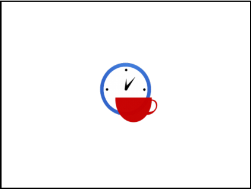

# 08. Software Team Management

> Source: `08. Software Team Management.pdf`  
> Extracted slides: **110**  
> Structure: one Markdown section per original PowerPoint slide in the 6-up PDF handout.  
> Wording is preserved from the PDF text layer; no outside knowledge was added. Visual-only slides include a cropped image.

## Slide 001 — Software Team

_PDF page 1, handout panel 1_

```text
Software Team
Management
Lecturer: Ngo Huy Bien
Software Engineering Department
Faculty of Information Technology
VNUHCM - University of Science
Ho Chi Minh City, Vietnam
nhbien@fit.hcmus.edu.vn
```

---

## Slide 002 — Objectives

_PDF page 1, handout panel 2_

```text
Objectives
To build a software team.
To manage a team.
To resolve conflicts.
To increase team productivity.
To motivate team members.
To prevent poor performance.
To lead a team.
To analyze and evaluate a management
approach.
```

---

## Slide 003 — Contents

_PDF page 1, handout panel 3_

```text
Contents
I.
Software team
II.
Team management
III.
Conflict resolution
IV. Team productivity
V.
Team motivation
VI.
Team performance
VII. Leading a team
VIII. Team evaluation
```

---

## Slide 004 — References

_PDF page 1, handout panel 4_

```text
References
1.
Tom DeMarco and Timothy Lister (2013). Peopleware: Productive
Projects and Teams. Addison-Wesley Professional.
2.
Frederick P. Brooks, Jr. (1995). The Mythical Man-Month: Essays on
Software Engineering. Addison-Wesley Professional.
3.
Kim Heldman (2018). PMP Project Management Professional Study
Guide. John Wiley & Sons.
4.
BW Boehm and R Ross (1989). Theory-W Software Project Management:
Principles and Examples.
5.
Douglas McGregor (1966). The Human Side of Enterprise.
6.
Bruce W. Tuckman and Mary Ann C. Jensen (1977). Stages of Small-Group
Development Revisited.
7.
Roger S. Pressman (2010). Software Engineering: A Practitioner's
Approach.
8.
A. H. Maslow (1943). A Theory of Human Motivation.
9.
William Holtsnider & Brian D. Jaffe (2012). IT Manager's Handbook.
10.
Frederick Herzberg (2003). One More Time: How Do You Motivate
Employees?
11.
Tom Peters and Robert Waterman (1980). Structure Is Not Organization.
```

---

## Slide 005 — Why Do Projects Fail?

_PDF page 1, handout panel 5_

```text
Why Do Projects Fail?
•
Unclear requirements (no problems, no business/user requirements,
no communication with clients/users)
– No executive summary, no project vision and scope
– No stories/use cases, no mockups, no prototypes
•
Human factors
– No feedback  No working together
– No money, no challenges, no interesting works  No motivation
•
No estimation or incorrect estimation
•
Effort/Duration/Cost/Resources
•
No planning
– No project schedule/release plan
•
No status reporting or incorrect status reporting
– No project schedule/release plan updates
•
No risk management
```

---

## Slide 006 — What Causes Project Failures? [1]

_PDF page 1, handout panel 6_

```text
What Causes Project Failures? [1]
• For the overwhelming majority of
the bankrupt projects, there was
not a single technological issue to
explain the failure.
• The major problems of our work
are not so much technological as
sociological in nature.
• The main reason we tend to focus
on the technical rather than the
human side of the work is not
because it's more crucial, but
because it's easier to do.
Peopleware can refer to anything
that has to do with the role of
people in the development or use of
computer software and hardware
systems, including such issues as
developer productivity, teamwork,
group dynamics, the psychology of
programming, project management,
organizational factors, human
interface design, and human-
machine-interaction.
```

---

## Slide 007 — Why a Team?

_PDF page 2, handout panel 1_

```text
Why a Team?
```

---

## Slide 008 — Software Team Formation

_PDF page 2, handout panel 2_

```text
Software Team Formation
• Managers
• Recruit team members, or work with the functional managers.
• Analyze the skills, experience and competencies within your team, and
start matching people to roles.
• Software engineers
• Carefully review a company or a team before deciding to join them.
• Fully understand what the team's role and goals are.
```

---

## Slide 009 — Why a Project Manager/Leader?

_PDF page 2, handout panel 3_

```text
Why a Project Manager/Leader?
```

---

## Slide 010 — Project Manager/Leader Selection

_PDF page 2, handout panel 4_

```text
Project Manager/Leader Selection
```

---

## Slide 011 — The Leadership Grid

_PDF page 2, handout panel 5_

```text
The Leadership Grid
•
The Leadership Grid is a model of
behavioral leadership developed
in the 1960s by Robert Blake and
Jane Mouton to measure concern
for production against concern for
people.
•
The grid identifies five types of
leaders: Impoverished, Produce or
Perish, Middle of the Road,
Country Club, and Team.
•
The Team approach is considered
the most effective form of
leadership, according to the
creators of the Leadership Grid.
```

---

## Slide 012 — Project Manager/Leader's Time

_PDF page 2, handout panel 6_

```text
Project Manager/Leader's Time
Technical
Issues: 20%
Human Dynamics
Issues: 80%
```

---

## Slide 013 — Visual-only slide

_PDF page 3, handout panel 1_

> No extractable text was found in the PDF text layer for this slide. The visual is preserved below.



---

## Slide 014 — Team Kick-off: Discussion Questions

_PDF page 3, handout panel 2_

```text
Team Kick-off: Discussion Questions
1.
Team building video or pictures?
2.
Decision-making process?
3.
Demonstration of communication plan and tools 
Producing a tangible result (Google Docs).
4.
Meeting minutes of a meeting?
```

---

## Slide 015 — Kick-off Meeting

_PDF page 3, handout panel 3_

```text
Kick-off Meeting
Introduce team members.
Clarify the project terminologies, problems, solution, and
deliverables.
Clarify RACI matrix.
Answer questions.
Start developing the project plan.
```

---

## Slide 016 — Icebreakers

_PDF page 3, handout panel 4_

```text
Icebreakers
```

---

## Slide 017 — How to Reach a Decision [2]

_PDF page 3, handout panel 5_

```text
How to Reach a Decision [2]
•
Won't one get a better product (system design) by getting the good
ideas from all the team, following a democratic philosophy, rather
than by restricting the development of specifications to a few?
•
The conceptual integrity of a system determines its ease of use.

Aristocracy
Democracy
Monarch
```

---

## Slide 018 — How to Share a Work

_PDF page 3, handout panel 6_

```text
How to Share a Work
•
Each segment of a large job is tackled by a team, but that
the team be organized like a surgical team rather than a
hog-butchering team.
•
That is, instead of each member cutting away on the
problem, one does the cutting and the others give him
every support that will enhance his effectiveness and
productivity.
The
Surgical
Team
```

---

## Slide 019 — How to Conduct a Meeting?

_PDF page 4, handout panel 1_

```text
How to Conduct a Meeting?
Target
Solving problems?
Making decisions?
Transferring knowledge, getting
feedback, reporting?

Responsibilities

Chairman

Secretary

Attendees

Agenda preparation
Timeframe preparation
Content, data preparation
Meeting minutes
o Who were present?
o What are the targets?
o What are the decisions,
resolutions?
o Who are responsible for doing
the tasks?
o When will decisions be
effective?
```

---

## Slide 020 — Visual-only slide

_PDF page 4, handout panel 2_

> No extractable text was found in the PDF text layer for this slide. The visual is preserved below.


---

## Slide 021 — How to Manage a Team?

_PDF page 4, handout panel 3_

```text
How to Manage a Team?
```

---

## Slide 022 — Management Styles: Discussion Questions

_PDF page 4, handout panel 4_

```text
Management Styles: Discussion Questions
1.
Organizational structure?
2.
What is theory X, Y, Z?
3.
Team leader: How to apply theory X, Y, Z?
4.
Why know about theory X, Y, Z?
5.
Team rules (guidelines for standard behavior) and policies (responses to
specific problems)? Working hours agreement?
6.
Task assignment and results approval procedure?
7.
Change control process?
```

---

## Slide 023 — Functional Organizations [3]

_PDF page 4, handout panel 5_

```text
Functional Organizations [3]
• Functional organizations are centered on specialties and
grouped by function, hence the term functional organization.
```

---

## Slide 024 — Projectized Organizations

_PDF page 4, handout panel 6_

```text
Projectized Organizations
```

---

## Slide 025 — Weak Matrix Organization

_PDF page 5, handout panel 1_

```text
Weak Matrix Organization
```

---

## Slide 026 — Balanced Matrix Organization

_PDF page 5, handout panel 2_

```text
Balanced Matrix Organization
```

---

## Slide 027 — Strong Matrix Organization

_PDF page 5, handout panel 3_

```text
Strong Matrix Organization
```

---

## Slide 028 — Why Understand

_PDF page 5, handout panel 4_

```text
Why Understand
Organizational Structure?
```

---

## Slide 029 — Answer

_PDF page 5, handout panel 5_

```text
Answer
• Organizational structure is an enterprise environmental factor,
which can affect the availability of resources and influence
how projects are conducted.
• Understanding the organizational structure will help you, as a
project manager, with the cultural influences and
communication avenues that exist in the organization to gain
cooperation and successfully bring your projects to a close.
```

---

## Slide 030 — Influence of Organizational

_PDF page 5, handout panel 6_

```text
Influence of Organizational
Structures on Projects
```

---

## Slide 031 — Visual-only slide

_PDF page 6, handout panel 1_

> No extractable text was found in the PDF text layer for this slide. The visual is preserved below.


---

## Slide 032 — Theory X [4]

_PDF page 6, handout panel 2_

```text
Theory X [4]
•
Theory X held that the most efficient way to get a
job done was to do more and more precise time
and motion studies, and to organize jobs into well-
orchestrated sequences of tasks in which people
were as efficient and predictable as machines.
•
Management consisted of keeping the system
running smoothly, largely through coercion.
•
The Theory X was a poor long-term strategy
because it stunted people's creativity,
adaptiveness, and self esteem, making the people
and their organizations unable to cope with
change.
People don't
like to work.
People are
irresponsible.
People prefer
to be
controlled,
directed.
```

---

## Slide 033 — Theory Y [4, 5]

_PDF page 6, handout panel 3_

```text
Theory Y [4, 5]
•
This is a process primarily of creating
opportunities, releasing potential, removing
obstacles, encouraging growth, providing
guidance.
•
Theory Y created difficulties in dealing with
conflict. This became a major concern in
Theory Y organizations, with many individual
initiatives competing for resources and
creating problems of coordination.

People like to work
if conditions are
favorable.
People are
responsible.
People can be self
directed, creative at
work if properly
motivated.
```

---

## Slide 034 — From Theory X to Theory Y [5]

_PDF page 6, handout panel 4_

```text
From Theory X to Theory Y [5]
•
Theory X places exclusive reliance upon external control of human
behavior, whereas Theory Y relies heavily on self-control and self-
direction.
•
These are ways of freeing people from the too-close control of
conventional organization, giving them a degree of freedom to
direct their own activities, to assume responsibility, and
importantly, to satisfy their egoistic needs.
```

---

## Slide 035 — Theory Z

_PDF page 6, handout panel 5_

```text
Theory Z
• Theory Z holds that much of the conflict resolution problem
can be eliminated by up-front investment in developing
shared values and arriving at major decisions by consensus.
```

---

## Slide 036 — William Ouchi's Theory Z (I)

_PDF page 6, handout panel 6_

```text
William Ouchi's Theory Z (I)
•
A strong company philosophy and culture: The company
philosophy and culture needs to be understood and embodied by
all employees, and employees need to believe in the work they're
doing.
•
Long-term staff development and employment: The organization
and management team has measures and programs in place to
develop employees. Employment is usually long-term, and
promotion is steady and measured. This leads to loyalty from team
members.
•
Concern for the happiness and well-being of workers: The
organization shows sincere concern for the health and happiness of
its employees, and for their families. It puts measures and programs
in place to help foster this happiness and well-being.
```

---

## Slide 037 — William Ouchi's Theory Z (II)

_PDF page 7, handout panel 1_

```text
William Ouchi's Theory Z (II)
•
Consensus in decisions: Employees are encouraged and expected to
take part in organizational decisions.
•
Generalist employees: Because employees have a greater
responsibility in making decisions, and understand all aspects of the
organization, they should be "generalists." However, employees are
still expected to have specialized career responsibilities.
•
Informal control with formalized measures: Employees are
empowered to perform tasks the way they see fit, and management is
quite "hands off." However, there should be formalized measures in
place to assess work quality and performance.
•
Individual responsibility: The organization recognizes the
contributions of individuals, but always within the context of the team
as a whole.
```

---

## Slide 038 — William Ouchi's Theory Z (III)

_PDF page 7, handout panel 2_

```text
William Ouchi's Theory Z (III)
• It can be impractical to use all elements of the theory.
• However, it still has many useful strategies, which you can use
to boost your team's performance and productivity.
```

---

## Slide 039 — Key Person [1]

_PDF page 7, handout panel 3_

```text
Key Person [1]
• Isn't that the essence of management, after all, to make sure
that the work goes on whether the individuals stay or not?
• So why don't we have a key person?
```

---

## Slide 040 — A Quota for Errors

_PDF page 7, handout panel 4_

```text
A Quota for Errors
• Fostering an atmosphere that doesn't allow for error simply
makes people defensive.
• They don't try things that may turn out badly.
```

---

## Slide 041 — Management: The Bozo Definition

_PDF page 7, handout panel 5_

```text
Management: The Bozo Definition
•
Management is kicking ass.
•
Managers provide all the thinking and the people underneath them
just carry out their bidding.
•
You may be able to kick people to make them active, but not to
make them creative, inventive, and thoughtful.
```

---

## Slide 042 — The People Store

_PDF page 7, handout panel 6_

```text
The People Store
• Think of people as parts of the machine.
• When a part wears out, you get another.
```

---

## Slide 043 — Parkinson's Law

_PDF page 8, handout panel 1_

```text
Parkinson's Law
• Parkinson's law: Work expands to fill the time allocated for it.
• Organizational busy work tends to expand to fill the working
day.
• The only way to get work done at all is to set an impossibly
optimistic delivery date.
• Parkinson's law almost certainly doesn't apply to your
development workers. Why?
```

---

## Slide 044 — Reserve Time for Thinking

_PDF page 8, handout panel 2_

```text
Reserve Time for Thinking
• We haven't got time to think about this task, only to do it.
What proportion of your time ought to be dedicated to
actually doing a task?
```

---

## Slide 045 — Visual-only slide

_PDF page 8, handout panel 3_

> No extractable text was found in the PDF text layer for this slide. The visual is preserved below.


---

## Slide 046 — Conflicts: Discussion Questions

_PDF page 8, handout panel 4_

```text
Conflicts: Discussion Questions
1.
Why learn about team development?
2.
What is the most important stage of team development?
What should we do at this stage?
3.
List of your team conflicts? Conflict resolution techniques?
4.
Lessons learned?
```

---

## Slide 047 — Example Conflicts

_PDF page 8, handout panel 5_

```text
Example Conflicts
•
Tools (GIT vs. SVN, Wrike vs. Jira)
•
Development process (which files should be put into source control,
broken code, different code structure, compilation errors, errors
when following compilation guide, need of mockups)
•
Coding standards (long methods, variable names)
•
Templates (use cases, user stories, test cases)
•
Progress tracking (task status, time log)
```

---

## Slide 048 — When Do We Get Conflicted? [6]

_PDF page 8, handout panel 6_

```text
Forming
Storming
Norming
Performing
Adjourning
Help the team
take responsibility
for progress
towards the goal.
Establish process
and structure
Work to smooth
conflict
Build good
relationships
between team
members.
When Do We Get Conflicted? [6]
Establish objectives clearly.
Delegate as far as
you sensibly can.
Aim to have as "light
a touch" as possible.
Celebrate its
achievements.
```

---

## Slide 049 — Why Do We Get Conflicted? (I)

_PDF page 9, handout panel 1_

```text
Why Do We Get Conflicted? (I)
No leader, lack of reputation
```

---

## Slide 050 — Why Do We Get Conflicted? (II)

_PDF page 9, handout panel 2_

```text
Why Do We Get Conflicted? (II)
Formal meeting
Informal meeting
Paper report
Phone call
Conference call
Email
Instant messages
Project management software
No Communication!
```

---

## Slide 051 — Forms of Communication [3]

_PDF page 9, handout panel 3_

```text
Forms of Communication [3]
• Verbal communication is easier and less
complicated than written
communication, and it's usually a fast
method of communication.
• Written communication, on the other
hand, is an excellent way to get across
complex, detailed messages.
• Horizontal communications are
messages sent and received to peers.
• Vertical communications are messages
sent and received down to subordinates
and up to executive management.
```

---

## Slide 052 — Face to Face Communication

_PDF page 9, handout panel 4_

```text
Face to Face Communication
• Body language.
• Tone of voice.
```

---

## Slide 053 — Why Can't We Communicate? [7]

_PDF page 9, handout panel 5_

```text
Why Can't We Communicate? [7]
•
Principle 1. Listen.
•
Principle 2. Prepare before you communicate.
•
Principle 3. Someone should facilitate the activity.
•
Principle 4. Face-to-face communication is best.
•
Principle 5. Take notes and document decisions.
•
Principle 6. Strive for collaboration.
•
Principle 7. Stay focused; modularize your discussion.
•
Principle 8. If something is unclear, draw a picture.
•
Principle 9. (a) Once you agree to something, move on. (b) If you can't
agree to something, move on. (c) If a feature or function is unclear and
cannot be clarified at the moment, move on.
•
Principle 10. Negotiation is not a contest or a game. It works best when
both parties win.
```

---

## Slide 054 — Barriers to Effective Listening

_PDF page 9, handout panel 6_

```text
• Considering that the subject is uninteresting
• Evaluating the speaker, not the subject
• Becoming emotionally involved
• Listening for facts, not central ideas
• Avoiding difficult topics
• Too much note taking

Barriers to Effective Listening
```

---

## Slide 055 — Active Listening

_PDF page 10, handout panel 1_

```text
Active Listening
• Look at the speaker directly
• Minimize external distractions
• Minimize internal distractions

• Nod occasionally, Murmur (“uh-huh” and “um-hmm”)
• Summarize the speaker's comments periodically
• Note unclear information, disagreement

• Allow the speaker to finish
• Ask questions for clarification
```

---

## Slide 056 — Conflict Management Techniques [3]

_PDF page 10, handout panel 2_

```text
Conflict Management Techniques [3]
•
Withdraw/Avoid. One of the parties gets up and leaves and
refuses to discuss the conflict. When parties withdraw or avoid,
they never reach resolution.
•
Smooth/Accommodate. The areas of agreement are
emphasized over the areas of difference. Someone attempts to
make the conflict appear less important than it is. The smooth
or accommodate technique does not lead to a permanent
solution.
•
Force/Direct. One person forces a solution on the other parties.
Although this is a permanent solution, it isn't necessarily the
best solution.
•
Compromise/Reconcile. Each of the parties involved in the
conflict gives up something to reach a solution.
•
Collaborate/Problem Solve. A fact-finding mission. Once the
facts are uncovered, they're presented to the parties and the
decision will be clear. Collaborating will lead to true consensus.
```

---

## Slide 057 — Division of Responsibilities and

_PDF page 10, handout panel 3_

```text
Division of Responsibilities and
Values Conflict
• Between 2 members.
• Among groups.
```

---

## Slide 058 — Members' Conflict

_PDF page 10, handout panel 4_

```text
Members' Conflict
•
Conduct one-to-one meetings with each party.
•
Review the goals, commitments, and policies.
•
Every one-on-one meeting should conclude with action items.
•
All parties are held accountable for deliverables.
•
If they aren't, ask what obstacles are preventing action and try to
help them resolve the issue.
```

---

## Slide 059 — Intergroup Conflicts

_PDF page 10, handout panel 5_

```text
Intergroup Conflicts
•
Review the motivation and goals of each group.
•
Review the policies and rules.
•
Review the bases of power: coercive power, legitimate power,
reward power, referent power and expert power.
•
Definition of justice, injustice and life meaning.
```

---

## Slide 060 — The Struggle for Recognition

_PDF page 10, handout panel 6_

```text
The Struggle for Recognition
```

---

## Slide 061 — Visual-only slide

_PDF page 11, handout panel 1_

> No extractable text was found in the PDF text layer for this slide. The visual is preserved below.


---

## Slide 062 — Productivity: Discussion Questions

_PDF page 11, handout panel 2_

```text
Productivity: Discussion Questions
1.
What is the Spanish theory?
2.
Overtime agreement?
3.
What is the English theory?
4.
Tools used for improving productivity?
```

---

## Slide 063 — Hot to Increase Team Productivity?

_PDF page 11, handout panel 3_

```text
Hot to Increase Team Productivity?
• Productivity ought to mean
achieving more in an hour of
work, but all too often it has
come to mean extracting more
for an hour of pay.
• The Spanish Theory: only a fixed
amount of value existed on
earth, and therefore the path to
the accumulation of wealth was
to learn to extract it more
efficiently from the soil or from
people's backs.
```

---

## Slide 064 — Overtime is Like Sprinting

_PDF page 11, handout panel 4_

```text
Overtime is Like Sprinting
• It makes some sense for the last hundred yards of the
marathon for those with any energy left, but if you start
sprinting in the first mile, you're just wasting time.
```

---

## Slide 065 — Force People Working Overtime

_PDF page 11, handout panel 5_

```text
Force People Working Overtime
•
Trying to get people to sprint too much can only result in loss of
respect for the manager.
•
The best workers take their compensatory under time when they
can, and end up putting in forty hours of real work each week.
•
People under time pressure don't work better; they just work faster.
•
In order to work faster, they may have to sacrifice the quality of the
product and their own job satisfaction.
Overtime for salaried
workers is a figment of
the naive manager's
imagination.
```

---

## Slide 066 — Vienna Waits for You

_PDF page 11, handout panel 6_

```text
Vienna Waits for You
• “Work longer and harder”
• Your people are very aware of the one short life that each
person is allotted.
• And they know too well that there has got to be something
more important than the silly job they're working on.
```

---

## Slide 067 — The English Theory

_PDF page 12, handout panel 1_

```text
The English Theory
• Value could be created through ingenuity and technology.
```

---

## Slide 068 — Visual-only slide

_PDF page 12, handout panel 2_

> No extractable text was found in the PDF text layer for this slide. The visual is preserved below.


---

## Slide 069 — Motivation: Discussion Questions

_PDF page 12, handout panel 3_

```text
Motivation: Discussion Questions
1.
What is Maslow's hierarchy of needs?
2.
Why learn about Maslow's hierarchy of needs?
3.
Benefits agreement? Learning opportunities? Career path?
```

---

## Slide 070 — Maslow's Hierarchy of Needs [8]

_PDF page 12, handout panel 4_

```text
Maslow's Hierarchy of Needs [8]
------------
Dead
---------------
Alive
------------------
Survive
Thrive
Necessary for life; unmet,
these needs lead to death
Without these
people will not
act civilly.
Obtaining our full potential;
becoming confident, eager to
express our beliefs, and willing to
reach out to others to help them
They can seek knowledge, peace,
esthetic experiences, self-
fulfillment, oneness with God, etc.
Extrinsic Motivation
```

---

## Slide 071 — The Carrot and Stick Approach [9]

_PDF page 12, handout panel 5_

```text
The Carrot and Stick Approach [9]
• The means for satisfying man's physiological and (within
limits) his safety needs can be provided or withheld by
management.
• Employment itself is such a means, and so are wages, working
conditions, and benefits. By these means the individual can be
controlled so long as he is struggling for subsistence. Man
lives for bread alone when there is no bread.
```

---

## Slide 072 — When to Use?

_PDF page 12, handout panel 6_

```text
When to Use?
• But the carrot and stick theory does not work at all once man
has reached an adequate subsistence level and is motivated
primarily by higher needs.
```

---

## Slide 073 — What Can You Do?

_PDF page 13, handout panel 1_

```text
What Can You Do?
------------------
Nothing
---------------------
Company
------------------------
Company
Nothing
Necessary for life; unmet,
these needs lead to death
Without these
people will not
act civilly.
Obtaining our full potential;
becoming confident, eager to
express our beliefs, and willing to
reach out to others to help them
They can seek knowledge, peace,
esthetic experiences, self-
fulfillment, oneness with God, etc.
Extrinsic Motivation
----------------------------
Leadership
--------------------------------
Leadership
```

---

## Slide 074 — Visual-only slide

_PDF page 13, handout panel 2_

> No extractable text was found in the PDF text layer for this slide. The visual is preserved below.


---

## Slide 075 — Performance: Discussion Questions

_PDF page 13, handout panel 3_

```text
Performance: Discussion Questions
1.
Commitment agreement?
2.
Tasks management system?
3.
Timesheet management system?
4.
Training?
5.
Tools for tracking KPIs?
```

---

## Slide 076 — Prevent Poor Performance

_PDF page 13, handout panel 4_

```text
Prevent Poor Performance
• Ensure that the task assignee knows
– why her task is important,
– what she need to do and deliver,
– when she need to submit her result,
– which support she needs.
```

---

## Slide 077 — Ask for Commitment

_PDF page 13, handout panel 5_

```text
Ask for Commitment
People commit to a
group or organization
because they gain
something important
from their involvement.
•
Be open and clear about the mission, principles, and
goals of your team.
•
Pick out the right level of challenge for people.
```

---

## Slide 078 — Prevent the Second-System Effect [2]

_PDF page 13, handout panel 6_

```text
Prevent the Second-System Effect [2]
•
The general tendency is to over-design the second system, using all
the ideas and frills that were cautiously sidetracked on the first one.
•
Be conscious of the peculiar hazards of that system, and exert extra
self-discipline to avoid functional ornamentation and to avoid
extrapolation of functions that are obviated by changes in
assumptions and purposes.
```

---

## Slide 079 — Provide Training [9]

_PDF page 14, handout panel 1_

```text
Provide Training [9]
• Cost
• Need
• Employee morale
• Scheduling demands
• Certification

• What if the employee takes a training class and then uses his
new-found skills to find another job? – Employee agreements
• Maximizing the value of training (transferring knowledge)
```

---

## Slide 080 — Perform Performance Reviews

_PDF page 14, handout panel 2_

```text
Perform Performance Reviews
•
Quality of work
•
Flexibility
•
Creativity in solving problems
•
Communication skills
•
Innovation
•
Going above and beyond the requirements of the job
•
Coordination, interaction, and collaboration with others
(particularly those they don't have direct authority over)
•
Accountability
•
Ability to complete assignments in a timely manner
•
Ethics and compliance
•
Ability to pick up new skills on their own
•
Ability to work with and enhance the work of other staff
members
•
Ability to manage short- and long-term projects
```

---

## Slide 081 — Solve Performance Problem

_PDF page 14, handout panel 3_

```text
Solve Performance Problem
Lack of
Resource
Lack of
Motivation
Lack of
Skills
•
Rewards and discipline are
clearly linked to
performance and defined
behavioral objectives.
•
Show positive things and people
•
Help people focus on past
success, strengths, rewards
•
Help people focus on work
•
Make sure people
have materials and
training
•
Help people
establish
performance
goals make sure
people have the
tools, resources
```

---

## Slide 082 — The Mythical Man-Month

_PDF page 14, handout panel 4_

```text
The Mythical Man-Month
Adding manpower to a late software project makes it later.
Task with
complex
interrelation
-ships
Partition-able
task requiring
communication
Unpartition-
able task
Perfectly
partition-
able task
```

---

## Slide 083 — Visual-only slide

_PDF page 14, handout panel 5_

> No extractable text was found in the PDF text layer for this slide. The visual is preserved below.


---

## Slide 084 — Leadership: Discussion Questions

_PDF page 14, handout panel 6_

```text
Leadership: Discussion Questions
1.
Intrinsic rewards (recognition, responsibility, advancement)?
2.
Achievement?
3.
Power?
4.
Affiliation?
```

---

## Slide 085 — Intrinsic Motivation [10]

_PDF page 15, handout panel 1_

```text
Intrinsic Motivation [10]
• Most of us are motivated by intrinsic rewards: interesting,
challenging work, and the opportunity to achieve and grow
into greater responsibility.
• Of course, you have to provide some extrinsic incentives.
• After all, few of us can afford to work for no salary.

Forget praise. Forget punishment. Forget cash.
You need to make their jobs more interesting.
```

---

## Slide 086 — Intrinsic Rewards

_PDF page 15, handout panel 2_

```text
Intrinsic Rewards
• Enrich their jobs by applying these principles:
– Enable people to take on new, more difficult tasks they
haven't handled before.
– Assign individuals specialized tasks that allow them to
become experts.
– Increase individuals' accountability for their work by
removing some controls.
– Make information available directly to employees rather
than sending it through their managers first.
– Give people responsibility for a complete process or unit of
work.
```

---

## Slide 087 — Hygiene Theory (Frederick Herzberg) [3]

_PDF page 15, handout panel 3_

```text
Hygiene Theory (Frederick Herzberg) [3]
•
There are two factors that contribute to motivation: hygiene factors and
motivators.
•
Hygiene factors deal with work environment issues. They prevent
dissatisfaction: Pay, benefits, the conditions of the work environment, and
relationships with peers and managers.
•
Motivators deal with the substance of the work itself and the satisfaction
one derives from performing the functions of the job. Motivators lead to
satisfaction: The ability to advance, the opportunity to learn new skills,
and the challenges involved in the work.
```

---

## Slide 088 — Expectancy Theory (Victor Vroom)

_PDF page 15, handout panel 4_

```text
Expectancy Theory (Victor Vroom)
•
The expectation of a positive outcome drives motivation.
•
People will behave in certain ways if they think there will be good
rewards for doing so.
•
This theory also says that people become what you expect of them.
Never criticize people
in public.
Treat people like valuable
contributors.
```

---

## Slide 089 — Coach by Encouragement

_PDF page 15, handout panel 5_

```text
Coach by Encouragement
•
The purpose of coaching is to redirect behavior and mentally
challenge the trainee.
•
Coaching is not intended to "do for" the learner or point out
mistakes, blame, or criticize.
Change incorrect actions or redirect the
behavior:
•
How else might you do it?
•
See if this works better for you. (Be specific,
explain, and demonstrate.)
•
Why don't you try a different approach?
•
Let me offer a suggestion.
•
What happens if you don't do that step?
```

---

## Slide 090 — Give Encouraging Feedback

_PDF page 15, handout panel 6_

```text
Give Encouraging Feedback
•
The purpose of feedback is to build self-esteem through
encouragement.
•
Feedback should be specific, positive, and focused on the
strengths and assets of the trainee; it should demonstrate
acceptance of and confidence in the trainee; and it should
recognize effort and improvement.
•
It usually takes a couple of practice sessions to master
that step. You'll make it!
•
Look how much better it went this time.
•
You're making progress. Hang in there!
•
You're really skilled in.................. (something specific)
•
You must feel good about the improvement you've
made.
•
You have put a lot of effort into mastering that task.
```

---

## Slide 091 — Achievement Theory (David McClelland)

_PDF page 16, handout panel 1_

```text
Achievement Theory (David McClelland)
•
Achievement theory says that people are motivated by the need for
three things: achievement, power, and affiliation.
•
The achievement motivation is obviously the need to achieve or
succeed.
•
The power motivation involves a desire for influencing the behavior
of others.
•
And the need for affiliation is relationship oriented.
```

---

## Slide 092 — Visual-only slide

_PDF page 16, handout panel 2_

> No extractable text was found in the PDF text layer for this slide. The visual is preserved below.


---

## Slide 093 — Contingency Theory (Fred Fiedler)

_PDF page 16, handout panel 3_

```text
Contingency Theory (Fred Fiedler)
•
Fred Edward Fiedler (1967). Theory of Leadership Effectiveness.
McGraw-Hill Education.
•
No single leadership style is perfect or ideal, as the needs change
depending on circumstances and context.
•
A leader's effectiveness is based on the situation.
•
This is the result of two factors – "leadership style" and "situational
favorableness" (later called "situational control").
```

---

## Slide 094 — Least-Preferred Coworker Scale

_PDF page 16, handout panel 4_

```text
Least-Preferred Coworker Scale
•
The least preferred coworker (LPC) scale requires a person to rate
the one individual they would least want to work with — the least-
preferred coworker — using a range of 18 to 25 bipolar (positive or
negative) adjectives, with ratings from 1 to 8.
•
The scale utilizes a subjective evaluation of an individual's attitudes
toward their least favorable coworker.
Unfriendly
1   2   3   4   5   6   7   8
Friendly
Unpleasant
1   2   3   4   5   6   7   8
Pleasant
Rejecting
1   2   3   4   5   6   7   8
Accepting
```

---

## Slide 095 — Example LPC Scale

_PDF page 16, handout panel 5_

```text
Example LPC Scale
Unfriendly
1   2   3   4   5   6   7   8
Friendly
Unpleasant
1   2   3   4   5   6   7   8
Pleasant
Rejecting
1   2   3   4   5   6   7   8
Accepting
Tense
1   2   3   4   5   6   7   8
Relaxed
Cold
1   2   3   4   5   6   7   8
Warm
Boring
1   2   3   4   5   6   7   8
Interesting
Backbiting
1   2   3   4   5   6   7   8
Loyal
Uncooperative
1   2   3   4   5   6   7   8
Cooperative
Hostile
1   2   3   4   5   6   7   8
Supportive
Guarded
1   2   3   4   5   6   7   8
Open
Insincere
1   2   3   4   5   6   7   8
Sincere
Unkind
1   2   3   4   5   6   7   8
Kind
Inconsiderate
1   2   3   4   5   6   7   8
Considerate
Untrustworthy
1   2   3   4   5   6   7   8
Trustworthy
Gloomy
1   2   3   4   5   6   7   8
Cheerful
Quarrelsome
1   2   3   4   5   6   7   8
Harmonious
```

---

## Slide 096 — LPC Score

_PDF page 16, handout panel 6_

```text
LPC Score
•
Task-oriented leaders usually view their LPCs more negatively, resulting in
a lower score. Low LPCs are very effective at completing tasks. They're
quick to organize a group to get tasks and projects done. Relationship-
building is a low priority.
•
Relationship-oriented leaders usually view their LPCs more positively,
giving them a higher score. High LPCs focus more on personal
connections, and they're good at avoiding and managing conflict. They're
better able to make complex decisions.
```

---

## Slide 097 — Situational Favorableness

_PDF page 17, handout panel 1_

```text
Situational Favorableness
Leader-Member
Relations
Task Structure
Leader's Position
Power
The level of trust
and confidence
that your team
has in you.
The type of task you're doing:
clear and structured, or vague
and unstructured.
The amount of
power you have to
direct the group,
and provide reward
or punishment.
Good
Poor Structured
Unstructured
Strong
Weak
```

---

## Slide 098 — Most Effective Leader Style

_PDF page 17, handout panel 2_

```text
Most Effective Leader Style
Leader-
Member
Relations
Task Structure
Leader's
Position Power
Most Effective
Leader
Good
Structured
Strong
Low LPC
Good
Structured
Weak
Low LPC
Good
Unstructured
Strong
Low LPC
Good
Unstructured
Weak
High LPC
Poor
Structured
Strong
High LPC
Poor
Structured
Weak
High LPC
Poor
Unstructured
Strong
High LPC
Poor
Unstructured
Weak
Low LPC
```

---

## Slide 099 — The Power of Leaders

_PDF page 17, handout panel 3_

```text
The Power of Leaders
•
Punishment, also known as coercive or penalty power, is just the
opposite of reward power.
•
Expert power occurs when the person being influenced believes the
manager, or the person doing the influencing, is knowledgeable
about the subject or has special abilities that make them an expert.
•
Legitimate, or formal, power comes about as a result of the
influencer's position.
•
Referent power is inferred to the influencer by their subordinates.
```

---

## Slide 100 — Visual-only slide

_PDF page 17, handout panel 4_

> No extractable text was found in the PDF text layer for this slide. The visual is preserved below.


---

## Slide 101 — Multi-team Management

_PDF page 17, handout panel 5_

```text
Multi-team Management
Is there any way to partition the project?
```

---

## Slide 102 — Visual-only slide

_PDF page 17, handout panel 6_

> No extractable text was found in the PDF text layer for this slide. The visual is preserved below.


---

## Slide 103 — Team Assessment

_PDF page 18, handout panel 1_

```text
Team Assessment
Meeting minutes
```

---

## Slide 104 — The McKinsey 7S Framework [11]

_PDF page 18, handout panel 2_

```text
The McKinsey 7S Framework [11]
• How do you go about analyzing how well your organization is
positioned to achieve its intended objective?
• While some models of organizational effectiveness go in and
out of fashion, one that has persisted is the McKinsey 7S
framework.
• Developed in the early 1980s by Tom Peters and Robert
Waterman, two consultants working at the McKinsey &
Company consulting firm.
• The basic premise of the model is that there are seven
internal aspects of an organization that need to be aligned if it
is to be successful.
```

---

## Slide 105 — The Seven Elements

_PDF page 18, handout panel 3_

```text
The Seven Elements
•
Strategy: the plan devised to maintain and build
competitive advantage over the competition.
•
Structure: the way the organization is structured and
who reports to whom.
•
Systems: the daily activities and procedures that staff
members engage in to get the job done.
•
Shared Values: called "super-ordinate goals" when the
model was first developed, these are the core values
of the company that are evidenced in the corporate
culture and the general work ethic.
•
Style: the style of leadership adopted.
•
Staff: the employees and their general capabilities.
•
Skills: the actual skills and competencies of the
employees working for the company.
```

---

## Slide 106 — Visual-only slide

_PDF page 18, handout panel 4_

> No extractable text was found in the PDF text layer for this slide. The visual is preserved below.


---

## Slide 107 — Key Takeaways

_PDF page 18, handout panel 5_

```text
Key Takeaways
•
Theory X.
•
Theory Y.
•
Theory Z.

 Shared Values / Objectives.

 Team of Friends.
•
Spanish Theory  Working Harder  Overtime.
•
English Theory  Working Smarter.

 Innovation / Creativity / Technology

- GitLab / CircleCI.

- Docker / Kubernetes.

- Automation Tests.

 Time Reduction.

 Steep Learning Curve (Initial Difficulty).
•
Motivation/Leadership.

 Needs.

 Other Theories.
•
Performance.

 KPIs.
```

---

## Slide 108 — Visual-only slide

_PDF page 18, handout panel 6_

> No extractable text was found in the PDF text layer for this slide. The visual is preserved below.


---

## Slide 109 — Further Reading

_PDF page 19, handout panel 1_

```text
Further Reading
1. Lyssa Adkins (2010). Coaching Agile Teams. Addison-Wesley.
2. Zachary Wong (2007). Human Factors in Project Management -
Concepts, Tools, and Techniques for Inspiring Teamwork and
Motivation. Jossey-Bass.
```

---

## Slide 110 — Thank You & See You Again

_PDF page 19, handout panel 2_

```text
Thank You & See You Again
```

---

