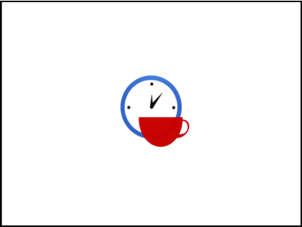

# 09. Software Project Monitoring and Control

> Source: `09. Software Project Monitoring and Control.pdf`  
> Extracted slides: **72**  
> Structure: one Markdown section per original PowerPoint slide in the 6-up PDF handout.  
> Wording is preserved from the PDF text layer; no outside knowledge was added. Visual-only slides include a cropped image.

## Slide 001 — Software Project

_PDF page 1, handout panel 1_

```text
Software Project
Monitoring and Control
Lecturer: Ngo Huy Bien
Software Engineering Department
Faculty of Information Technology
VNUHCM - University of Science
Ho Chi Minh City, Vietnam
nhbien@fit.hcmus.edu.vn
```

---

## Slide 002 — Objectives

_PDF page 1, handout panel 2_

```text
Objectives
To direct and manage project work
To control project changes
To report project status
```

---

## Slide 003 — Contents

_PDF page 1, handout panel 3_

```text
Contents
I.
Work performance data
II.
Work performance information
III.
Change requests
IV. Deliverables
V.
Project status report
```

---

## Slide 004 — References

_PDF page 1, handout panel 4_

```text
References
1.
Roger S. Pressman (2010). Software
Engineering: A Practitioner’s Approach. 7th
Edition. McGraw-Hill.
2.
Project Management Institute (2017). A Guide
to the Project Management Body of
Knowledge. 6th Edition.
3.
Jennifer Greene and Andrew Stellman (2005).
Applied Software Project Management.
4.
Andrew Stellman and Jennifer Greene (2014).
Head First PMP. 3rd Edition. O’Reilly Media.
5.
Project Management Institute (2005). Practice
Standard for Earned Value Management.
```

---

## Slide 005 — Why Did Projects Fail?

_PDF page 1, handout panel 5_

```text
Why Did Projects Fail?
•
Unclear requirements (business requirements /
problems, no communication with clients/users)
– No executive summary
– No project vision
– No prototypes, no use cases, no mockups
•
Human factors
– No feedback  No working together
– No money, no challenges, no interesting works  No
motivation
•
No planning
– No estimation: Effort/Duration/Cost/Resources.
– No project schedule.
– No release plan.
•
No status reporting (or incorrect status reporting)
```

---

## Slide 006 — We Do Have a Project Plan [1]

_PDF page 1, handout panel 6_

```text
We Do Have a Project Plan [1]
• A project plan is produced as
management activities
commence.
• The plan defines
– the process and tasks to be
conducted,
– the people who will do the work, and
– the mechanisms for assessing risks,
controlling change, and evaluating
quality.
```

---

## Slide 007 — How Do We Execute the Plan?

_PDF page 2, handout panel 1_

```text
How Do We Execute the Plan?
```

---

## Slide 008 — Deliverables [2]

_PDF page 2, handout panel 2_

```text
Deliverables [2]
• A deliverable is any unique and verifiable product, result
or capability to perform a service that is required to be
produced to complete a process, phase, or project.
• Deliverables are typically tangible components
completed to meet the project objectives.
```

---

## Slide 009 — 1. Create Project Timeline

_PDF page 2, handout panel 3_

```text
1. Create Project Timeline
•
Establish the timeline for deliverables for each phase of the project.
```

---

## Slide 010 — Create a Timeline in Visio

_PDF page 2, handout panel 4_

```text
Create a Timeline in Visio
•
https://www.microsoft.com/en-us/microsoft-365/visio/flowchart-software
```

---

## Slide 011 — Create a Timeline in Lucidchart

_PDF page 2, handout panel 5_

```text
Create a Timeline in Lucidchart
• https://lucid.app
```

---

## Slide 012 — Direct and Manage Project Work

_PDF page 2, handout panel 6_

```text
Direct and Manage Project Work
• Direct and Manage Project Work is the process of leading and
performing the work defined in the project management plan
and implementing approved changes to achieve the project’s
objectives.
Inputs:
Project
management
plan,
Approved
change
requests
Techniques:
Expert
judgment,
Project
management
information
system,
Meetings
Outputs:
Deliverables,
Work
performance
data, Change
requests
```

---

## Slide 013 — Why is Delegating Work Difficult?

_PDF page 3, handout panel 1_

```text
Why is Delegating Work Difficult?
• The project manager does not believe that the team members
can complete the assigned tasks.
• The project manager does not want to take the time to train
the team members.
• The project manager is egotistical.
```

---

## Slide 014 — Why Don’t Team Members

_PDF page 3, handout panel 2_

```text
Why Don’t Team Members
 Want Delegation?
• No rewards.
• Do not have the skills and do not want to learn the skills.
• Boring tasks.
• Do not respect the project manager.
• Too busy with other tasks.
• Simply do not want to do the task.
```

---

## Slide 015 — 2. Evaluate Members for Delegation

_PDF page 3, handout panel 3_

```text
2. Evaluate Members for Delegation
• Daily job duties
• Special skills
• Unique background or education
• History of receiving delegated tasks
• Willingness to accept delegated tasks
• Willingness to accept training and guidance
• Previous experience on a project team
• Overall level of self-confidence
• Typical level of response to being monitored
• Personal ambitions and desires
```

---

## Slide 016 — Tasking Guidelines

_PDF page 3, handout panel 4_

```text
Tasking Guidelines
• When assigning a task always clearly define
1)
a purpose/objective/problem,
2)
a (recommended) solution,
3)
an expected output/result (installed
software or source code and deployed
application or a document) and
4)
an expected deadline.
• Ensure that the assignee understands all the
4 elements before doing any task so that
effort will not be wasted on unnecessary
things.
```

---

## Slide 017 — Do Trust Your Team But [3]

_PDF page 3, handout panel 5_

```text
Do Trust Your Team But [3]
• Do not blindly trust your team.
• Understand at least the basic principles of
– software requirements engineering,
– design and architecture,
– programming, and
– software testing in order to

guide a software project through all of the phases of
development.
```

---

## Slide 018 — 3. Implement Tracking Tools

_PDF page 3, handout panel 6_

```text
3. Implement Tracking Tools
•
https://www.atlassian.com/software/jira
•
https://www.atlassian.com/software/confluence
•
https://basecamp.com/
•
https://www.bitrix24.com/
•
https://trello.com/
•
https://products.office.com/en-
au/Project/project-for-office-365
```

---

## Slide 019 — 4. Collect Work Performance Data

_PDF page 4, handout panel 1_

```text
4. Collect Work Performance Data
• Work performance data are the raw observations and
measurements identified during activities being performed to
carry out the project work.
• Examples of work performance data include work completed,
start and finish dates of schedule activities, number of change
requests, actual costs, and actual durations, number of
defects, key performance indicators, technical performance
measures.
```

---

## Slide 020 — Task Information

_PDF page 4, handout panel 2_

```text
Task Information
Completion
Status
Priority
Due date
Assignee
Planned
effort
Actual
effort
Comment
Notification
```

---

## Slide 021 — Time Tracking

_PDF page 4, handout panel 3_

```text
Time Tracking
Timesheet
```

---

## Slide 022 — Prevent Effort Creep

_PDF page 4, handout panel 4_

```text
Prevent Effort Creep
• http://agilekiwi.com/estimationandpricing/effort-creep
• It takes you longer than expected to do one stuff.
• Reasons and solutions:
– Underestimation: risk reserve (how much? -  old projects cost)
– Over engineering: solution understanding prior implementation,
project status should be visible
– Explosion of implicit requirements: "derived requirements" caused by
the complexity of the solution process.
– Fuzzy grey boundaries: relationship between customer and supplier
– Lack of skills: skilled personnel
```

---

## Slide 023 — Visual-only slide

_PDF page 4, handout panel 5_

> No extractable text was found in the PDF text layer for this slide. The visual is preserved below.



---

## Slide 024 — Software Changes

_PDF page 4, handout panel 6_

```text
Software Changes
•
Software changes are the modifications of system for a specific
purpose.
New features
Revised
features
Code
Refactoring
Conflicting
requirements
System usage
Software
changes vs.
project
changes.
```

---

## Slide 025 — Change Requests [4]

_PDF page 5, handout panel 1_

```text
Change Requests [4]
• A change request is a formal proposal to modify any
document, deliverable, or baseline.
• An approved change request will replace the associated
document, deliverable, or baseline and may result in an
update to other parts of the project management plan.
• When issues are found while project work is being performed,
change requests are submitted, which may modify project
policies or procedures, project scope, project cost or budget,
project schedule, or project quality.
```

---

## Slide 026 — Basic Principles

_PDF page 5, handout panel 2_

```text
Basic Principles
•
Change often involves a loss,
and people go through the
"loss curve" (SARAH - Shock,
Anger, Rejection, Acceptance,
Healing)
•
Fears have to be dealt with
•
Different people react
differently to change
•
Everyone has fundamental
needs that have to be met
•
Expectations need to be
managed realistically
•
Give people information
•
Give people choices to make, and
be honest about the possible
consequences of those choices
•
Give people time, to express their
views, and support their decision
making, providing coaching,
counseling or information as
appropriate
•
Provide reassurances
•
Make time for informal discussion
and feedback
```

---

## Slide 027 — Scope Creep

_PDF page 5, handout panel 3_

```text
Scope creep refers to uncontrolled
changes in a project's scope.

Scope Creep
```

---

## Slide 028 — 5. Establish Change Control Board

_PDF page 5, handout panel 4_

```text
5. Establish Change Control Board
Senior
Manager
Project
Manager
Stakeholder
User
Team Lead
Technical
Architect
Tester
1.
Before the project begins, the list of CCB members should be
written down and agreed upon.
2.
Each CCB member should understand why the change control
process is needed and what her role will be in it.
Describe the
requested change.
Explain scope and
significance of change
Approve the change,
update the project plan
```

---

## Slide 029 — 6. Define Change Control Process

_PDF page 5, handout panel 5_

```text
6. Define Change Control Process
Change
proposal
preparation
Describe
change
Analyze
change
Discussion
Approval
Update project
documentation
Implement
change
Verify
change
Archive
Supply feedback
Change control is a method for implementing only those changes that are
worth pursuing, and for preventing unnecessary or overly costly changes
from derailing the project.
```

---

## Slide 030 — Change

_PDF page 5, handout panel 6_

```text
Change Analysis
Change
Change
requirement
New
features /
use cases
Affected
features /
use cases
Solution /
design /
code
Effort /
WBS /
Cost
Benefit
Schedule
```

---

## Slide 031 — Example

_PDF page 6, handout panel 1_

```text
Example
• SRS/Design  Change Control Board

 Meetings

 Estimation (additional $30,000, 20 days)  Cost

 Client/Sponsor  Benefits vs. Cost

 Approval  Development Team
```

---

## Slide 032 — Change Control Process Improvement

_PDF page 6, handout panel 2_

```text
Change Control Process Improvement
Establishing CCB
Defining the change process
Processing changes
Verifying change process
Updating change process
```

---

## Slide 033 — Why Change Control Process?

_PDF page 6, handout panel 3_

```text
Why Change Control Process?
Minimizes the risks involved
```

---

## Slide 034 — Visual-only slide

_PDF page 6, handout panel 4_

> No extractable text was found in the PDF text layer for this slide. The visual is preserved below.


---

## Slide 035 — Work Performance Information

_PDF page 6, handout panel 5_

```text
Work Performance Information
• Work performance information includes information
about project progress, such as
– which deliverables have started, their progress,
– which deliverables have finished, or
– which have been accepted.
```

---

## Slide 036 — Variance Analysis [2, 4]

_PDF page 6, handout panel 6_

```text
Variance Analysis [2, 4]
• Variance analysis is a technique for determining the cause
and degree of difference between the baseline and actual
performance.
• Project performance measurements are used to assess the
magnitude of variation from the original scope baseline.
• This is where you constantly compare the information that
you’re gathering about the way the project’s going to affect
your baseline.
```

---

## Slide 037 — 7. Control Scope [2]

_PDF page 7, handout panel 1_

```text
7. Control Scope [2]
• Control Scope is the process of monitoring the status of the
project and product scope and managing changes to the
scope baseline.
Inputs: Work
breakdown
structure (WBS),
Requirements
documentation,
Requirements
traceability
matrix, Work
performance
data
Techniques:
Variance
analysis
Outputs:
Work
performance
information,
Change
requests, WBS
updates,
Requirements
documentation
updates
```

---

## Slide 038 — 8. Control Schedule

_PDF page 7, handout panel 2_

```text
8. Control Schedule
• Control Schedule is the process of monitoring the status of
project activities to update project progress and manage
changes to the schedule baseline to achieve the plan.
• The key benefit of this process is that it provides the means to
recognize deviation from the plan and take corrective and
preventive actions and thus minimize risk.
Inputs: Project
schedule, Work
performance data,
Project calendars,
Schedule data
Techniques:
Scheduling
tool,
Schedule
compression
Outputs:
Work
performance
information,
Change requests,
Schedule baseline
```

---

## Slide 039 — 9. Validate Scope

_PDF page 7, handout panel 3_

```text
9. Validate Scope
• Validate Scope is the process of formalizing acceptance of the
completed project deliverables.
• The key benefit of this process is that it brings objectivity to
the acceptance process and increases the chance of final
product, service, or result acceptance by validating each
deliverable.
Inputs: Requirements
documentation,
Requirements
traceability matrix,
Verified deliverables,
Work performance
data
Techniques:
Inspection,
Group
decision-
making
techniques
Outputs:
Accepted
deliverables,
Change requests,
Work
performance
information
```

---

## Slide 040 — Inspection [2, 4]

_PDF page 7, handout panel 4_

```text
Inspection [2, 4]
• Inspection includes activities such as measuring, examining,
and validating to determine whether work and deliverables
meet requirements and product acceptance criteria.
• Inspections are sometimes called reviews, product reviews,
audits, and walkthroughs.
• Inspection just means sitting down with the stakeholders and
looking at each deliverable to see if it’s acceptable.
```

---

## Slide 041 — Group Decision-Making Techniques [4]

_PDF page 7, handout panel 5_

```text
Group Decision-Making Techniques [4]
• Unanimity means everyone agrees on the decision.
• Majority means that more than half the people in the
group agree on the decision.
• Plurality means that the idea that gets the most votes
wins.
• Dictatorship is when one person makes the decision for
the whole group.
```

---

## Slide 042 — Requirements Traceability Matrix

_PDF page 7, handout panel 6_

```text
Requirements Traceability Matrix
• The requirements traceability matrix is a grid that links
product requirements from their origin to the deliverables
that satisfy them.
• The implementation of a requirements traceability matrix
helps ensure that each requirement adds business value by
linking it to the business and project objectives.
```

---

## Slide 043 — Review Everything, Test Everything [3]

_PDF page 8, handout panel 1_

```text
Review Everything, Test Everything [3]
• It's much easier to fix something on paper than it is
to build it first and fix it later.
• Testing must be planned from the beginning and
then supported throughout the entire project.
```

---

## Slide 044 — Visual-only slide

_PDF page 8, handout panel 2_

> No extractable text was found in the PDF text layer for this slide. The visual is preserved below.


---

## Slide 045 — How is Your Project Going?

_PDF page 8, handout panel 3_

```text
How is Your Project Going?
```

---

## Slide 046 — Learning at Home

_PDF page 8, handout panel 4_

```text
Learning at Home
• RUP/Waterfall
– Read slides
  Focus on EVM.
  Prepare slides and artifacts
based on your project.
  Make a presentation.
```

---

## Slide 047 — Discussion Questions

_PDF page 8, handout panel 5_

```text
Discussion Questions
1.
% completed? 10%?, 20%?, 33%?
2.
End date? 8/9/2021?, 22/9/2021?, 3/2/2024?.
3.
Budget usage? $15,000?/$70,000
4.
Final cost? $1200?, $8000?.
5.
Status?: On Track?, Late?, Early?
```

---

## Slide 048 — When to Report?

_PDF page 8, handout panel 6_

```text
When to Report?
•
Waterfall/RUP: weekly.
```

---

## Slide 049 — What are the Inputs?

_PDF page 9, handout panel 1_

```text
What are the Inputs?
•
Trello/Jira  Items completed. Process demonstration?
•
RUP/Waterfall
–
Schedule
```

---

## Slide 050 — By this Reporting Date [4]

_PDF page 9, handout panel 2_

```text
By this Reporting Date [4]
• Are we ahead of or behind schedule?
• How efficiently are we using our time?
• When is the project likely to be completed?
• Are we currently under or over our budget?
• How efficiently are we using our resources?
• What is the remaining work likely to cost?
• What is the entire project likely to cost?
• How much will we be under or over budget
at the end?
```

---

## Slide 051 — Total Planned and Completed Work

_PDF page 9, handout panel 3_

```text
Total Planned and Completed Work
```

---

## Slide 052 — Planned Value

_PDF page 9, handout panel 4_

```text
Planned Value
Planned Value (PV) describes how far along project work is supposed to be
at any given point in the project schedule. It is a numeric reflection of the
budgeted work that is scheduled to be performed ($). Also known as the
Budgeted Cost of Work Scheduled (BCWS).
```

---

## Slide 053 — Earned Value

_PDF page 9, handout panel 5_

```text
Earned Value
Earned Value (EV) is a snapshot of work progress at a given point in
time. Also known as the Budgeted Cost of Work Performed (BCWP).
6
20
32
48
```

---

## Slide 054 — Actual Cost

_PDF page 9, handout panel 6_

```text
Actual Cost
Actual Cost (AC), also known as the Actual Cost of Work Performed
(ACWP), is an indication of the level of resources that have been expended
to achieve the actual work performed to date (or in a given time period).
6
20
32
40
48
```

---

## Slide 055 — Schedule Variance

_PDF page 10, handout panel 1_

```text
Schedule Variance
The Schedule Variance
(SV) determines whether
a project is ahead of or
behind schedule.
SV = EV – PV
=  32 – 48
=  – 16
48
32
```

---

## Slide 056 — Schedule Performance Index

_PDF page 10, handout panel 2_

```text
Schedule Performance Index
The Schedule
Performance Index (SPI)
indicates how efficiently
the project team is using
its time.
SPI= EV/PV
=  32/48
= 0.67
SPI is calculated by
dividing the Earned
Value(EV) by the Planned
Value (PV).
48
32
```

---

## Slide 057 — Time Estimate at Completion

_PDF page 10, handout panel 3_

```text
Time Estimate at Completion
Time Estimate at
Completion
=  Originally Estimated
Completion Time/SPI
=  12/0.67
= 18 months
48
32
When are we likely to
finish work?
```

---

## Slide 058 — Cost Variance

_PDF page 10, handout panel 4_

```text
Cost Variance
A project’s Cost Variance
(CV) shows whether a
project is under or over
budget.
CV = EV – AC
=  32 – 40
= – 8
32
40
```

---

## Slide 059 — Cost Performance Index

_PDF page 10, handout panel 5_

```text
Cost Performance Index
Cost Performance Index
(CPI) gauges how
efficiently the team is
using its resources.
CPI = EV/AC
=  32/40
= 0.8
```

---

## Slide 060 — Estimate at Completion

_PDF page 10, handout panel 6_

```text
Estimate at Completion
The calculated Estimate
at Completion (EAC)
projects for the team the
final cost of the project if
current performance
trends continue.
EAC = BAC/CPI
=  150/0.8
= $187.5
32
40
```

---

## Slide 061 — Earned Value Management

_PDF page 11, handout panel 1_

```text
Earned Value Management
Earned value management (EVM) is a project
management technique for measuring project
performance and progress in an objective manner.
Good metrics let us see if we are doing the right
things and doing them well.
```

---

## Slide 062 — How is This Project: Good or Bad?

_PDF page 11, handout panel 2_

```text
How is This Project: Good or Bad?
```

---

## Slide 063 — A Successful Project

_PDF page 11, handout panel 3_

```text
A Successful Project
```

---

## Slide 064 — If the Project Goes Off Track

_PDF page 11, handout panel 4_

```text
If the Project Goes Off Track
• Persuade team members to work overtime.
• Lower the quality to reduce task durations
or eliminate tasks.
• Reduce the scope.
• Increase the budget.
• Implement a new process.
• Replace team members.
• Add new team members.
```

---

## Slide 065 — Visual-only slide

_PDF page 11, handout panel 5_

> No extractable text was found in the PDF text layer for this slide. The visual is preserved below.


---

## Slide 066 — 10. Create Weekly Status Report (I)

_PDF page 11, handout panel 6_

```text
10. Create Weekly Status Report (I)
```

---

## Slide 067 — 10. Create Weekly Status Report (II)

_PDF page 12, handout panel 1_

```text
10. Create Weekly Status Report (II)
-
Project: ....
-
Start: MM/DD/YYYYY. Finish: MM/DD/YYYY.
-
Total effort: N man-day. Duration: D days. Cost: $M
-
Week ending: MM/DD/YYYY. Schedule variance: X. Cost variance: Y.
-
Schedule status: P% completed. Remaining effort: R man-day.

See the attached schedule for details.
-
Issues: .... Resolution:....
-
Changes: ....
-
Next milestone: MM/DD/YYYY – Goal: P% completed.
-
Activities for next week: ....
-
Risks: .... Resolution:...
```

---

## Slide 068 — Additional Effort Request

_PDF page 12, handout panel 2_

```text
Additional Effort Request

Project name: XYZ
Additional effort request: (days)
Issues/Reasons:
 +) Issue 1/Reason 1
 +) Issue 2/Reason 2
Things needed to be completed (Additional effort will
be spent on):
 +) Task 1
 +) Task 2
•
Original total effort: (days)
•
Original finish date:
MM/DD/yyyy
• New total effort: (days)
• New finish date:
MM/DD/yyyy
```

---

## Slide 069 — Tell Everyone the Truth [3]

_PDF page 12, handout panel 3_

```text
Tell Everyone the Truth [3]
• DO NOT
– Put pressure on the team to work late and make up the
time.
– Trim the scope, gut quality tasks, start eliminating reviews,
inspections, and pretty much any documentation, and just
– Stop updating the schedule entirely.
– Wait until the very last minute to tell everyone that the
project is late.
```

---

## Slide 070 — 11. Document Lessons Learned

_PDF page 12, handout panel 4_

```text
11. Document Lessons Learned
• A lesson learned is knowledge or understanding gained by
experience.
• The experience may be positive, as in a successful test or
mission, or negative, as in a mishap or failure...
```

---

## Slide 071 — 12. Create Punch List

_PDF page 12, handout panel 5_

```text
12. Create Punch List
•
A punch list, also punchlist or snag list, is a document created in the final stages of a
construction project to provide a list of items that must be addressed before construction is
considered complete and payment is issued.
•
The list is usually made by the owner, architect or designer, and general contractor, while
they tour and visually inspect the project.
•
Most often, the items are minor issues, like scratches and markings on walls and floors from
construction, but it may also include items that were done incorrectly and require rework.
•
Punch lists may even include brand new items that were not included in the original project
specifications. Sometimes during the walk through, the owner may identify some changes
they’d prefer and then agree with the general contractor to add new scope and cost to the
project.
```

---

## Slide 072 — Thank You & See You Again

_PDF page 12, handout panel 6_

```text
Thank You & See You Again
```

---

