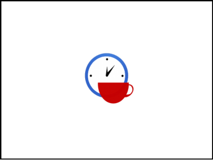

# 10. Software Risk Management

> Source: `10. Software Risk Management.pdf`  
> Extracted slides: **49**  
> Structure: one Markdown section per original PowerPoint slide in the 6-up PDF handout.  
> Wording is preserved from the PDF text layer; no outside knowledge was added. Visual-only slides include a cropped image.

## Slide 001 — Software Risk

_PDF page 1, handout panel 1_

```text
Software Risk
Management
Lecturer: Ngo Huy Bien
Software Engineering Department
Faculty of Information Technology
VNUHCM - University of Science
Ho Chi Minh City, Vietnam
nhbien@fit.hcmus.edu.vn
```

---

## Slide 002 — Objectives

_PDF page 1, handout panel 2_

```text
Objectives
To identify project risks
To analyze project risks
To propose and select risk responses
To create risk management plan
To monitor and track project risks
```

---

## Slide 003 — Contents

_PDF page 1, handout panel 3_

```text
Contents
I.
Risk list
II.
Decision trees
III. Risk management plan
```

---

## Slide 004 — References

_PDF page 1, handout panel 4_

```text
References
1.
C. Ravindranath Pandian (2007). Applied Software
Risk Management A Guide for Software Project
Managers.
2.
Kathy Schwalbe (2017). An Introduction to Project
Management. 6th Edition. Schwalbe Publishing.
3.
Hooman Hoodat and Hassan Rashidi (2009).
Classification and Analysis of Risks in Software
Engineering.
4.
Barry W. Boehm (1991). Software Risk
Management Principles and Practices.
5.
M. T. Taghavifard et al. (2009). Decision Making
Under Uncertain and Risky Situations.
6.
RD Shachter (1986). Evaluating Influence Diagrams.
```

---

## Slide 005 — Why Do Projects Fail?

_PDF page 1, handout panel 5_

```text
Why Do Projects Fail?
planned scope,
resources, cost
and schedule
known
unknowns
(future events)
 final project
cost, performance,
and schedule
All software
projects are
unique
undertakings.
Know as many
as possible
unknowns.
```

---

## Slide 006 — Risk [1]

_PDF page 1, handout panel 6_

```text
Risk [1]
•
Risk is the possibility of something bad
happening at some time in the future.
•
Risk is the probability of suffering loss while
pursuing goals due to factors that are
unpredictable or beyond.
```

---

## Slide 007 — Risk vs. Problem

_PDF page 2, handout panel 1_

```text
Risk vs. Problem
```

---

## Slide 008 — 1. Identify Risks

_PDF page 2, handout panel 2_

```text
1. Identify Risks
Technical risks
Management risks
Financial risks
Contractual and legal risks
User acceptance risks
Maintainability risks
Risk Identification produces lists of the project-specific risk items
likely to compromise a project's satisfactory outcome.
```

---

## Slide 009 — How to Indentify Risks?

_PDF page 2, handout panel 3_

```text
How to Indentify Risks?
• Brainstorming
• Risk taxonomies
• Decomposition
• Critical path analysis
• Interviewing
• Assumption analysis
• Voluntary reporting
Past projects comparison
```

---

## Slide 010 — Software Risk Check List (I)

_PDF page 2, handout panel 4_

```text
Software Risk Check List (I)
Lack of leadership
Unclear requirements
Too many requirement changes
Unrealistic schedules
Working on new technology
Working on new process
Manpower attrition
Slow performance
```

---

## Slide 011 — Software Risk Check List (II)

_PDF page 2, handout panel 5_

```text
Software Risk Check List (II)
The mid-course correction
Padded estimates generate distrust
Self-fulfilling prophecy
Working backward from a deadline
Misunderstood predecessors
Iteration abuse
Problems are found too late
Big, useless meetings
The indispensable "hero"
```

---

## Slide 012 — Previous Classes' Issues

_PDF page 2, handout panel 6_

```text
Previous Classes' Issues
• Not enough time
• Working on new technology
• Lack of leadership
• No status reporting
• Unclear requirements: Real world problems, domain
knowledge.
```

---

## Slide 013 — PEST Analysis

_PDF page 3, handout panel 1_

```text
PEST Analysis
•
Brainstorm the relevant
factors that apply to you

•
Identify the information that
applies to these factors

•
Draw conclusions from this
information
PEST analysis is a strategic planning method used to review a
strategy or position, direction of a company, a marketing
proposition, or idea in a project.
```

---

## Slide 014 — SWOT Analysis

_PDF page 3, handout panel 2_

```text
SWOT Analysis
SWOT analysis is a strategic planning method used to evaluate the
Strengths, Weaknesses, Opportunities, and Threats involved in a project.
Strengths
• Skills, prices, motivation,
resources
Weaknesses
• Experiences, skills, time
Opportunities
• Learning, skill and
knowledge improvement
Threats
• Competitors, changes,
team work
Objective
```

---

## Slide 015 — Risk Identification Product

_PDF page 3, handout panel 3_

```text
Risk Identification Product
```

---

## Slide 016 — Visual-only slide

_PDF page 3, handout panel 4_

> No extractable text was found in the PDF text layer for this slide. The visual is preserved below.



---

## Slide 017 — 2. Analyze Risks

_PDF page 3, handout panel 5_

```text
2. Analyze Risks
─“How risky are my risks?”
Risk analysis is the scientific measurement of the degree
of danger or hazard involved in any operation or activity.
```

---

## Slide 018 — Risk Characterization

_PDF page 3, handout panel 6_

```text
Risk Characterization
Probability
Description
0% – 20%
Remote
20% – 40%
Unlikely
40% – 70%
Likely
70% – 90%
Highly likely
90% – 100%
Nearly certain
Impact (Slips to schedule and budget)
Description
< 10% of total budget
Minimal or no impact
< 15% of total budget
Small, acceptable
< 50% of total budget
Moderate system damage
< 60% of total budget
Significant impact to project
>= 60% of total budget
Failure of project operations
Time of Occurrence
In next month
One to two months from now
Three or more months from now
```

---

## Slide 019 — Example

_PDF page 4, handout panel 1_

```text
Example
• Strategy
– Experience
• Not enough time: P = 80%, C = $4000, 2 months.
• Working on new technology: P = 40%, C = $2000, 1 week.
• Lack of leadership: P = 95%, C = $100, 1 month.
```

---

## Slide 020 — Uncertainty [2]

_PDF page 4, handout panel 2_

```text
Uncertainty [2]
```

---

## Slide 021 — Delphi Method

_PDF page 4, handout panel 3_

```text
Delphi Method
1. Develop initial questionnaire and distribute it to the
panel.
2. Panelists independently generate their ideas in answer
to the questionnaire and return it.
3. The moderator summarizes the responses to the first
questionnaire and develops a feedback report along
with the second set of questionnaires for the panelists.
4. Having received the feedback report, panelists
independently evaluate earlier responses and
independently vote on the second questionnaire.
5. The moderator develops a final summary and feedback
report to the group and decision makers.
Delphi method is a method for structuring a group communication
process so that the process is effective in allowing a group of
individuals, as a whole, to deal with a complex problem.
```

---

## Slide 022 — Risk Tree Analysis [3]

_PDF page 4, handout panel 4_

```text
Risk Tree Analysis [3]
• Risk tree is a graphical model of various combinations of risks
that result in the occurrence of the predefined undesired event.
• To analyze using risk tree, it is necessary to
– specify the undesired state of the system. This state may be the failure of
the system or of a subsystem.
– Then a list is made of all the possible ways in which these events can
occur.
– Each of the possible ways is then examined independently to find out how
it can occur.
```

---

## Slide 023 — Risk Tree Example

_PDF page 4, handout panel 5_

```text
Risk Tree Example
Rectangle:
Top or intermediate event
Circle:
Elementary
basic event
Transfer
The output is generated if at
least one of the inputs exists
```

---

## Slide 024 — Risk Exposure (Priority)

_PDF page 4, handout panel 6_

```text
Risk Exposure (Priority)
• Risk exposure is defined as

Risk Exposure (Priority) = Probability * Impact.
• It is simply the average impact.
Risk Matrix
```

---

## Slide 025 — 3. Prioritize Risks

_PDF page 5, handout panel 1_

```text
3. Prioritize Risks
• Strategy
– Experience
• Not enough time: P = 80%, C = $4000, 2 months.
• Working on new technology: P = 40%, C = $2000, 1 week.
• Lack of leadership: P = 95%, C = $100, 1 month.
• Priority = P * C and consider time of occurrence.
```

---

## Slide 026 — Risk Analysis Product [4]

_PDF page 5, handout panel 2_

```text
Risk Analysis Product [4]
```

---

## Slide 027 — Visual-only slide

_PDF page 5, handout panel 3_

> No extractable text was found in the PDF text layer for this slide. The visual is preserved below.


---

## Slide 028 — Risk Response

_PDF page 5, handout panel 4_

```text
Risk Response
•
Acceptance: To acknowledge the risk’s
existence, but to take no preemptive action to
resolve it, except for the possible
development of contingency plans should the
risk event come to pass.
•
Avoidance: To eliminate the conditions that
allow the risk to be present at all, most
frequently by dropping the project or the task.
•
Deflection: To transfer the risk (in whole or
part) to another organization, individual, or
entity.
•
Mitigation: To minimize the probability of a
risk’s occurrence or the impact of the risk
should it occur.
```

---

## Slide 029 — Risk Tolerance

_PDF page 5, handout panel 5_

```text
Risk Tolerance
Risk tolerance is the willingness of some person or some
organization to accept or avoid risk.
```

---

## Slide 030 — Example of Risk Mitigation (I)

_PDF page 5, handout panel 6_

```text
Example of Risk Mitigation (I)
• Inexperience with project process/technology
– Make estimates with a buffer for initial learning time
– Maintain buffers of extra resources
– Define a project-specific training program
– Conduct cross-training sections
• Unclear requirements and/or acceptance criteria
– Use experience and logic to make some assumptions and keep
the client informed; obtain sign-off
– Develop a prototype and have the requirements reviewed by
the client.
```

---

## Slide 031 — Example of Risk Mitigation (II)

_PDF page 6, handout panel 1_

```text
Example of Risk Mitigation (II)
• Too many requirement changes
– Obtain sign-off for the initial requirements specification from the customer.
– Convince the customer that changes in requirements will affect the schedule
•
If the requirements are changing rapidly we should RE-ESTIMATE the final delivery date and
NOTIFY the manger about the new schedule AS SOON AS we receive a change request.
•
We should NOT let the manager know the effect on the last day.
– Define a procedure to handle requirement changes
– Negotiate payment on actual effort
• Unrealistic schedules
– Negotiate for a better schedule.
– Identify parallel tasks.
– Have resources ready early
– Identify areas that can be automated, COTS components
– If the critical path is not within the schedule, negotiate with the client
– Negotiate payment on actual effort.
```

---

## Slide 032 — Example of Risk Mitigation (III)

_PDF page 6, handout panel 2_

```text
Example of Risk Mitigation (III)
• Team spirit and attitude
– Ensure that multiple resources are assigned on key project areas.
– Have team-building sessions.
– Rotate jobs among team members
– Keep extra resources in the project as backup.
– Maintain proper documentation of each individual's work.
– Follow the configuration management process and guidelines strictly.
• Not meeting performance requirements
– Define the performance criteria clearly and have them reviewed by the client.
– Define standards to be followed to meet the performance criteria
– Prepare the design to meet performance criteria and review it.
– Simulate or prototype performance of critical transactions.
– Test with a representative volume of data where possible.
– Conduct stress tests where possible.
```

---

## Slide 033 — Example of Risk Mitigation (IV) [4]

_PDF page 6, handout panel 3_

```text
Example of Risk Mitigation (IV) [4]
1
Personnel shortfalls
Staffing with top talent; job matching (matching the right people with the right job);
teambuilding; morale  building; cross-training ; prescheduling key people
2
Unrealistic schedules and
budgets
Detailed multisource costs & schedule estimation;  design to cost;
incremental development; software reuse; requirements scrubbing
3
Developing the wrong
software functions
Organization analysis; mission analysis;  ops-concept formulation ; user survey;
prototyping; early users' manuals
4
Developing the wrong user
interfacing
Prototyping; scenarios; task analysis
5
Gold plating
Requirements scrubbing; prototyping; cost-benefit analysis; design to cost
6
Continuing stream of
requirements changes
High change threshold; information hiding; incremental development (defer changes
to later increments)
7
Shortfalls in externally
furnished components
Benchmarking; inspections; reference checking; compatibility analysis
8
Shortfalls in externally
performed tasks
Reference checking; pre-award audits; award-fee contacts; competitive design or
prototyping; teambuilding
9
Real-time performance
shortfalls
Simulation; benchmarking; modeling; prototyping; instrumentation; tuning
10
Straining computer science
capabilities
Technical analysis; cost-benefit analysis; prototyping; reference checking.
```

---

## Slide 034 — Risk Mitigation: Buying Information

_PDF page 6, handout panel 4_

```text
Risk Mitigation: Buying Information
• Scenarios
• Modeling
• Prototyping
• Task analysis
• Software reuse
• Cost-Benefit analysis
Some risk is necessary for potential reward.
You can avoid risks by investing your money in
a bank savings account, but you won't get rich
that way.
```

---

## Slide 035 — 4. List Risk Reponses

_PDF page 6, handout panel 5_

```text
4. List Risk Reponses
• Not enough time
– ?
– ?
• Working on new technology
– ?
• Lack of leadership
– ?
• Unclear requirements
– ?
– ?
```

---

## Slide 036 — Visual-only slide

_PDF page 6, handout panel 6_

> No extractable text was found in the PDF text layer for this slide. The visual is preserved below.


---

## Slide 037 — Response Analysis [4]

_PDF page 7, handout panel 1_

```text
Response Analysis [4]
• Unclear requirements (P = 70%, Loss = $3000)
– Use experience and logic to make some assumptions
and keep the client informed (P = 40%, Cost = $400).
– Develop a prototype and have the requirements
reviewed by the client (P = 5%, Cost = $1000).
```

---

## Slide 038 — Decision Tree [5]

_PDF page 7, handout panel 2_

```text
Decision Tree [5]
• A decision tree is a chronological representation of the
decision process.
• It utilizes a network of two types of nodes:
– decision (choice) nodes (represented by square shapes), and
– states of nature (chance) nodes (represented by circles).
Unclear
requirements
Acceptance
70%
$3000
30%
$0
Mitigation
Assumptions
40%
$3400
60%
$400
Prototype
5%
$4000
95%
$1000
$3000 + $400
$3000 + $1000
```

---

## Slide 039 — How to Use a Decision Tree?

_PDF page 7, handout panel 3_

```text
How to Use a Decision Tree?
•
Draw the decision tree using squares to represent decisions and circles to
represent uncertainty,
•
Evaluate the decision tree to make sure all possible outcomes are included,
•
Calculate the tree values working from the right side back to the left,
•
Calculate the values of uncertain outcome nodes by multiplying the value of the
outcomes by their probability (i.e., expected values or average impact).
Unclear
requirements
Acceptance
70%
$3000
30%
$0
Mitigation
Assumptions
40%
$3400
60%
$400
Prototype
5%
$4000
95%
$1000
$2100
$1600
$1150
```

---

## Slide 040 — Risk Reduction Leverage [4]

_PDF page 7, handout panel 4_

```text
Risk Reduction Leverage [4]
Risk reduction leverage provides a cost benefit analysis of
treatment options. (1$ reduces ? average impact)
Risk Reduction Leverage =
(REbefore – REafter) / Risk Reduction Cost
Unclear
requirements
Acceptance
70%
$3000
30%
$0
Mitigation
Assumptions
40%
$4100
60%
$400
Prototype
5%
$4000
95%
$1000
$2100
$1600
Cost = $400
$1150
Cost = $1000
RRL:1.25
RRL:0.95
```

---

## Slide 041 — Influence Diagram [6]

_PDF page 7, handout panel 5_

```text
Influence Diagram [6]
•
An influence diagram is a graphical
structure for modeling uncertain variables
and decisions and explicitly revealing
probabilistic dependence and the flow of
information.
•
Influence diagram consists of nodes or
variables connected by directed arrows.
There are three kinds of nodes:
– (1) decision nodes representing alternative
actions that can be taken by decision makers;
– (2) chance nodes representing events or
system variables that are outcomes of the
decision or other chance variables;
– (3) value or utility nodes, variables that
summarize the final outcome of a decision.
```

---

## Slide 042 — Visual-only slide

_PDF page 7, handout panel 6_

> No extractable text was found in the PDF text layer for this slide. The visual is preserved below.


---

## Slide 043 — 6. Create Risk Management Plan

_PDF page 8, handout panel 1_

```text
6. Create Risk Management Plan
Risk management planning produces plans for addressing each
risk item (e.g., via risk avoidance, risk transfer, risk reduction, or
buying information), including the coordination of the individual
risk-item plans with each other and with the overall project plan.
• The plan is organized around a standard
format for software plans, oriented around
answering the standard questions of "why,
what, when, who, where, how, and how
much.“
• This plan organization allows the plans to be
concise (e.g., fitting on one page), action-
oriented, easy to understand, and easy to
monitor.
[IEEE Std 1540-2001]
```

---

## Slide 044 — Risk Management Plan Example (I)

_PDF page 8, handout panel 2_

```text
Risk Management Plan Example (I)
Risk Management Plan: Fault Tolerance Prototyping
1. Objectives (The “Why”)
–
Determine, reduce level of risk of the software fault tolerance features causing unacceptable
performance
–
Create a description of and a development plan for a set of low-risk fault tolerance features
2. Deliverables and Milestones (The “What” and “When”)
- By week 3
1. Evaluation of fault tolerance option
2. Assessment of reusable components
3. Draft workload characterization
4. Evaluation plan for prototype exercise
5. Description of prototype
- By week 7
6. Operational prototype with key fault tolerance features
7. Workload simulation
8. Instrumentation and data reduction capabilities
9. Draft Description, plan for fault tolerance features
-By week 10
10. Evaluation and iteration of prototype
11. Revised description, plan for fault tolerance features
1 Risk
```

---

## Slide 045 — Risk Management Plan Example (II)

_PDF page 8, handout panel 3_

```text
Risk Management Plan Example (II)
3. Responsibilities (The “Who” and “Where”)
- System Engineer: G. Smith

Tasks 1, 3, 4, 9, 11, support of tasks 5, 10
- Lead Programmer: C. Lee

Tasks 5, 6, 7, 10 support of tasks 1, 3
- Programmer: J. Wilson

Tasks 2, 8, support of tasks 5, 6, 7, 10
4. Approach (The “How”)
–
Design-to-Schedule prototyping effort
–
Driven by hypotheses about fault tolerance-performance effects
–
Use real-time OS, add prototype fault tolerance features
–
Evaluate performance with respect to representative workload
–
Refine Prototype based on results observed
5. Resources (The “How Much”)
$60K - Full-time system engineer, lead programmer, programmer (10weeks)*(3 staff)*($2K/staff-week)
$0K - 3 Dedicated workstations (from project pool)$0K - 2 Target processors (from project pool)
$0K - 1 Test co-processor (from project pool)
$10K – Contingencies
$70K - Total
```

---

## Slide 046 — 7. Monitor Risks

_PDF page 8, handout panel 4_

```text
7. Monitor Risks
Risk monitoring involves tracking the project's progress towards
resolving its risk items and taking corrective action where appropriate.
```

---

## Slide 047 — Risk Management

_PDF page 8, handout panel 5_

```text
Risk
Management
Risk
Assessment
Risk
Identification
Risk Analysis
Risk
Prioritization
Risk Control
Risk
Management
Planning
Risk
Resolution
(Taking
Action)
Risk
Monitoring
Risk Management
Risk management is a systematic approach to reducing the harm
due to risks, making the project less vulnerable and the product
more robust.
```

---

## Slide 048 — Why Risk Management?

_PDF page 8, handout panel 6_

```text
Why Risk Management?
Improve governance and
controls
Reduce losses and the impact
of risks to objectives
Comply with legal and
regulatory requirements
"If you don't actively
attack the risks, they will
actively attack you."  --
Tom Gilb
```

---

## Slide 049 — Thank You & See You Again

_PDF page 9, handout panel 1_

```text
Thank You & See You Again
```

---

