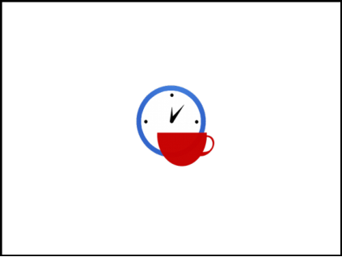

# 12. Software Project Management

> Source: `12. Software Project Management.pdf`  
> Extracted slides: **45**  
> Structure: one Markdown section per original PowerPoint slide in the 6-up PDF handout.  
> Wording is preserved from the PDF text layer; no outside knowledge was added. Visual-only slides include a cropped image.

## Slide 001 — Software Project

_PDF page 1, handout panel 1_

```text
Software Project
Management
Lecturer: Ngo Huy Bien
Software Engineering Department
Faculty of Information Technology
VNUHCM - University of Science
Ho Chi Minh City, Vietnam
nhbien@fit.hcmus.edu.vn
```

---

## Slide 002 — Objectives

_PDF page 1, handout panel 2_

```text
Objectives
To present what is software project
management.
To present why software project
management.
To select PMI tools and techniques for
software project management.
To select software project
management approach.
```

---

## Slide 003 — Contents

_PDF page 1, handout panel 3_

```text
Contents
I.
Project management
II.
Project manager
III.
PMI methodology
IV. Project management approaches
```

---

## Slide 004 — References

_PDF page 1, handout panel 4_

```text
References
1.
Project Management Institute (2017). A Guide to the
Project Management Body of Knowledge. 6th Edition.
2.
Kim Heldman (2018). PMP Project Management
Professional Study Guide. Sybex.
3.
Murali K. Chemuturi and Thomas M. Cagley Jr. (2010).
Mastering Software Project Management - Best
Practices, Tools and Techniques. J. Ross Publishing.
4.
Kathy Schwalbe (2017). An Introduction to Project
Management. 6th Edition.
5.
Scott Berkun (2008). Making Things Happen:
Mastering Project Management.
6.
Roger S. Pressman (2010). Software Engineering: A
Practitioner’s Approach.
```

---

## Slide 005 — Do We Really Need Project Management?

_PDF page 1, handout panel 5_

```text
Do We Really Need Project Management?
```

---

## Slide 006 — We Have to Ensure That [1]

_PDF page 1, handout panel 6_

```text
We Have to Ensure That [1]
• Projects will be within cost.
• Projects will be delivered on time.
• Projects will be within scope.
• Projects will meet customer quality requirements.
```

---

## Slide 007 — Project Management

_PDF page 2, handout panel 1_

```text
Project management is the application of knowledge,
skills, tools, and techniques to project activities to meet
the project requirements.
Project Management
```

---

## Slide 008 — Planning [2]

_PDF page 2, handout panel 2_

```text
Planning [2]
•
Project management is a process that includes planning, putting the
project plan into action, and measuring progress and performance.
•
It involves establishing project objectives, identifying the project
requirements, balancing constraints, and taking the needs and
expectations of the key stakeholders into consideration.
•
Planning is one of the most important functions you’ll perform
during the course of a project. It sets the standard for the rest of
the project’s life and is used to track future project performance.
```

---

## Slide 009 — Why is Software Project

_PDF page 2, handout panel 3_

```text
Why is Software Project
Management Hard? [3]
•
The primary output is not physical. Almost everything is inside a computer.
•
Despite significant progress in software engineering tools and
diagramming techniques, they do not rise to the level of precision of the
engineering drawings used in other engineering disciplines.
•
Professional associations in software development and standards
organizations have not defined standards or practices for developing
software as has occurred in other engineering practices.
•
Although significant improvements in software development
methodologies have been made, these methodologies are still largely
dependent on human beings for productivity and quality.
```

---

## Slide 010 — Art of Project Management

_PDF page 2, handout panel 4_

```text
Art of Project Management
• Different situations require different behavior.
• This contributes to the idea of project management as an art:
it requires intuition, judgment, and experience to use these
forces effectively.
• Paradoxes
– Ego/no-ego
– Autocrat/delegator
– Tolerate ambiguity/pursue perfection
– Oral/written
– Acknowledge complexity/champion simplicity
– Impatient/patient
– Courage/fear
– Believer/skeptic
```

---

## Slide 011 — People Involving in Project Management

_PDF page 2, handout panel 5_

```text
People Involving in Project Management
Project manager
Programmer, designer, business
analyst, architect, tester, or other
member of a software team
Researcher, consultant or quality
assurance manager
```

---

## Slide 012 — Why Project Management? [4]

_PDF page 2, handout panel 6_

```text
Why Project Management? [4]
• Project management reduces risks and
increases the chance of success.
• A good project management discipline will
not eliminate all risks, issues and surprises
but it will provide standard processes and
procedures to deal with them.
• How can you avoid the problems that occur
when you meet scope, time, and cost goals,
but lose sight of customer satisfaction?
• The answer is good project management,
which includes more than meeting project
constraints.
```

---

## Slide 013 — Visual-only slide

_PDF page 3, handout panel 1_

> No extractable text was found in the PDF text layer for this slide. The visual is preserved below.


---

## Slide 014 — Do We Really Need a Project Manager?

_PDF page 3, handout panel 2_

```text
Do We Really Need a Project Manager?
```

---

## Slide 015 — Software Project Manager Hiring

_PDF page 3, handout panel 3_

```text
Software Project Manager Hiring
•
Education: Bachelor of IT/Software
Engineering or Information System.
•
Language: Excellent in English (4 skills).
•
Have experience in Web development and
some technologies (.NET or PHP or JAVA).
•
Strong knowledge in software engineering
process (such as Agile, XP, and/or CMMi) and
tools (Jira, MS project).
•
Strong and confident in problem solving,
conflict resolution, negotiation and customer
management skills.
•
Personality: Dedicated, confident, business-
minded, pro-active, self-organized, hard-
working.
```

---

## Slide 016 — Project Manager's Responsibilities

_PDF page 3, handout panel 4_

```text
Project Manager's Responsibilities
•
Define the scope and analyze the  feasibility of your project.
•
Estimate the effort required to do the work and schedule your project.
•
Manage the requirements, specifications, design, programming, and
testing of the software or items purchases.
•
Manage (coach) the development process of project.
•
Liaison with customer and management about the project.
•
Provide guidance if your project runs into quality problems.
•
Make effective changes to the way projects are run in your organization.
```

---

## Slide 017 — Project Manager’s Daily Tasks [5]

_PDF page 3, handout panel 5_

```text
Project Manager’s Daily Tasks [5]
•
Reviewing marketing plans,
•
Writing visions and statement of work,
•
Doing strategic planning,
•
Generating schedules, planning releases,
•
Leading teams, settling arguments, shielding the team from politics,
•
Running bug/defect triage,
•
Doing anything else that needed to be done that no one else was doing
(well),
•
Finding clever workarounds for unexpected situations,
•
Finding shortcuts and clever optimizations in the daily workflow,
•
Cultivating team morale, and giving a boost of enthusiasm or
encouragement in the right way and at the right time.
```

---

## Slide 018 — Project Manager's Skill Set

_PDF page 3, handout panel 6_

```text
Project Manager's Skill Set
•
Planning, estimating, time management
•
Contract management
•
People management (customers,
suppliers, functional managers and
project team)
•
Problem solving, negotiation, conflict
management
•
Effective communication (verbal and
written)
•
Influencing
•
Creative thinking
•
Leadership
```

---

## Slide 019 — A Way to Guarantee the Failure

_PDF page 4, handout panel 1_

```text
A Way to Guarantee the Failure
• Use a Technical Lead that has never built a similar system.
• Build the system in Java, even though most of the
development team still thinks that Java is coffee.
```

---

## Slide 020 — Project Manager’s Contribution

_PDF page 4, handout panel 2_

```text
Project Manager’s Contribution
• The PM will understand
– the business view of the project as well as
– the technical view, and
– he'll help the team translate between them when necessary.
• Good project managers know all kinds of useful things about
– the state of the team, and
– the state of the world, and then
– apply that knowledge to help people get stuff done.
• Because these contributions are harder to measure, many
PMs struggle with the ambiguity of their role.
• It takes a combination of conviction, confidence, and
awareness to be effective and happy as a leader of a team.
```

---

## Slide 021 — PM’s Contribution Example

_PDF page 4, handout panel 3_

```text
PM’s Contribution Example
• Consider that in hospital emergency rooms, one doctor takes
the lead in deciding the course of action for a patient.
• This expedites many decisions and gives clarity to the roles
that everyone on the trauma team is expected to play.
```

---

## Slide 022 — The Absence of a Dedicated PM

_PDF page 4, handout panel 4_

```text
The Absence of a Dedicated PM
• As long as everyone is willing to pay the tax of responsibility
for keeping things together, and distributing the burden that a
dedicated project manager would carry for the team, there's
one less employee that the team needs.
• Efficiency and simplicity are good things.
```

---

## Slide 023 — Possible Issue

_PDF page 4, handout panel 5_

```text
Possible Issue
• Without a person whose primary job is to shepherd the
overall effort, individual biases and interests can derail the
directions of the team.
• Strong adversarial factions may develop around engineering
and business roles, slowing progress and frustrating everyone
involved.
```

---

## Slide 024 — Visual-only slide

_PDF page 4, handout panel 6_

> No extractable text was found in the PDF text layer for this slide. The visual is preserved below.


---

## Slide 025 — How to Manage a Project? [6]

_PDF page 5, handout panel 1_

```text
How to Manage a Project? [6]
•
Understand the four P’s—product, process, project and people.
•
Communication with the customer and other stakeholders must occur so
that product scope and requirements are understood.
•
A process that is appropriate for the people and the product should be
selected.
•
The project must be planned by estimating effort and calendar time to
accomplish work tasks: defining work products, establishing quality
checkpoints, and identifying mechanisms to monitor and control work
defined by the plan.
•
People must be organized to perform software work effectively.
```

---

## Slide 026 — PMI Project Life Cycle [1]

_PDF page 5, handout panel 2_

```text
PMI Project Life Cycle [1]
• Project management is the application of knowledge, skills,
tools, and techniques to project activities to meet project
requirements.
• How many activities are there?
– Understand the project life cycle.
• A project life cycle is the series of phases that a project passes
through from its initiation to its closure.
• Project phases are divisions within a project where extra
control is needed to effectively manage the completion of a
major deliverable.

Starting
the project
Organizing
and
preparing
Carrying
out the
work
Closing the
project
```

---

## Slide 027 — How to Organize Cost, Staffing and Work Products ?

_PDF page 5, handout panel 3_

```text
How to Organize Cost, Staffing and Work Products ?
Typical Cost and Staffing Levels Across the Project Life Cycle
```

---

## Slide 028 — How to Manage Changes and Risks?

_PDF page 5, handout panel 4_

```text
How to Manage Changes and Risks?
Impact of Variables Based On Project Time
```

---

## Slide 029 — Typical Project

_PDF page 5, handout panel 5_

```text
Typical Project
• Project phases are typically completed sequentially.
Example of a Single-Phase Project
```

---

## Slide 030 — Complex Project

_PDF page 5, handout panel 6_

```text
Complex Project
•
The phase structure allows the project to be segmented into logical
subsets for ease of management, planning, and control.
•
The number of phases, the need for phases, and the degree of
control applied depend on the size, complexity, and potential
impact of the project.
A Project with Overlapping Phases
```

---

## Slide 031 — Project Management Processes

_PDF page 6, handout panel 1_

```text
Project Management Processes
• How to manage a project easily and effectively? – Use
appropriate processes.
• Project management processes are grouped into five
categories known as Project Management Process Groups (or
Process Groups)
1
2
3
4
5
```

---

## Slide 032 — PMI Tools and Techniques [5]

_PDF page 6, handout panel 2_

```text
PMI Tools and Techniques [5]
Man is a tool-using
animal.
Without tools he is
nothing, with tools
he is all.
```

---

## Slide 033 — Visual-only slide

_PDF page 6, handout panel 3_

> No extractable text was found in the PDF text layer for this slide. The visual is preserved below.



---

## Slide 034 — Engineering and Management [3]

_PDF page 6, handout panel 4_

```text
Engineering and Management [3]
• Software project execution has two components, namely,
software engineering and management.
```

---

## Slide 035 — Software Engineering

_PDF page 6, handout panel 5_

```text
Software Engineering
• Software engineering consists of all of the technical activities
that are performed to build the project deliverable (the “just
build it” activities).

• Software engineering deals with
– specifying product requirements,
– constructing the components,
– integrating them,
– verifying them,
– validating them, and
– finally combining all of the components into a product and
– convincing the customer to accept delivery of it.
```

---

## Slide 036 — SE Methodologies: Waterfall vs. Agile

_PDF page 6, handout panel 6_

```text
SE Methodologies: Waterfall vs. Agile
Week 1
Requirements
Solutions
Week 2
Requirements
Solutions
Week 3
Requirements
Solutions
Week 4
Requirements
Solutions
Week 1
Requirements
Week 2
Requirements
Week 3
Solutions
Week 4
Solutions
```

---

## Slide 037 — SE Methodologies: Waterfall vs. RUP

_PDF page 7, handout panel 1_

```text
SE Methodologies: Waterfall vs. RUP
Week 1
Requirements
Week 2
Requirements
Solutions
Week 3
Requirements
Solutions
Week 4
Solutions
Week 1
Requirements
Week 2
Requirements
Week 3
Solutions
Week 4
Solutions
```

---

## Slide 038 — Management

_PDF page 7, handout panel 2_

```text
Management
• Management facilitates software engineering so that the
project deliverable is completed on time, efficiently (low cost)
and effectively (right goals), and without defects.
• Management deals with
– creating visions,
– estimating time and cost,
– coordinating members and business,
– solving conflicts,
– handling unexpected situations, and
– optimizing the daily workflow.
```

---

## Slide 039 — Project Management Methodology (I)

_PDF page 7, handout panel 3_

```text
Project Management Methodology (I)
• Project management methodology is incorporated into the
software engineering methodology adopted for building the
project deliverable.
Software Engineering
(Waterfall, RUP,
Scrum, Kanban)
Management
(Waterfall, RUP,
Scrum, Kanban)
Development Team
Business Team
```

---

## Slide 040 — Project Management Methodology (II)

_PDF page 7, handout panel 4_

```text
Project Management Methodology (II)
• Software engineering and management are loosely coupled,
but they do influence each other.
• Each aspect needs some amount of tailoring to suit the other.
Management
(PRINCE2, PMI)
Development Team
Business Team
influence
Software Engineering
(Waterfall, RUP,
Scrum, Kanban)
```

---

## Slide 041 — Managing PM Methodology (I)

_PDF page 7, handout panel 5_

```text
Managing PM Methodology (I)
• Ad hoc methods (e.g., process definition, maintenance groups,
measurement, and analysis) are NOT documented and are
dependent on the involved parties.
• In an ad hoc method approach, a software project manager
(SPM) is given almost absolute control within a general policy
framework that tends to be rather flexible.
• In this situation, often the management style also reflects the
personality of the leader of the organization.

• Advantages: least costly, and the most profitable
• Disadvantages: lose the leader, lose the project
```

---

## Slide 042 — Managing PM Methodology (II)

_PDF page 7, handout panel 6_

```text
Managing PM Methodology (II)
•
Organizations using a process-driven approach are characterized by having
documented processes for all activities.
•
Individuals must also be knowledgeable in the processes that concern
them to be effective and efficient.
•
The organization facilitates the execution of projects by providing the
processes, the tools, a knowledge repository, the training, and expert
assistance as needed to help the SPM(s).
•
Each SPM is responsible for executing projects while diligently conforming
to defined processes provided by the organization.
•
SPMs also are responsible for providing feedback, suggestions, and
support for the organizational initiatives in continuous improvement of
processes, tools, and the knowledge repository.
•
Disadvantages: Cost. Advantages: minimizing the person-dependency,
predictability in project execution.
```

---

## Slide 043 — Project Management Office [2]

_PDF page 8, handout panel 1_

```text
Project Management Office [2]
```

---

## Slide 044 — What is the Right Approach? [3]

_PDF page 8, handout panel 2_

```text
What is the Right Approach? [3]
• Most organizations that evolve in an organic manner start
small, typically beginning with an ad hoc approach to
software project management.
• As the organization grows and takes on more projects, the
workload increases, putting pressure on the human resources.
• As this pressure on the human resources builds up, two things
can happen:
– the organization buckles under the pressure and moves
toward stagnation, failure, and closure or
– the organization moves toward a process-driven approach.
```

---

## Slide 045 — Thank You & See You Again

_PDF page 8, handout panel 3_

```text
Thank You & See You Again
```

---

